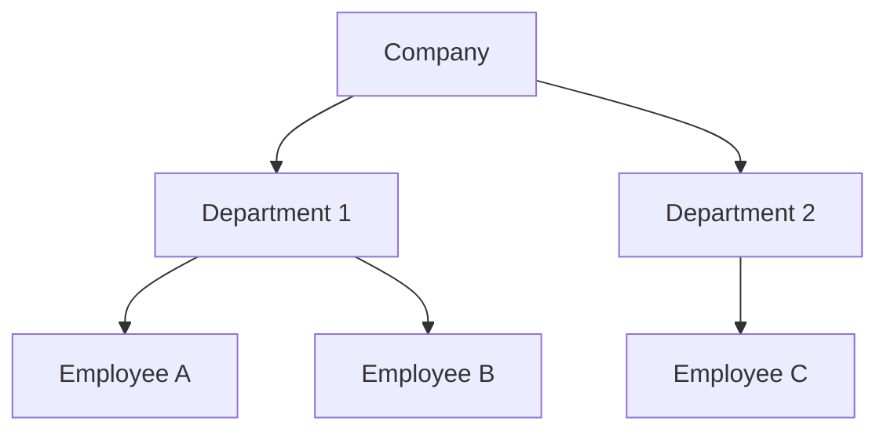
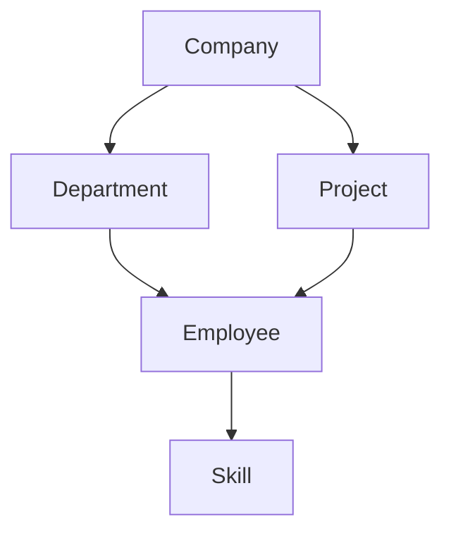
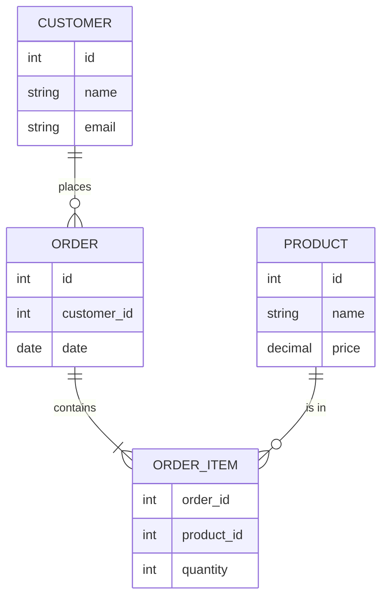

# 📚 Lesson 1 – Introduction to Databases and MySQL

---

## 🎯 Lesson Objectives

* Understand the origin of the database concept
* Understand the analogy between physical and digital storage systems
* Understand the evolution of data storage methods
* Learn the formal concept of a Database and its components
* Identify the main data models and the role of the relational model
* Understand what SQL is and how it became standardized
* Identify the main database solutions available in the market

---

## 🕰️ Before Computing: The Origin of the Data Concept

Before the advent of computers, **all information was recorded on paper**. Companies, governments, and institutions relied on physical organization systems to store and retrieve data.

### 🗂️ Organization in the Physical World

```text
- Manually filled index cards
- Folders organized by subject or person
- Metal cabinets and filing systems for storage
```

---

### 1950s and 1960s – Sequential Access Files

With the emergence of computers, it became necessary to create ways to store data digitally.

```text
- Punched cards
- Magnetic tapes
- Mandatory sequential reading
```

**Advantage**: First form of digital storage, enabling automated processing.
**Problem**: To access a single piece of data, all previous data had to be read.

**Limitations**:

* Slowness
* High processing cost
* No flexibility

---

### 1970s – Direct Access Files

```text
- Emergence of hard disk drives (HDD)
- Creation of indexes and identifying keys
- Direct access to data without scanning the entire file
```

**Advantage**: Much higher performance, fast access to any file position.

**Important advancement**, but still with serious problems:

* Lack of data integrity
* Difficult maintenance
* No concurrency control
* Limited security

> ⚠️ Each application had to manage its own data — any error could compromise everything.

---

## 🧠 The Emergence of the Database Concept

In the 1960s, the United States Department of Defense promoted **CODASYL** (*Conference on Data Systems Languages*), bringing together the military, companies, and universities.

### Historical Outcomes of CODASYL

* Formal and theoretical definition of the **Database** concept
* Creation of the **COBOL** language, focused on data structure

---

## 🔄 Analogy: Physical World → Digital World

| Physical World (Pre-Computing) | Digital World (IT)              |
| ------------------------------ | ------------------------------- |
| Individual **index cards**     | **Records** in the database     |
| **Folders** grouping cards     | **Tables** organizing records   |
| Physical **cabinets/files**    | **Digital files** in the system |

> 💡 Computing did not reinvent information organization — it **digitized and automated** an existing model.

**Practical Example**:

```
Physical Library → Digital Database
├── Book card → Record in the Books table
├── "Romance" folder → "Categories" table
└── Cabinet "A-D" → File "authors_A_D.db"
```

---

## 🏗️ Components of a Database Ecosystem

According to the theory established by CODASYL, a complete system has **4 parts**:

### 1. Database

```text
- The data itself
- The structure that organizes the data
- Relationships between different elements
```

### 2. DBMS (Database Management System)

```text
- Software responsible for managing data: Storage, Security, Integrity, Access control, and Concurrency
- Known as DBMS (Database Management System)
- Examples: MySQL, Oracle, PostgreSQL
```

### 3. Query / Data Manipulation Language

```text
- Specific language to access and manipulate data
- Allows: Insert data, Query data, Update data, Delete data
- Current standard: SQL (Structured Query Language)
- Evolved from "SEQUEL" to SQL
```

### 4. Additional Programs

```text
- User management tools
- Backup and recovery systems
- Graphical interfaces (e.g., MySQL Workbench)
- Automation tools
```

---

## 📊 Data Models: Evolution Driven by IBM

As system complexity increased, different ways of organizing data emerged.

### 📌 Hierarchical Model (Early Implementations)



**Limitation**: Rigid tree structure, parent-child relationships only, low flexibility.

---

### 📌 Network Model (Evolution of the Hierarchical Model)



**Improvement**: Allows multiple relationships, but complex to manage and difficult to maintain.

---

### 📌 Relational Model (Edgar Codd’s Revolution – 1970s)

The **relational model**, proposed by **Edgar Frank Codd**, revolutionized data storage.



**Main characteristics**:

* Data organized into tables
* Relationships based on keys
* Independence between data and applications

> 🔗 Data now has **intrinsic relationships**, reflecting the real world.

This model connects directly with object-oriented languages, enabling future mapping between **tables and objects**.

---

## 🗣️ SQL – Structured Query Language

Originally called **SEQUEL**, the language evolved into **SQL**.

### Purpose of SQL

```text
- Standard language for relational databases
- Independent of programming languages
- Based on declarative commands
```

Despite the idea of universality, each vendor created **its own variations**, making standardization necessary.

### Standardization

* **ANSI**
* **ISO**

> Even with standards, each DBMS has its own extensions.

---

## 🌍 The Database Market

### Paid (Enterprise) Solutions

| System         | Company            | Characteristics                           |
| -------------- | ------------------ | ----------------------------------------- |
| **Oracle**     | Oracle Corporation | Market leader, high cost, robust          |
| **DB2**        | IBM                | Mainframe integration, enterprise         |
| **SQL Server** | Microsoft          | Integration with Microsoft ecosystem      |
| **dBase**      | Ashton-Tate        | Historical (80s–90s), considered obsolete |

### Free and Open Source Solutions

| System         | Origin                 | Current Status                     |
| -------------- | ---------------------- | ---------------------------------- |
| **MySQL**      | MySQL AB (now Oracle)  | Free, widely used on the web       |
| **MariaDB**    | MySQL fork             | Community-driven, MySQL-compatible |
| **PostgreSQL** | University of Berkeley | Advanced, strong SQL compliance    |
| **Firebird**   | Borland InterBase      | Lightweight, embedded capabilities |

---

## 📊 Quick Summary

* Evolution path: **Paper → Sequential Files → Direct Access Files → Databases**
* Physical analogy helps understand digital structures: **Cards → Records, Folders → Tables**
* A complete ecosystem has **4 components**: Database, DBMS, Language, Programs
* **Edgar Codd** revolutionized storage with the **relational model** (1970s)
* **SQL** is the standard language, with variations (dialects)
* Market divided between **paid solutions** (Oracle, SQL Server) and **free solutions** (MySQL, PostgreSQL)
* **MySQL** is one of the most popular solutions for learning and web applications

---

## 💡 Tip for OOP Developers

“Think of tables as persistent classes, records as serialized objects, and relationships as associations between classes. The database is the ‘long-term memory’ of your OOP application.”

> 🧠 **Reflection Exercise**:
>
> 1. Think of a system you use (social network, e-commerce, banking)
> 2. Identify at least 3 main entities (e.g., User, Post, Comment)
> 3. Imagine how these entities would be represented as tables
> 4. Think about the relationships between them (1-to-1, 1-to-many, many-to-many)
