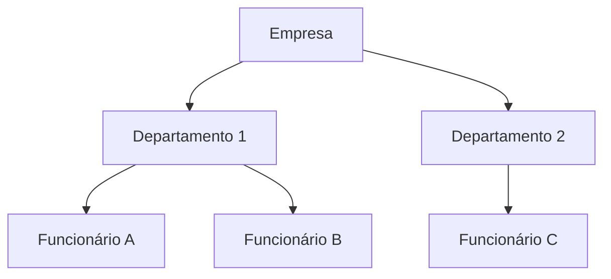
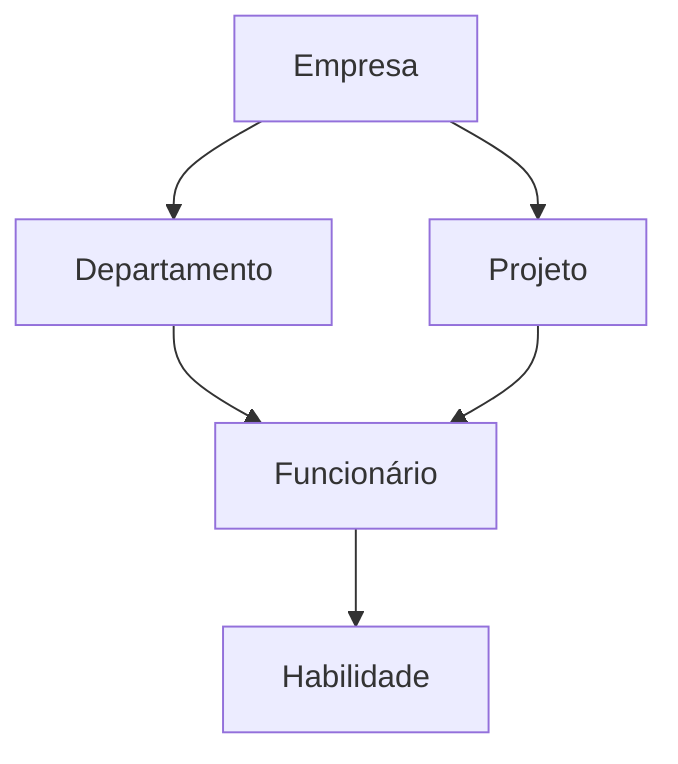
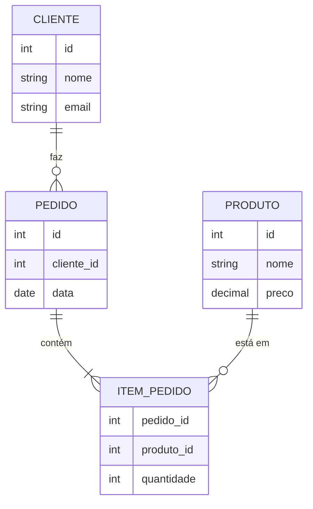

# 📚 Aula 1 - Introdução a Banco de Dados e MySQL

---

## 🎯 Objetivos da Aula

* Compreender a origem do conceito de banco de dados
* Entender a analogia entre sistemas físicos e digitais de armazenamento
* Entender a evolução dos métodos de armazenamento de dados
* Conhecer o conceito formal de Banco de Dados e seus componentes
* Identificar os principais modelos de dados e o papel do modelo relacional
* Compreender o que é SQL e a sua padronização
* Identificar as principais soluções de mercado para bancos de dados

---

## 🕰️ Antes da Computação: A Origem do Conceito de Dados

Antes do surgimento dos computadores, **toda informação era registrada em papel**. Empresas, governos e instituições dependiam de sistemas físicos de organização para armazenar e recuperar dados.

### 🗂️ Organização no Mundo Físico

```text
- Fichas preenchidas manualmente
- Pastas organizadas por assunto ou pessoa
- Armários e arquivos metálicos para armazenamento
```
---

### Anos 50 e 60 – Arquivos de Acesso Sequencial

Com o surgimento dos computadores, tornou-se necessário criar formas de armazenar dados digitalmente.

```text
- Cartões perfurados
- Fitas magnéticas
- Leitura obrigatoriamente sequencial
```

**Vantagem**: Primeira forma de armazenamento digital, permitindo processamento automatizado.
**Problema**: Para acessar um único dado, era necessário ler todos os anteriores.

**Limitações**:

* Lentidão
* Alto custo de processamento
* Nenhuma flexibilidade

---

### Anos 70 – Arquivos de Acesso Direto

```text
- surgimento dos Discos rígidos (HDD)
- Criação de índices e chaves identificadoras
- Acesso direto aos dados sem varrer todo o arquivo
```
**Vantagem**: Performance muito superior, acesso rápido a qualquer posição do arquivo.

**Avanço importante**, porém ainda com problemas sérios:

* Falta de integridade dos dados
* Dificuldade de manutenção
* Ausência de controle de concorrência
* Segurança limitada

> ⚠️ Cada aplicação precisava cuidar sozinha dos dados — qualquer erro podia comprometer tudo.

---

## 🧠 O Surgimento do Conceito de Banco de Dados

Na década de 60, o Departamento de Defesa dos Estados Unidos promoveu o **CODASYL** (*Conference on Data Systems Languages*), reunindo militares, empresas e universidades.

### Resultados Históricos do CODASYL

* Definição formal e teórica do conceito de **Banco de Dados**
* Criação da linguagem **COBOL**, linguagem que priorizava a estrutura de dados

---

## 🔄 Analogia: Mundo Físico → Mundo Digital

| Mundo Físico (Pré-Computação) | Mundo Digital (TI) |
|------------------------------|--------------------|
| **Fichas** individualizadas | **Registros** no banco |
| **Pastas** que agrupam fichas | **Tabelas** que organizam registros |
| **Armários/Arquivos** físicos | **Arquivos digitais** no sistema |

> 💡 A computação não reinventou a organização da informação — ela **digitalizou e automatizou** um modelo que já existia.

**Exemplo Prático**:
```
Biblioteca Física → Banco de Dados Digital
├── Ficha do livro → Registro na tabela Livros
├── Pasta "Romance" → Tabela "Categorias"
└── Armário "A-D" → Arquivo "autores_A_D.db"
```
---
## 🏗️ Componentes de um Ecossistema de Banco de Dados

De acordo com a teoria estabelecida no CODASYL, um sistema completo possui **4 partes**:

### 1. Base de Dados
```text
- Os dados propriamente ditos
- A estrutura que organiza esses dados
- Relações entre os diferentes elementos
```

### 2. SGBD (Sistema Gerenciador de Banco de Dados)
```text
- Software que gerencia os dados responsável por: Armazenamento, Segurança, Integridade, Controle de acesso e Concorrência
- Conhecido como DBMS (Database Management System)
- Exemplos: MySQL, Oracle, PostgreSQL
```

### 3. Linguagem de Exploração/Consulta
```text
- Linguagem específica para acessar e manipular dados
- Permite: Inserir dados, Consultar dados, Atualizar dados, Remover dados
- Padrão atual: SQL (Structured Query Language)
- Evoluiu de "SEQUEL" para SQL
```

### 4. Programas Adicionais
```text
- Ferramentas de gerenciamento de usuários
- Sistemas de backup e recuperação
- Interfaces gráficas (ex: MySQL Workbench)
- Ferramentas de automação
```

---

## 📊 Modelos de Dados: A Evolução pela IBM

Com o crescimento da complexidade dos sistemas, surgiram diferentes formas de organizar os dados.

### 📌 Modelo Hierárquico (Primeiras Implementações)


**Limitação**: Estrutura rígida em árvore, relações apenas pai-filho, pouca flexibilidade.

---

### 📌 Modelo em Rede (Evolução do Hierárquico)


**Melhoria**: Permite relações múltiplas, mas complexo de gerenciar e difícil manutenção.

---

### 📌 Modelo Relacional (Revolução de Edgar Codd - Anos 70)

O **modelo relacional**, proposto por **Edgar Frank Codd**, revolucionou o armazenamento de dados.



**Características principais**:

* Dados organizados em tabelas
* Relações baseadas em chaves
* Independência entre dados e aplicações

> 🔗 Os dados passam a ter **relações intrínsecas**, refletindo o mundo real.

Esse modelo se conecta diretamente com linguagens orientadas a objetos, permitindo futuramente o mapeamento entre **tabelas e objetos**.

---

## 🗣️ SQL – Structured Query Language

Inicialmente chamada de **SEQUEL**, a linguagem evoluiu para **SQL**.

### Objetivo do SQL

```text
- Linguagem padrão para bancos relacionais
- Independente de linguagem de programação
- Baseada em comandos declarativos
```

Apesar da ideia de universalidade, cada fabricante criou **variações próprias**, tornando necessária a padronização.

### Padronização

* **ANSI**
* **ISO**

> Mesmo com padrões, cada SGBD possui extensões próprias.

---

## 🌍 O Mercado de Bancos de Dados

### Soluções Pagas (Empresariais)
| Sistema | Empresa | Características |
|---------|---------|-----------------|
| **Oracle** | Oracle Corporation | Líder de mercado, alto custo, robustez |
| **DB2** | IBM | Integração com mainframes, enterprise |
| **SQL Server** | Microsoft | Integração com ecossistema Microsoft |
| **dBase** | Ashton-Tate | Histórico (anos 80-90), considerado arcaico |

### Soluções Gratuitas e Open Source
| Sistema | Origem | Status Atual |
|---------|--------|--------------|
| **MySQL** | MySQL AB (agora Oracle) | Gratuito, ampla adoção web |
| **MariaDB** | Fork do MySQL | Comunitário, compatível com MySQL |
| **PostgreSQL** | Universidade de Berkeley | Avançado, foco em conformidade SQL |
| **Firebird** | Borland InterBase | Leve, embedded capabilities |

---

## 📊 Resumo Rápido

* A evolução foi: **Papel → Arquivos Sequenciais → Arquivos Diretos → Bancos de Dados**
* A analogia física ajuda a entender estruturas digitais: **Fichas → Registros, Pastas → Tabelas**
* Um ecossistema completo tem **4 componentes**: Base, SGBD, Linguagem, Programas
* **Edgar Codd** revolucionou com o **modelo relacional** (anos 70)
* **SQL** é a linguagem padrão, mas com variações (dialetos)
* Mercado dividido entre **soluções pagas** (Oracle, SQL Server) e **gratuitas** (MySQL, PostgreSQL)
* **MySQL** é uma das soluções mais populares para aprendizado e aplicações web

---

## 💡 Dica para Desenvolvedores POO

"Pense em tabelas como classes persistentes, registros como objetos serializados, e relacionamentos como associações entre classes. O banco de dados é a 'memória de longo prazo' da sua aplicação POO."

> 🧠 **Exercício de Reflexão**:
> 1. Pense em um sistema que você usa (rede social, e-commerce, banco)
> 2. Identifique pelo menos 3 entidades principais (ex: Usuário, Post, Comentário)
> 3. Imagine como essas entidades seriam representadas como tabelas
> 4. Pense nos relacionamentos entre elas (1 para 1, 1 para muitos, muitos para muitos)

