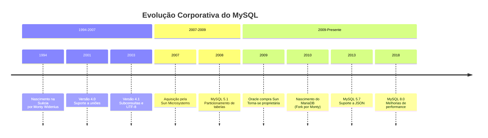
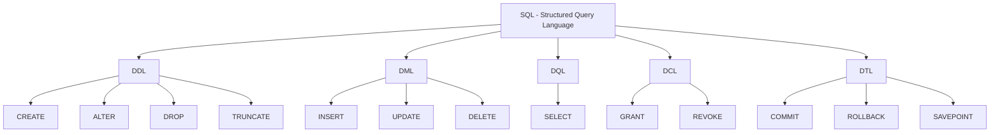
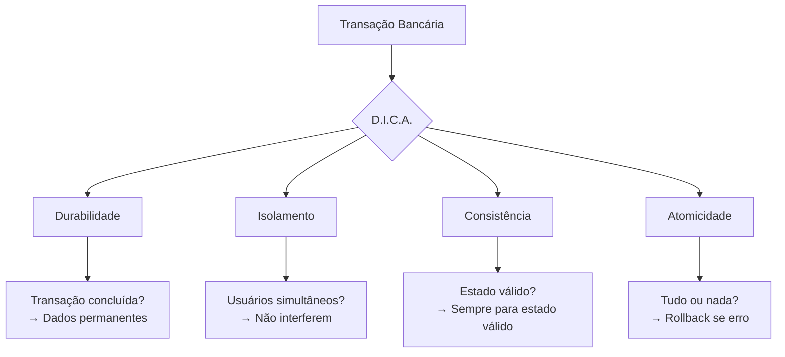

# 📚 Aula 2 - Introdução ao MySQL

---

## 🎯 Objetivos da Aula

* Conhecer a origem e evolução histórica do MySQL
* Compreender a estrutura corporativa e licenciamento do MySQL
* Entender as subdivisões da linguagem SQL (DDL, DML, DQL, DCL, DTL)
* Dominar os princípios D.I.C.A. (ACID) para transações confiáveis
* Familiarizar-se com as ferramentas de implementação do MySQL
* Preparar o ambiente para desenvolvimento prático

---

## 🕰️ Origem e Evolução Histórica do MySQL

### 1994 - O Nascimento na Suécia
```text
Criadores: Michael "Monty" Widenius e David Axmark
Local: Suécia
Filosofia: Gratuito e de código aberto (Open Source)
Licença: GPL (General Public License)
```

**Características Iniciais**:
- Foco em velocidade e simplicidade
- Nome "MySQL": "My" (filha de Monty) + "SQL"
- Alternativa aos bancos caros da época

---

### Linha do Tempo Corporativa



### O Fork: MariaDB
```text
Criado por: Monty Widenius (criador original do MySQL)
Motivo: Resposta à aquisição pela Oracle
Status: Projeto comunitário independente
Compatibilidade: Alta compatibilidade com MySQL
```

### Grandes Usuários do MySQL
```text
┌─────────────────┬────────────────────────────┐
│ Google         │ Backend de diversos serviços│
├─────────────────┼────────────────────────────┤
│ NASA           │ Controle de missões         │
├─────────────────┼────────────────────────────┤
│ Wikipedia      │ Todo o conteúdo             │
├─────────────────┼────────────────────────────┤
│ Facebook       │ Sistema de relacionamentos  │
├─────────────────┼────────────────────────────┤
│ YouTube        │ Metadados dos vídeos        │
└─────────────────┴────────────────────────────┘
```

---

## 🗃️ Estrutura da Linguagem SQL

### As 5 Subdivisões do SQL (MySQL)



### 1. DDL - Data Definition Language
**Função**: Definir e modificar a estrutura do banco
```sql
-- Exemplos práticos
CREATE DATABASE escola;          -- Criar banco
CREATE TABLE aluno (...);        -- Criar tabela
ALTER TABLE aluno ADD COLUMN ...;-- Modificar tabela
DROP TABLE aluno;                -- Remover tabela
TRUNCATE TABLE aluno;            -- Esvaziar tabela
```

### 2. DML - Data Manipulation Language
**Função**: Manipular os dados dentro das tabelas
```sql
-- Exemplos práticos
INSERT INTO aluno VALUES (...);  -- Inserir dados
UPDATE aluno SET nome = ...;     -- Atualizar dados
DELETE FROM aluno WHERE ...;     -- Remover dados
```

### 3. DQL - Data Query Language
**Função**: Consultar e recuperar dados
```sql
-- Exemplos práticos
SELECT * FROM aluno;             -- Consultar tudo
SELECT nome, idade FROM aluno;   -- Colunas específicas
SELECT * FROM aluno WHERE ...;   -- Com filtros
```

### 4. DCL - Data Control Language
**Função**: Controlar acesso e permissões
```sql
-- Exemplos práticos
GRANT SELECT ON escola.* TO usuario;  -- Dar permissão
REVOKE DELETE ON escola.* FROM usuario; -- Remover permissão
```

### 5. DTL - Data Transaction Language
**Função**: Gerenciar transações
```sql
-- Exemplos práticos
START TRANSACTION;               -- Iniciar transação
COMMIT;                          -- Confirmar alterações
ROLLBACK;                        -- Desfazer alterações
```

---

## 🔒 O Conceito D.I.C.A. (ACID)

### Por que transações são importantes?
```text
Exemplo do Caixa Eletrônico:
1. Você solicita R$ 100,00
2. Sistema verifica saldo (tem R$ 500,00)
3. Sistema debita R$ 100,00 da sua conta
4. Sistema libera R$ 100,00 no caixa

Se falhar no passo 3 ou 4: Problema!
```

### D.I.C.A. na Prática



### 1. Durabilidade (Durability)
**Princípio**: Uma vez confirmada, a transação é permanente
```sql
-- Exemplo em MySQL
START TRANSACTION;
UPDATE conta SET saldo = saldo - 100 WHERE id = 1;
UPDATE conta SET saldo = saldo + 100 WHERE id = 2;
COMMIT;  -- Agora é permanente!
```

### 2. Isolamento (Isolation)
**Princípio**: Transações simultâneas não interferem
```sql
-- Usuário A (às 10:00:00)
START TRANSACTION;
SELECT saldo FROM conta WHERE id = 1;  -- Vê R$ 500,00

-- Usuário B (às 10:00:01)
START TRANSACTION;
UPDATE conta SET saldo = 400 WHERE id = 1;
COMMIT;

-- Usuário A ainda vê R$ 500,00 até COMMIT
```

### 3. Consistência (Consistency)
**Princípio**: O banco sempre passa de um estado válido para outro
```sql
-- Estado válido: Saldo nunca negativo
CREATE TABLE conta (
    id INT PRIMARY KEY,
    saldo DECIMAL(10,2) CHECK (saldo >= 0)  -- Restrição
);

-- Transação rejeitada se violar consistência
UPDATE conta SET saldo = -50 WHERE id = 1;  -- ERRO!
```

### 4. Atomicidade (Atomicity)
**Princípio**: "Tudo ou Nada" - Ctrl+Z interno
```sql
START TRANSACTION;
-- Operação 1: OK
UPDATE estoque SET quantidade = quantidade - 1 WHERE produto_id = 5;

-- Operação 2: FALHA (produto não existe)
INSERT INTO venda (produto_id, quantidade) VALUES (999, 1);

-- Como a segunda falhou, tudo é desfeito
ROLLBACK;  -- Atomicidade em ação!
```

---

## 🛠️ Ferramentas de Implementação e Uso

### 1. MySQL Server
```text
Função: O motor do banco de dados
Características:
- Serviço que roda em background
- Escuta conexões (normalmente porta 3306)
- Processa comandos SQL
- Gerencia dados em disco
```

### 2. MySQL Workbench (Interface Gráfica)
```text
Vantagens sobre terminal:
- Interface visual amigável
- Editor SQL com highlight
- Design visual de tabelas
- Administração gráfica
- Exportação/Importação visual
- Modelagem de dados (EER Diagrams)
```

### 3. Terminal/CLI (Command Line Interface)
```bash
# Comandos básicos no terminal
mysql --version                    # Verificar versão
mysql -u root -p                   # Conectar ao servidor
mysql -h localhost -u usuario -p   # Conectar com host

# Dentro do MySQL CLI
SHOW DATABASES;                    # Listar bancos
USE nome_banco;                    # Selecionar banco
SHOW TABLES;                       # Listar tabelas
EXIT; ou \q                        # Sair
```

### 4. Documentação Oficial
```text
Site: https://dev.mysql.com/doc/
Conteúdo:
- Manual completo
- Tutoriais passo a passo
- Referência de comandos
- Exemplos práticos
- Notas de versão
```

---

## 📥 Instalação Prática

### Passo a Passo para Windows

```text
1. Acesse: https://www.mysql.com/downloads/
2. Selecione: "MySQL Community (GPL) Downloads"
3. Escolha: "MySQL Community Server"
4. Baixe o instalador (Windows MSI Installer)
5. Execute o instalador:
   - Escolha "Developer Default"
   - Siga as instruções
   - Anote a senha do root!
6. Instale também o MySQL Workbench
```

### Verificação da Instalação
```bash
# Abra o terminal (CMD) e digite:
mysql --version
# Deve mostrar: mysql  Ver 8.0.x for Win64...

# Inicie o MySQL Workbench
# Conecte usando:
Hostname: localhost
Port: 3306
Username: root
Password: [sua senha]
```

---

## 🚀 Primeiros Comandos Práticos

### Criando Nosso Primeiro Banco
```sql
-- 1. Conectar ao MySQL (Workbench ou CLI)
-- 2. Criar banco de dados escola
CREATE DATABASE escola;

-- 3. Usar o banco escola
USE escola;

-- 4. Criar primeira tabela: aluno
CREATE TABLE aluno (
    id INT PRIMARY KEY AUTO_INCREMENT,
    nome VARCHAR(100) NOT NULL,
    email VARCHAR(100) UNIQUE,
    data_nascimento DATE,
    ativo BOOLEAN DEFAULT TRUE
);

-- 5. Verificar tabela criada
SHOW TABLES;
DESCRIBE aluno;  -- ou DESC aluno;
```

### Operações Básicas CRUD
```sql
-- CREATE (Inserir)
INSERT INTO aluno (nome, email, data_nascimento)
VALUES ('Ana Silva', 'ana@email.com', '2005-05-15');

-- READ (Consultar)
SELECT * FROM aluno;
SELECT nome, email FROM aluno WHERE ativo = TRUE;

-- UPDATE (Atualizar)
UPDATE aluno SET email = 'ana.nova@email.com' WHERE id = 1;

-- DELETE (Excluir)
DELETE FROM aluno WHERE id = 1;
-- Cuidado: DELETE é permanente (sem lixeira)
```

---

## 📊 Resumo Rápido

* **MySQL** nasceu em **1994** na Suécia, criado por Monty Widenius
* Pertence à **Oracle** desde 2009, mas continua gratuito
* **MariaDB** é um fork criado pelo próprio Monty após a venda
* SQL se divide em **5 partes**: DDL, DML, DQL, DCL, DTL
* **D.I.C.A.** garante transações confiáveis: Durabilidade, Isolamento, Consistência, Atomicidade
* **MySQL Workbench** é a ferramenta gráfica recomendada
* A **documentação oficial** é essencial para consulta

---

## 💡 Dica

"Pense no MySQL como o 'armazém' da sua aplicação POO. As classes são os 'catálogos' (tabelas), os objetos são os 'produtos' (registros), e os métodos são os 'funcionários' que organizam e recuperam esses produtos quando necessário."

> 🧠 **Exercício Prático para Casa**:
> 1. Instale o MySQL Server e Workbench no seu computador
> 2. Crie um banco chamado `biblioteca`
> 3. Crie uma tabela `livro` com: id, titulo, autor, ano_publicacao, disponivel
> 4. Insira 3 livros diferentes
> 5. Faça uma consulta que mostre apenas livros disponíveis

---
