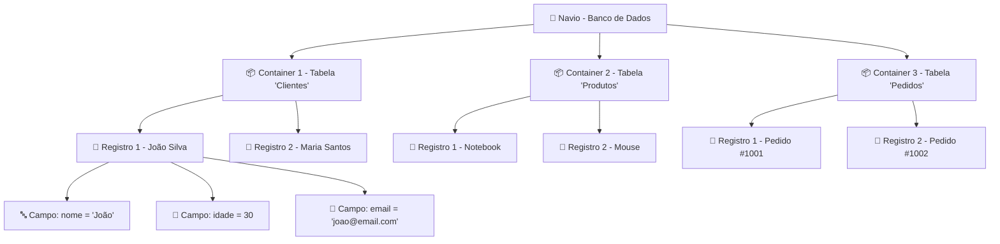
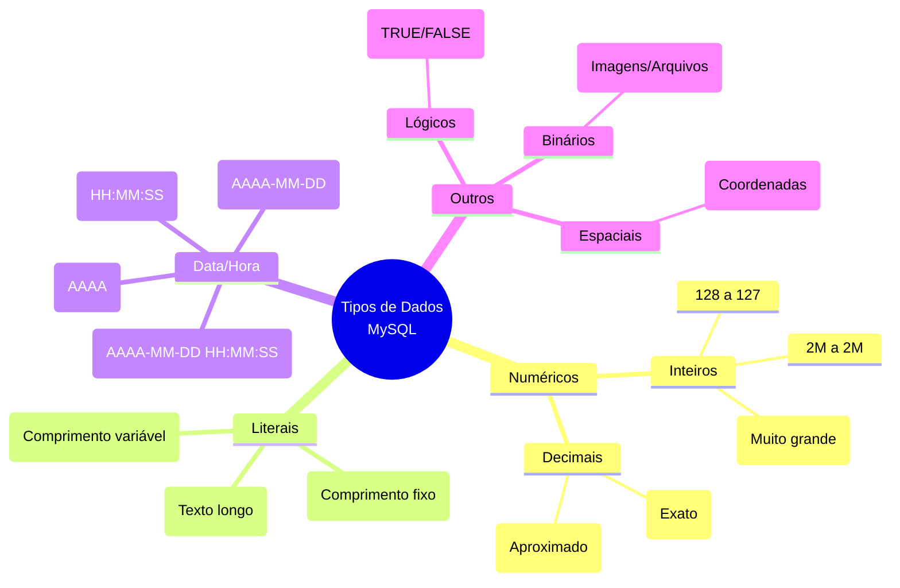

# 📚 Aula 3 - Estrutura e Tipos de Dados no MySQL

---

## 🎯 Objetivos da Aula

* Compreender a analogia estrutural do banco de dados como um navio
* Dominar os comandos básicos de criação e manipulação de estruturas
* Conhecer e aplicar os tipos primitivos de dados do MySQL
* Entender a importância fundamental das chaves primárias
* Configurar e utilizar o ambiente de desenvolvimento WAMP + MySQL Workbench
* Criar nossas primeiras tabelas com estrutura adequada

---

## 🚢 Analogia Estrutural: O Navio e os Containers

### Visão Geral da Arquitetura



### Correspondência Técnica
| Analogia Naval | Termo Técnico | Exemplo |
|----------------|---------------|---------|
| **Navio** | **Banco de Dados** | `escola`, `empresa`, `ecommerce` |
| **Container** | **Tabela** | `alunos`, `produtos`, `pedidos` |
| **Pacote/Caixa** | **Registro/Linha** | Dados de um aluno específico |
| **Etiqueta/Info** | **Campo/Coluna** | `nome`, `idade`, `email` |

**Regra Fundamental**:
```
Banco de Dados → Conjunto de Tabelas
Tabela → Conjunto de Registros
Registro → Conjunto de Campos
```

---

## ⌨️ Comandos Básicos de SQL (Fundamentais!)

### Por que aprender comandos manuais?
```text
✅ Independência de ferramentas gráficas
✅ Programação em PHP, Java, Python, etc.
✅ Automação de scripts
✅ Resolução de problemas em produção
✅ Entendimento profundo do funcionamento
```

### Grupo 1: Comandos de Banco de Dados

```sql
-- 1. Criar um banco de dados (navio)
CREATE DATABASE escola;

-- 2. Listar todos os bancos existentes
SHOW DATABASES;

-- 3. Selecionar/Usar um banco específico
USE escola;

-- 4. Excluir um banco de dados (CUIDADO!)
DROP DATABASE escola;

-- 5. Verificar qual banco está em uso
SELECT DATABASE();
```

### Grupo 2: Comandos de Tabela

```sql
-- 1. Criar uma tabela (container)
CREATE TABLE aluno (
    id INT,
    nome VARCHAR(100),
    idade INT
);

-- 2. Listar tabelas do banco atual
SHOW TABLES;

-- 3. Ver estrutura detalhada de uma tabela
DESCRIBE aluno;      -- Forma completa
DESC aluno;          -- Forma abreviada

-- 4. Excluir uma tabela
DROP TABLE aluno;

-- 5. Renomear uma tabela
RENAME TABLE aluno TO estudantes;
```

### Grupo 3: Comandos Avançados de Estrutura

```sql
-- 1. Adicionar nova coluna
ALTER TABLE aluno ADD COLUMN email VARCHAR(100);

-- 2. Modificar tipo de coluna existente
ALTER TABLE aluno MODIFY COLUMN idade TINYINT;

-- 3. Renomear coluna
ALTER TABLE aluno CHANGE COLUMN idade idade_aluno TINYINT;

-- 4. Remover coluna
ALTER TABLE aluno DROP COLUMN email;

-- 5. Adicionar chave primária posteriormente
ALTER TABLE aluno ADD PRIMARY KEY (id);
```

---

## 📊 Tipos Primitivos de Dados

### Árvore de Tipos de Dados MySQL



### 1. Tipos Numéricos - Escolha Inteligente!

```sql
-- INTEIROS - Escolha pelo tamanho necessário
CREATE TABLE exemplos_numericos (
    -- Para idades (0-120) - 1 byte
    idade TINYINT UNSIGNED,           -- 0 a 255 (3 bytes economizados!)
    
    -- Para IDs normais - 4 bytes
    id INT PRIMARY KEY AUTO_INCREMENT,
    
    -- Para números muito grandes (ex: CPF sem formatação)
    cpf BIGINT,                       -- 8 bytes
    
    -- Para preços/dinheiro - PRECISÃO!
    preco DECIMAL(10, 2),             -- Ex: 99999999.99
    preco_aprox FLOAT(8, 2)           -- Para cálculos científicos
);
```

**Regra de Ouro**: Use o menor tipo que atenda sua necessidade!

### 2. Tipos Literais (Texto) - Performance Importa!

```sql
CREATE TABLE exemplos_texto (
    -- CHAR: Tamanho fixo (preenchido com espaços)
    sexo CHAR(1),                     -- 'M' ou 'F' - SEMPRE 1 byte
    uf CHAR(2),                       -- 'SP', 'RJ' - SEMPRE 2 bytes
    
    -- VARCHAR: Tamanho variável (mais comum)
    nome VARCHAR(100),                -- Até 100 caracteres
    endereco VARCHAR(255),            -- Tamanho comum para endereços
    
    -- TEXT: Para textos MUITO longos
    descricao TEXT,                   -- Até 65,535 caracteres
    historia LONGTEXT                 -- Até 4GB de texto!
);
```

**Comparação CHAR vs VARCHAR**:
```sql
-- CHAR(10) com valor 'OK'
'OK        '  -- 10 bytes (8 espaços extras)

-- VARCHAR(10) com valor 'OK'
'OK'          -- 2 bytes + 1 byte de controle = 3 bytes
```

### 3. Tipos de Data e Hora - Precisão Temporal

```sql
CREATE TABLE exemplos_data (
    -- Apenas data
    data_nascimento DATE,             -- '2005-05-15'
    
    -- Data e hora completas
    data_cadastro DATETIME,           -- '2024-01-31 14:30:00'
    data_atualizacao TIMESTAMP,       -- Auto-atualiza com NOW()
    
    -- Apenas hora
    hora_entrada TIME,                -- '08:30:00'
    
    -- Apenas ano
    ano_fabricacao YEAR               -- 2024
);
```

### 4. Outros Tipos Úteis

```sql
CREATE TABLE exemplos_especiais (
    -- Boolean (na verdade é TINYINT(1))
    ativo BOOLEAN DEFAULT TRUE,       -- TRUE = 1, FALSE = 0
    
    -- Binários (imagens, PDFs, etc)
    foto BLOB,                        -- Até 65KB
    documento MEDIUMBLOB,             -- Até 16MB
    
    -- Valores pré-definidos
    status ENUM('ativo', 'inativo', 'pendente'),
    tamanho SET('P', 'M', 'G', 'GG')
);
```

---

## 🔑 A Importância CRÍTICA da Chave Primária

### O Problema: Duplicação de Registros

```sql
-- SEM chave primária - DESASTRE!
CREATE TABLE cliente_errado (
    nome VARCHAR(100),
    cpf VARCHAR(11)
);

-- Inserções problemáticas
INSERT INTO cliente_errado VALUES ('João', '12345678901');
INSERT INTO cliente_errado VALUES ('João', '12345678901'); -- DUPLICADO!
INSERT INTO cliente_errado VALUES ('João', '12345678901'); -- DE NOVO!

-- Resultado: 3 registros IDÊNTICOS!
```

### A Solução: Chave Primária (PRIMARY KEY)

```sql
-- COM chave primária - ORGANIZADO!
CREATE TABLE cliente_correto (
    id INT PRIMARY KEY AUTO_INCREMENT,  -- ← CHAVE PRIMÁRIA
    nome VARCHAR(100) NOT NULL,
    cpf VARCHAR(11) UNIQUE NOT NULL    -- ← CHAVE ALTERNATIVA
);

-- Tentativa de duplicação
INSERT INTO cliente_correto (nome, cpf) VALUES ('João', '12345678901');
INSERT INTO cliente_correto (nome, cpf) VALUES ('João', '12345678901');
-- ERRO: Duplicate entry '12345678901' for key 'cpf'
```

### Propriedades da Chave Primária
```text
✅ ÚNICA: Não permite valores repetidos
✅ NÃO NULA: Sempre tem um valor
✅ IDENTIFICADORA: Identifica cada registro exclusivamente
✅ ÍNDICE: Cria índice automático para busca rápida
```

### Tipos de Chaves Primárias
```sql
-- 1. Simples (um campo)
CREATE TABLE exemplo1 (
    id INT PRIMARY KEY
);

-- 2. Composta (múltiplos campos)
CREATE TABLE exemplo2 (
    aluno_id INT,
    disciplina_id INT,
    nota DECIMAL(4,2),
    PRIMARY KEY (aluno_id, disciplina_id)
);

-- 3. Natural vs Surrogate
CREATE TABLE exemplo3 (
    -- Surrogate: Criada apenas para identificação
    id INT PRIMARY KEY AUTO_INCREMENT,
    
    -- Natural: Já existe no mundo real
    cpf VARCHAR(11) UNIQUE,
    email VARCHAR(100) UNIQUE
);
```

---

## 🛠️ Ambiente de Desenvolvimento

### Opção 1: WAMP Server (Windows)
```text
O que é: Pacote completo para Windows
Componentes:
├── Windows (Sistema Operacional)
├── Apache (Servidor Web)
├── MySQL (Banco de Dados)
└── PHP (Linguagem de Programação)

Vantagens:
✓ Tudo em um só instalador
✓ Configuração automática
✓ Ideal para PHP + MySQL
✓ Painel de controle fácil

Download: https://www.wampserver.com/
```

### Opção 2: XAMPP (Multiplataforma)
```text
Para: Windows, Linux, macOS
Componentes similares ao WAMP
Download: https://www.apachefriends.org/
```

### Opção 3: MySQL Standalone + Workbench
```text
Para: Quem já tem servidor web ou usa Java/Python
Componentes:
├── MySQL Server (Motor do banco)
└── MySQL Workbench (Interface gráfica)

Vantagens:
✓ Mais leve
✓ Foco apenas no MySQL
✓ Ideal para Java, Python, C#
```

### Conectando via MySQL Workbench

```sql
-- Configuração típica:
Hostname: localhost  ou  127.0.0.1
Port: 3306
Username: root
Password: [sua senha]

-- Teste de conexão bem-sucedida
SELECT @@version;  -- Mostra versão do MySQL
SELECT NOW();      -- Mostra data/hora atual
```

### Terminal/Console (Opção Avançada)
```bash
# Acesso via linha de comando
mysql -u root -p

# Comandos úteis no terminal
mysql> \s          # Status do servidor
mysql> \h          # Ajuda
mysql> \q          # Sair (ou EXIT)
mysql> source arquivo.sql  # Executar script
```

---

## 🏗️ Exemplo Prático Completo

### Criando um Sistema de Biblioteca

```sql
-- 1. Criar banco de dados
CREATE DATABASE biblioteca;
USE biblioteca;

-- 2. Tabela de Autores
CREATE TABLE autor (
    id INT PRIMARY KEY AUTO_INCREMENT,
    nome VARCHAR(100) NOT NULL,
    nacionalidade VARCHAR(50),
    data_nascimento DATE,
    UNIQUE KEY idx_autor_nome (nome)
);

-- 3. Tabela de Livros
CREATE TABLE livro (
    id INT PRIMARY KEY AUTO_INCREMENT,
    titulo VARCHAR(200) NOT NULL,
    isbn VARCHAR(13) UNIQUE NOT NULL,
    ano_publicacao YEAR,
    paginas SMALLINT UNSIGNED,
    preco DECIMAL(6,2),
    disponivel BOOLEAN DEFAULT TRUE,
    autor_id INT,
    FOREIGN KEY (autor_id) REFERENCES autor(id)
);

-- 4. Tabela de Usuários
CREATE TABLE usuario (
    id INT PRIMARY KEY AUTO_INCREMENT,
    nome VARCHAR(100) NOT NULL,
    email VARCHAR(100) UNIQUE NOT NULL,
    telefone VARCHAR(15),
    data_cadastro DATETIME DEFAULT CURRENT_TIMESTAMP,
    ativo BOOLEAN DEFAULT TRUE
);

-- 5. Verificar estrutura
SHOW TABLES;
DESCRIBE livro;
```

### Inserindo Dados de Teste

```sql
-- Inserir autores
INSERT INTO autor (nome, nacionalidade, data_nascimento)
VALUES 
    ('Machado de Assis', 'Brasileira', '1839-06-21'),
    ('Clarice Lispector', 'Brasileira', '1920-12-10'),
    ('George Orwell', 'Britânica', '1903-06-25');

-- Inserir livros
INSERT INTO livro (titulo, isbn, ano_publicacao, paginas, preco, autor_id)
VALUES
    ('Dom Casmurro', '9788535902775', 1899, 256, 29.90, 1),
    ('1984', '9788535902776', 1949, 328, 39.90, 3),
    ('A Hora da Estrela', '9788535902777', 1977, 96, 24.90, 2);

-- Consultar dados
SELECT * FROM autor;
SELECT titulo, ano_publicacao FROM livro WHERE disponivel = TRUE;
```

---

## 📋 Resumo Rápido

* **Analogia do navio**: Banco → Tabelas → Registros → Campos
* **Comandos SQL fundamentais**: `CREATE`, `USE`, `SHOW`, `DESCRIBE`
* **Tipos de dados**: Escolha o MENOR que atenda sua necessidade
* **Chave primária é OBRIGATÓRIA**: Evita duplicação, identifica registros
* **CHAR vs VARCHAR**: Fixo vs Variável (VARCHAR é mais comum)
* **WAMP/MAMP/XAMPP**: Pacotes completos para desenvolvimento
* **MySQL Workbench**: Interface gráfica recomendada

---

## 💡 Dica 

"Pergunte-se sempre: 'Que operações farei com este dado?' Isso define o tipo ideal. Um CPF é número, mas você nunca fará cálculos com ele - use VARCHAR! Uma idade é pequena - use TINYINT! Economize bytes, ganhe performance."

> 🧠 **Exercício Prático**:
> 1. Crie um banco `empresa`
> 2. Crie tabela `funcionario` com: id(PK), nome, cargo, salario(DECIMAL), data_admissao(DATE), ativo(BOOLEAN)
> 3. Crie tabela `departamento` com: id(PK), nome, orcamento(DECIMAL)
> 4. Insira 5 funcionários e 3 departamentos
> 5. Liste funcionários admitidos após 2020

---