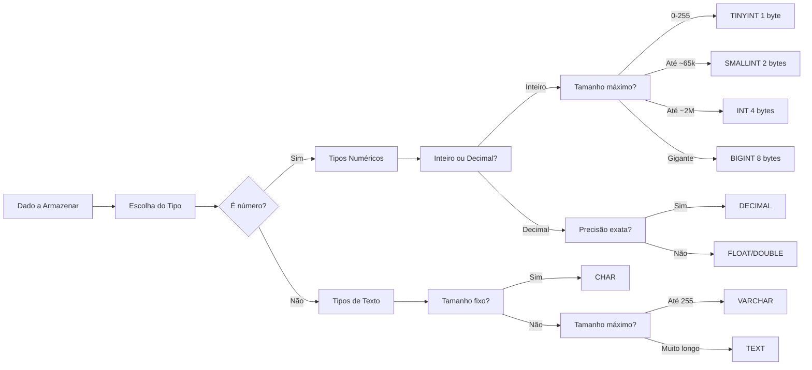
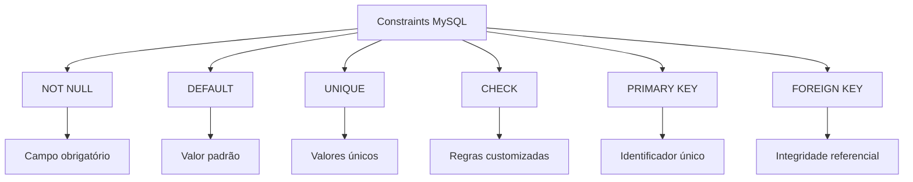

# 📚 Aula 4 - Otimização e Boas Práticas no MySQL

---

## 🎯 Objetivos da Aula

* Entender como remover e recriar estruturas no MySQL durante o desenvolvimento
* Implementar corretamente o suporte a caracteres UTF-8
* Compreender a importância da escolha adequada de tipos primitivos
* Conhecer o uso de constraints para garantir integridade de dados
* Entender o papel da chave primária na identificação de registros
* Reconhecer detalhes importantes de sintaxe em SQL

---

## 🗑️ Gerenciamento e Exclusão de Estruturas

Durante a fase inicial de desenvolvimento, quando ainda não existem dados importantes armazenados, é comum recriar a estrutura do banco de dados.

### Removendo um banco de dados

```sql
DROP DATABASE nome_do_banco;
```

O comando **DROP** remove completamente a estrutura existente.

> ⚠️ Atenção: este comando apaga permanentemente o banco de dados e tudo o que estiver dentro dele.

---

### Comandos de Exclusão Controlada

```sql
-- ⚠️ COMANDO PERIGOSO - USE COM CUIDADO!
DROP DATABASE escola;  -- Apaga TUDO: estrutura + dados

-- Alternativas mais seguras durante desenvolvimento:
DROP DATABASE IF EXISTS escola;  -- Só apaga se existir
CREATE DATABASE escola;          -- Recria vazio

-- Para tabelas específicas:
DROP TABLE IF EXISTS aluno;
DROP TABLE IF EXISTS professor, disciplina, turma;

-- Exclusão parcial (apenas dados):
TRUNCATE TABLE aluno;  -- Mantém estrutura, remove dados
DELETE FROM aluno WHERE id > 100;  -- Exclusão seletiva
```

### Fluxo de Desenvolvimento Seguro

```sql
-- 1. Primeiro, verifique o que existe
SHOW DATABASES;
SHOW TABLES;

-- 2. Faça backup mental (ou real)
-- Comente o que está fazendo:
/*
Estou recriando o banco 'escola' 
porque preciso refazer a estrutura.
Dados atuais: apenas de teste.
*/

-- 3. Execute com segurança
DROP DATABASE IF EXISTS escola;
CREATE DATABASE escola;
USE escola;

-- 4. Confirme
SELECT DATABASE();  -- Mostra: escola
```

---

## 🌐 Aprimorando o CREATE DATABASE (UTF‑8)

Para evitar problemas com acentuação e caracteres especiais, recomenda-se definir o padrão de codificação já na criação do banco.

### O Problema dos Caracteres Especiais

```sql
-- ❌ PROBLEMA: Caracteres estranhos
CREATE DATABASE escola;
-- Inserindo: "João São Paulo"
-- Resultado: "João São Paulo"

-- ✅ SOLUÇÃO: UTF-8 desde a criação
CREATE DATABASE escola
DEFAULT CHARACTER SET utf8mb4
DEFAULT COLLATE utf8_general_ci;
```

### CHARACTER SET

Define o conjunto de caracteres suportados pelo banco.

```text
UTF-8 suporta:
- Acentuação
- Caracteres especiais
- Múltiplos idiomas
```

### COLLATE

Define as regras de **comparação e ordenação de texto**.

### O ponto e vírgula no SQL
> O ponto e vírgula ";" indica o **fim de um comando SQL**, independentemente do número de linhas utilizadas.

---

## ⚙️ Otimização de Tipos Primitivos

### Princípio: "Menos é Mais"



### Otimização Numérica - Economize Bytes!

```sql
CREATE TABLE pessoa_otimizada (
    -- ❌ INT(11) para idade: 4 bytes
    -- ✅ TINYINT UNSIGNED: 1 byte (0-255)
    idade TINYINT UNSIGNED,
    
    -- ❌ INT para número de filhos: 4 bytes  
    -- ✅ TINYINT: 1 byte (-128 a 127)
    filhos TINYINT,
    
    -- ❌ INT para código postal: 4 bytes
    -- ✅ MEDIUMINT UNSIGNED: 3 bytes (0-16M)
    cep MEDIUMINT UNSIGNED,
    
    -- Para preços: SEMPRE DECIMAL
    -- ❌ FLOAT(10,2): aproximado
    -- ✅ DECIMAL(10,2): exato
    salario DECIMAL(10,2),      -- Até 99.999.999,99
    altura DECIMAL(3,2),        -- 1.75, 2.10, etc.
    peso DECIMAL(5,2),          -- 85.50, 120.75
    
    -- Para datas dinâmicas
    -- ❌ INT para idade: precisa atualizar
    -- ✅ DATE: sistema calcula idade
    data_nascimento DATE,
    
    -- Cálculo de idade automático
    -- (idade em anos)
    idade_calculada TINYINT 
        AS (TIMESTAMPDIFF(YEAR, data_nascimento, CURDATE()))
        VIRTUAL
);
```

### ENUM vs VARCHAR para Valores Fixos

```sql
CREATE TABLE exemplos_enum (
    -- ❌ VARCHAR para gênero: 1-10 bytes
    -- ✅ ENUM: 1-2 bytes + validação
    genero ENUM('M', 'F', 'O') NOT NULL,
    
    -- ❌ VARCHAR para estados: 2 bytes + overhead
    -- ✅ ENUM: 1 byte + lista controlada
    uf ENUM(
        'AC','AL','AP','AM','BA','CE','DF','ES','GO',
        'MA','MT','MS','MG','PA','PB','PR','PE','PI',
        'RJ','RN','RS','RO','RR','SC','SP','SE','TO'
    ),
    
    -- ❌ VARCHAR para status: vários tamanhos
    -- ✅ ENUM: tamanho fixo + validação
    status_pedido ENUM(
        'pendente', 
        'processando', 
        'enviado', 
        'entregue', 
        'cancelado'
    ) DEFAULT 'pendente',
    
    -- Para muitas opções (>20), use tabela separada
    -- ENUM não é escalável para muitas opções
    cidade_id SMALLINT  -- Referência para tabela cidades
);
```

---

## 🛡️ Constraints (Regras de Integridade)

Constraints garantem **consistência e confiabilidade dos dados**.

### Sistema de Constraints no MySQL



### Exemplos Práticos de Constraints

```sql
CREATE TABLE cliente_profissional (
    -- PRIMARY KEY: identificador único obrigatório
    id INT PRIMARY KEY AUTO_INCREMENT, // Gera automaticamente valores sequenciais para novos registros.
    
    -- NOT NULL: campo obrigatório
    nome VARCHAR(100) NOT NULL,
    cpf VARCHAR(11) NOT NULL,
    
    -- UNIQUE: valor único no banco
    email VARCHAR(100) UNIQUE NOT NULL,
    
    -- DEFAULT: valor inicial automático
    data_cadastro DATETIME DEFAULT CURRENT_TIMESTAMP,
    ativo BOOLEAN DEFAULT TRUE,
    nacionalidade VARCHAR(30) DEFAULT 'Brasil',
    
    -- CHECK: validação customizada (MySQL 8.0+)
    idade TINYINT CHECK (idade >= 18),
    salario DECIMAL(10,2) CHECK (salario > 0),
    
    -- Combinação de constraints
    telefone VARCHAR(15) UNIQUE,
    
    -- INDEX para performance
    INDEX idx_nome (nome),
    INDEX idx_data_cad (data_cadastro)
);

-- AUTO_INCREMENT em ação
INSERT INTO cliente_profissional (nome, cpf, email) 
VALUES ('Maria Silva', '12345678901', 'maria@email.com');
-- id = 1 (gerado automaticamente)

INSERT INTO cliente_profissional (nome, cpf, email) 
VALUES ('João Santos', '98765432109', 'joao@email.com');
-- id = 2 (sequencial)
```

---

## 🔑 Chave Primária (PRIMARY KEY)

A **chave primária** identifica cada registro de forma única.

```sql
id INT AUTO_INCREMENT PRIMARY KEY
```

### Por que a PK é Essencial?

```sql
-- CENÁRIO SEM PRIMARY KEY - CAOS!
CREATE TABLE aluno_sem_pk (
    nome VARCHAR(100),
    matricula VARCHAR(20)
);

-- Problema 1: Duplicação
INSERT INTO aluno_sem_pk VALUES ('Ana', '2024001');
INSERT INTO aluno_sem_pk VALUES ('Ana', '2024001'); -- Aceita!

-- Problema 2: Dificuldade para atualizar
UPDATE aluno_sem_pk SET nome = 'Ana Silva' WHERE nome = 'Ana';
-- Atualiza TODAS as Anas!

-- Problema 3: Dificuldade para excluir
DELETE FROM aluno_sem_pk WHERE matricula = '2024001';
-- Pode excluir vários registros acidentalmente

-- CENÁRIO COM PRIMARY KEY - ORGANIZAÇÃO!
CREATE TABLE aluno_com_pk (
    id INT PRIMARY KEY AUTO_INCREMENT,  -- Identificador único
    nome VARCHAR(100),
    matricula VARCHAR(20) UNIQUE        -- Garante matrícula única
);

-- Agora cada registro é único e identificável
INSERT INTO aluno_com_pk (nome, matricula) VALUES ('Ana', '2024001');
INSERT INTO aluno_com_pk (nome, matricula) VALUES ('Ana', '2024002'); -- OK, nome pode repetir
INSERT INTO aluno_com_pk (nome, matricula) VALUES ('João', '2024001'); -- ERRO! matrícula duplicada
```

---

### AUTO_INCREMENT - O Sequenciador Automático

```sql
CREATE TABLE exemplos_auto_increment (
    -- Padrão: inicia em 1, incrementa de 1 em 1
    id1 INT PRIMARY KEY AUTO_INCREMENT,
    
    -- Iniciando de um valor específico
    id2 INT PRIMARY KEY AUTO_INCREMENT = 1000,
    
    -- Incremento personalizado
    -- (Precisa de configuração especial)
    
    -- Resetando o contador
    -- DELETE FROM tabela;  -- NÃO reseta auto_increment
    -- TRUNCATE TABLE tabela;  -- RESETA para 1
    
    -- Ver próximo valor
    -- SELECT AUTO_INCREMENT 
    -- FROM information_schema.TABLES
    -- WHERE TABLE_NAME = 'exemplos_auto_increment';
);

-- Inserções demonstram o sequenciamento
INSERT INTO exemplos_auto_increment (id1) VALUES (NULL); -- id1 = 1
INSERT INTO exemplos_auto_increment (id1) VALUES (NULL); -- id1 = 2
INSERT INTO exemplos_auto_increment (id1) VALUES (100);  -- id1 = 100 (valor explícito)
INSERT INTO exemplos_auto_increment (id1) VALUES (NULL); -- id1 = 101 (continua do maior)
```

---

## 📝 Detalhes de Sintaxe

### Aspas simples

```sql
'texto' 
'Valor'
```

Usadas para valores literais em SQL.

---

### Crase (backtick)

```sql
`nome_da_tabela`
```

Permite nomes com caracteres especiais, mas **não é recomendado** em modelagens profissionais.

---

## 📊 Resumo Rápido

* DROP DATABASE remove estruturas durante o desenvolvimento
* UTF‑8 evita problemas com acentuação
* **Otimização de tipos**: Escolha o menor tipo que atenda sua necessidade
* **Constraints**: `NOT NULL`, `DEFAULT`, `UNIQUE`, `CHECK` garantem qualidade
* **Primary Key**: OBRIGATÓRIA em toda tabela, preferencialmente `AUTO_INCREMENT`
* SQL possui regras simples, mas importantes, de sintaxe

---

> 💡 Dica: Um banco de dados bem modelado evita problemas antes mesmo que eles aconteçam. Escolher corretamente tipos, constraints e chaves é tão importante quanto escrever consultas SQL.
