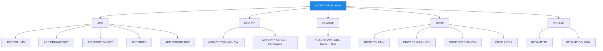
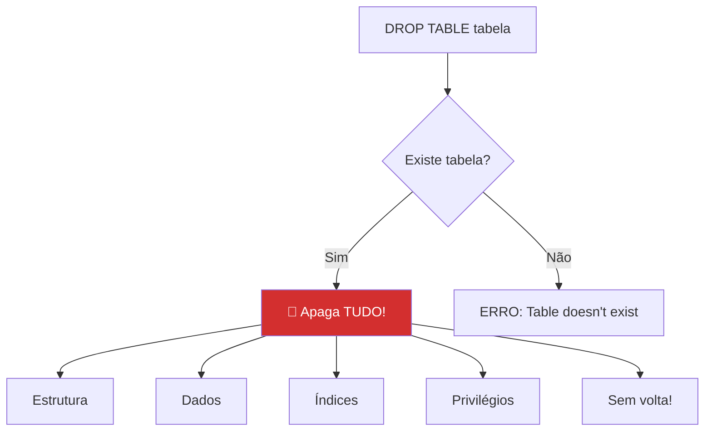

# 📚 Aula 6 - Modificação de Estruturas: ALTER TABLE

---

## 🎯 Objetivos da Aula

* Dominar o comando ALTER TABLE para modificação de estruturas
* Compreender as diferenças entre ADD, MODIFY, CHANGE e DROP
* Aprender técnicas avançadas de posicionamento de colunas
* Implementar constraints pós-criação com segurança
* Utilizar comandos DDL com boas práticas e prevenção de erros
* Gerenciar integridade durante alterações estruturais

---

## 🏗️ O Comando ALTER TABLE: O Construtor Flexível

### Visão Geral das Operações ALTER TABLE


```mermaid
graph TD
    A[ALTER TABLE tabela] --> B[ADD]
    A --> C[MODIFY]
    A --> D[CHANGE]
    A --> E[DROP]
    A --> F[RENAME]
    
    B --> B1[ADD COLUMN]
    B --> B2[ADD PRIMARY KEY]
    B --> B3[ADD FOREIGN KEY]
    B --> B4[ADD INDEX]
    B --> B5[ADD CONSTRAINT]
    
    C --> C1[MODIFY COLUMN - Tipo]
    C --> C2[MODIFY COLUMN - Constraints]
    
    D --> D1[CHANGE COLUMN - Nome + Tipo]
    
    E --> E1[DROP COLUMN]
    E --> E2[DROP PRIMARY KEY]
    E --> E3[DROP FOREIGN KEY]
    E --> E4[DROP INDEX]
    
    F --> F1[RENAME TO]
    F --> F2[RENAME COLUMN]
    
    style A fill:#1E88E5,color:#fff
```

### 1. Adicionar Colunas (ADD COLUMN)

```sql
-- Criar tabela base para exemplos
CREATE TABLE aluno_base (
    id INT,
    nome VARCHAR(100)
);

-- ✅ ADICIONAR COLUNA BÁSICA (ao final por padrão)
ALTER TABLE aluno_base ADD COLUMN idade INT;
-- Resultado: id, nome, idade

-- ✅ POSICIONAMENTO ESTRATÉGICO
-- Adicionar como PRIMEIRA coluna
ALTER TABLE aluno_base ADD COLUMN matricula VARCHAR(20) FIRST;
-- Resultado: matricula, id, nome, idade

-- Adicionar APÓS uma coluna específica
ALTER TABLE aluno_base ADD COLUMN email VARCHAR(100) AFTER nome;
-- Resultado: matricula, id, nome, email, idade

-- ✅ ADICIONAR COM CONSTRAINTS E VALOR DEFAULT
ALTER TABLE aluno_base 
ADD COLUMN ativo BOOLEAN DEFAULT TRUE AFTER idade;

ALTER TABLE aluno_base 
ADD COLUMN data_nascimento DATE NOT NULL DEFAULT '2000-01-01';

-- ❌ PROBLEMA COMUM: Adicionar NOT NULL sem DEFAULT
-- Se a tabela já tem dados, isso causa ERRO:
ALTER TABLE aluno_base ADD COLUMN cpf VARCHAR(11) NOT NULL;
-- ERRO: Invalid use of NULL value

-- ✅ SOLUÇÃO: Adicionar com DEFAULT primeiro, depois ajustar
ALTER TABLE aluno_base 
ADD COLUMN cpf VARCHAR(11) DEFAULT '00000000000';

-- Depois de preencher os dados, pode tornar NOT NULL
UPDATE aluno_base SET cpf = CONCAT('CPF', id) WHERE cpf = '00000000000';
ALTER TABLE aluno_base MODIFY COLUMN cpf VARCHAR(11) NOT NULL;
```

### 2. Modificar Colunas (MODIFY)

```sql
-- ✅ MUDAR TIPO DE DADO (mantendo nome)
ALTER TABLE aluno_base MODIFY COLUMN idade TINYINT UNSIGNED;

-- ✅ ADICIONAR/REMOVER CONSTRAINTS
ALTER TABLE aluno_base MODIFY COLUMN nome VARCHAR(100) NOT NULL;
ALTER TABLE aluno_base MODIFY COLUMN email VARCHAR(100) UNIQUE;

-- ✅ AUMENTAR/DIMINUIR TAMANHO
ALTER TABLE aluno_base MODIFY COLUMN nome VARCHAR(150);  -- Aumentar
ALTER TABLE aluno_base MODIFY COLUMN nome VARCHAR(50);   -- Diminuir
-- Cuidado: Se dados excederem novo tamanho, haverá truncamento!

-- ✅ MUDAR VALOR DEFAULT
ALTER TABLE aluno_base MODIFY COLUMN ativo BOOLEAN DEFAULT FALSE;

-- ✅ POSICIONAMENTO COM MODIFY
ALTER TABLE aluno_base MODIFY COLUMN idade INT AFTER nome;

-- 🚨 LIMITAÇÕES DO MODIFY:
-- 1. Não pode mudar o nome da coluna
-- 2. Algumas mudanças requerem recriação da tabela (lento em grandes tabelas)
```

### 3. Mudar Nome e Estrutura (CHANGE)

```sql
-- ✅ MUDAR APENAS O NOME (mantendo tipo e constraints)
ALTER TABLE aluno_base CHANGE COLUMN idade idade_aluno INT;

-- ✅ MUDAR NOME E TIPO SIMULTANEAMENTE
ALTER TABLE aluno_base 
CHANGE COLUMN email email_contato VARCHAR(150) NOT NULL;

-- ✅ MUDAR TUDO: nome, tipo, constraints e posição
ALTER TABLE aluno_base 
CHANGE COLUMN matricula codigo_matricula VARCHAR(25) 
UNIQUE NOT NULL 
FIRST;

-- 📊 COMPARAÇÃO: MODIFY vs CHANGE
-- MODIFY:  ALTER TABLE tabela MODIFY coluna novo_tipo;
-- CHANGE: ALTER TABLE tabela CHANGE coluna_antiga nova_coluna novo_tipo;

-- Para apenas renomear sem mudar tipo:
ALTER TABLE aluno_base CHANGE idade idade_aluno INT;  -- Repete o tipo atual
```

### 4. Remover Colunas (DROP COLUMN)

```sql
-- ✅ REMOVER COLUNA SIMPLES
ALTER TABLE aluno_base DROP COLUMN idade_aluno;

-- ✅ REMOVER MÚLTIPLAS COLUNAS (em uma única operação)
ALTER TABLE aluno_base 
DROP COLUMN email_contato,
DROP COLUMN cpf;

-- ⚠️ PERIGOS DO DROP COLUMN:
-- 1. Dados são perdidos PERMANENTEMENTE
-- 2. Não há lixeira/reciclagem
-- 3. Índices que usam a coluna também são removidos

-- ✅ BOA PRÁTICA: Backup antes de remover
CREATE TABLE aluno_backup AS SELECT * FROM aluno_base;
-- Ou exportar para arquivo:
-- SELECT * INTO OUTFILE '/tmp/backup.csv' FROM aluno_base;

-- ❌ NÃO FAÇA: Remover coluna usada em chave estrangeira
CREATE TABLE endereco (
    id INT PRIMARY KEY,
    aluno_id INT,
    FOREIGN KEY (aluno_id) REFERENCES aluno_base(id)
);

ALTER TABLE aluno_base DROP COLUMN id;  -- ERRO! Coluna referenciada

-- ✅ PRIMEIRO: Remover a constraint
ALTER TABLE endereco DROP FOREIGN KEY endereco_ibfk_1;
-- Depois pode remover a coluna
ALTER TABLE aluno_base DROP COLUMN id;
```

### 5. Renomear Tabela (RENAME)

```sql
-- ✅ RENOMEAR TABELA COMPLETA
ALTER TABLE aluno_base RENAME TO estudante;

-- ✅ RENOMEAR MÚLTIPLAS TABELAS (MySQL 8.0+)
ALTER TABLE tabela1 RENAME TO nova_tabela1,
             tabela2 RENAME TO nova_tabela2;

-- ⚠️ ATENÇÃO: Renomear quebra referências
-- Views, stored procedures e aplicações podem parar de funcionar

-- ✅ VERIFICAR DEPENDÊNCIAS ANTES DE RENOMEAR
SELECT 
    TABLE_NAME,
    COLUMN_NAME,
    CONSTRAINT_NAME,
    REFERENCED_TABLE_NAME,
    REFERENCED_COLUMN_NAME
FROM INFORMATION_SCHEMA.KEY_COLUMN_USAGE
WHERE TABLE_SCHEMA = DATABASE()
AND REFERENCED_TABLE_NAME = 'aluno_base';
```

---

## 💀 O Comando DROP TABLE: O Exterminador

### Entendendo o Poder do DROP


```mermaid
flowchart TD
    A[DROP TABLE tabela] --> B{Existe tabela?}
    B -->|Sim| C[🚨 Apaga TUDO!]
    C --> C1[Estrutura]
    C --> C2[Dados]
    C --> C3[Índices]
    C --> C4[Privilégios]
    C --> C5[Sem volta!]
    B -->|Não| D[ERRO: Table doesn't exist]
    
    style C fill:#d32f2f,color:#fff
```

### Uso Seguro do DROP TABLE

```sql
-- ❌ PERIGOSO: DROP sem verificação
DROP TABLE estudante;  -- Se não existir: ERRO

-- ✅ SEGURO: Com IF EXISTS
DROP TABLE IF EXISTS estudante;  -- Se não existir: apenas aviso

-- ✅ DROP MÚLTIPLO
DROP TABLE IF EXISTS tabela1, tabela2, tabela3;

-- 🔄 CICLO COMPLETO: CREATE → ALTER → DROP
CREATE TABLE teste (id INT);
ALTER TABLE teste ADD COLUMN nome VARCHAR(100);
SELECT * FROM teste;  -- Verifica
DROP TABLE IF EXISTS teste;  -- Limpa

-- 🚨 DROP vs TRUNCATE vs DELETE
DROP TABLE tabela;     -- Remove estrutura + dados + definição
TRUNCATE TABLE tabela; -- Remove dados, mantém estrutura (mais rápido que DELETE)
DELETE FROM tabela;    -- Remove dados linha por linha (pode reverter com ROLLBACK)

-- 📊 COMPARAÇÃO DE COMANDOS DE REMOÇÃO
/*
| Comando   | Estrutura | Dados | Auto-increment | Transação | Velocidade |
|-----------|-----------|-------|----------------|-----------|------------|
| DROP      | ❌ Remove | ❌    | 🔄 Reseta      | ❌ DDL     | 🚀 Muito rápida |
| TRUNCATE  | ✅ Mantém | ❌    | 🔄 Reseta      | ❌ DDL     | 🚀 Rápida |
| DELETE    | ✅ Mantém | ❌    | 🔄 Continua    | ✅ DML     | 🐢 Lenta (linha a linha) |
*/
```

---

## 🛡️ Constraints e Parâmetros Avançados

### 1. IF NOT EXISTS / IF EXISTS - Segurança em DDL

```sql
-- ✅ EVITAR ERROS NA CRIAÇÃO
CREATE TABLE IF NOT EXISTS produto (
    id INT PRIMARY KEY AUTO_INCREMENT,
    nome VARCHAR(100)
);

-- Mesmo se executar múltiplas vezes, não dá erro
CREATE TABLE IF NOT EXISTS produto (
    id INT PRIMARY KEY AUTO_INCREMENT,
    nome VARCHAR(100)
);

-- ✅ EVITAR ERROS NA REMOÇÃO
DROP TABLE IF EXISTS produto_inexistente;  -- Apenas warning, não erro

-- ✅ EM CONJUNTO: Recriação segura de tabelas
DROP TABLE IF EXISTS temp_data;
CREATE TABLE temp_data (
    id INT PRIMARY KEY
);
```

### 2. UNIQUE vs PRIMARY KEY

```sql
CREATE TABLE curso (
    id INT PRIMARY KEY AUTO_INCREMENT,  -- PK: única, não nula, identificadora
    codigo VARCHAR(10) UNIQUE,          -- UNIQUE: única, pode ser nula
    nome VARCHAR(100) NOT NULL UNIQUE   -- Pode ter múltiplos UNIQUE
);

-- ✅ ADICIONAR UNIQUE VIA ALTER TABLE
ALTER TABLE curso ADD UNIQUE INDEX idx_codigo_unico (codigo);

-- ✅ ADICIONAR UNIQUE COMPOSTO (múltiplas colunas)
ALTER TABLE curso ADD CONSTRAINT uc_nome_tipo 
UNIQUE (nome, tipo);

-- ❓ PERGUNTA: Qual a diferença prática?
INSERT INTO curso (codigo, nome) VALUES (NULL, 'Matemática');  -- ✅ Permitido (UNIQUE pode ser NULL)
INSERT INTO curso (id, nome) VALUES (NULL, 'Português');       -- ❌ ERRO (PK não pode ser NULL)
INSERT INTO curso (codigo, nome) VALUES ('MAT101', 'Matemática');
INSERT INTO curso (codigo, nome) VALUES ('MAT101', 'Física');  -- ❌ ERRO (código duplicado)
```

### 3. UNSIGNED - Otimização Numérica

```sql
-- ✅ ECONOMIA DE ESPAÇO
CREATE TABLE metricas (
    -- Com UNSIGNED: 0 a 255 (1 byte)
    visitas TINYINT UNSIGNED,
    
    -- Sem UNSIGNED: -128 a 127 (1 byte)
    temperatura TINYINT,
    
    -- Grande economia em milhões de registros
    populacao INT UNSIGNED,  -- 0 a ~4 bilhões
    altura SMALLINT UNSIGNED -- 0 a 65535 cm (655 metros)
);

-- ✅ ADICIONAR UNSIGNED VIA ALTER
ALTER TABLE metricas 
MODIFY COLUMN visitas SMALLINT UNSIGNED;

-- ⚠️ CUIDADO: Conversão pode truncar dados negativos
UPDATE metricas SET temperatura = -5;
ALTER TABLE metricas MODIFY COLUMN temperatura TINYINT UNSIGNED;
-- Valor -5 se torna 0 (truncado!)
```

### 4. PRIMARY KEY Pós-Criação

```sql
-- ❌ TABELA SEM PRIMARY KEY (problema futuro garantido)
CREATE TABLE cliente_sem_pk (
    nome VARCHAR(100),
    cpf VARCHAR(11)
);

-- ✅ ADICIONAR PRIMARY KEY DEPOIS
ALTER TABLE cliente_sem_pk 
ADD COLUMN id INT FIRST;

UPDATE cliente_sem_pk SET id = @row_number := @row_number + 1;

ALTER TABLE cliente_sem_pk 
ADD PRIMARY KEY (id);

-- OU adicionar PK em coluna existente (se for única)
ALTER TABLE cliente_sem_pk 
ADD PRIMARY KEY (cpf);

-- ✅ ADICIONAR AUTO_INCREMENT DEPOIS
ALTER TABLE cliente_sem_pk 
MODIFY COLUMN id INT AUTO_INCREMENT;

-- ✅ PK COMPOSTA VIA ALTER
CREATE TABLE matricula (
    aluno_id INT,
    disciplina_id INT,
    data DATE
);

ALTER TABLE matricula 
ADD PRIMARY KEY (aluno_id, disciplina_id, data);
```

### 5. COLUMN - Palavra-chave Opcional

```sql
-- ✅ FORMA COMPLETA (mais legível)
ALTER TABLE tabela ADD COLUMN nome VARCHAR(100);

-- ✅ FORMA SIMPLIFICADA (também funciona)
ALTER TABLE tabela ADD nome VARCHAR(100);

-- ✅ AMBAS FUNCIONAM:
ALTER TABLE tabela MODIFY COLUMN idade INT;
ALTER TABLE tabela MODIFY idade INT;

ALTER TABLE tabela CHANGE COLUMN antigo novo VARCHAR(100);
ALTER TABLE tabela CHANGE antigo novo VARCHAR(100);

ALTER TABLE tabela DROP COLUMN idade;
ALTER TABLE tabela DROP idade;

-- 💡 RECOMENDAÇÃO: Use sempre COLUMN para clareza, 
-- especialmente em scripts compartilhados
```

---

## 🚨 Resolução de Problemas Comuns

### 1. Conflito: NOT NULL sem DEFAULT em tabela com dados

```sql
-- CENÁRIO PROBLEMA
CREATE TABLE produto (
    id INT PRIMARY KEY,
    nome VARCHAR(100)
);

INSERT INTO produto VALUES (1, 'Notebook'), (2, 'Mouse');

-- ❌ ESTE COMANDO FALHA:
ALTER TABLE produto ADD COLUMN preco DECIMAL(10,2) NOT NULL;
-- ERRO: Invalid use of NULL value

-- ✅ SOLUÇÃO EM 3 PASSOS:
-- 1. Adicionar com DEFAULT
ALTER TABLE produto ADD COLUMN preco DECIMAL(10,2) DEFAULT 0.00;

-- 2. Atualizar valores (se necessário diferente do DEFAULT)
UPDATE produto SET preco = 2999.90 WHERE id = 1;
UPDATE produto SET preco = 89.90 WHERE id = 2;

-- 3. Tornar NOT NULL
ALTER TABLE produto MODIFY COLUMN preco DECIMAL(10,2) NOT NULL;
```

### 2. Renomear coluna referenciada por VIEW

```sql
-- CENÁRIO: Coluna usada em VIEW
CREATE TABLE pessoa (
    id INT PRIMARY KEY,
    nome_completo VARCHAR(100)
);

CREATE VIEW vw_pessoas AS SELECT nome_completo FROM pessoa;

-- ❌ ESTE COMANDO QUEBRA A VIEW:
ALTER TABLE pessoa CHANGE COLUMN nome_completo nome VARCHAR(100);

-- ✅ SOLUÇÃO:
-- 1. Verificar dependências
SELECT TABLE_NAME, VIEW_DEFINITION 
FROM INFORMATION_SCHEMA.VIEWS 
WHERE TABLE_SCHEMA = DATABASE();

-- 2. DROP da VIEW (ou alterá-la primeiro)
DROP VIEW IF EXISTS vw_pessoas;

-- 3. Renomear coluna
ALTER TABLE pessoa CHANGE COLUMN nome_completo nome VARCHAR(100);

-- 4. Recriar VIEW
CREATE VIEW vw_pessoas AS SELECT nome FROM pessoa;
```

### 3. Alterar tipo com perda de dados

```sql
CREATE TABLE exemplo (
    texto VARCHAR(10)
);

INSERT INTO exemplo VALUES ('1234567890'), ('muito longo');

-- ❌ PERDA DE DADOS SILENCIOSA:
ALTER TABLE exemplo MODIFY COLUMN texto VARCHAR(5);
-- 'muito longo' é truncado para 'muito'

-- ✅ SOLUÇÃO SEGURA:
-- 1. Verificar se há dados que excedem o novo tamanho
SELECT texto, LENGTH(texto) as tamanho 
FROM exemplo 
WHERE LENGTH(texto) > 5;

-- 2. Ajustar dados primeiro
UPDATE exemplo 
SET texto = LEFT(texto, 5) 
WHERE LENGTH(texto) > 5;

-- 3. Aí sim alterar a coluna
ALTER TABLE exemplo MODIFY COLUMN texto VARCHAR(5);
```

---

## 🏗️ Exemplo Prático Completo

### Evolução de uma Tabela de Produtos

```sql
-- FASE 1: Criação inicial (MVP)
CREATE TABLE IF NOT EXISTS produto_v1 (
    id INT PRIMARY KEY AUTO_INCREMENT,
    nome VARCHAR(50) NOT NULL,
    preco DECIMAL(8,2)
);

-- FASE 2: Primeiras melhorias
ALTER TABLE produto_v1 
RENAME TO produto;

ALTER TABLE produto 
MODIFY COLUMN nome VARCHAR(100) NOT NULL,
ADD COLUMN descricao TEXT AFTER nome,
ADD COLUMN categoria VARCHAR(30) DEFAULT 'geral',
ADD COLUMN estoque INT DEFAULT 0;

-- FASE 3: Otimizações e constraints
ALTER TABLE produto 
MODIFY COLUMN preco DECIMAL(10,2) NOT NULL,
ADD CONSTRAINT chk_preco_positivo CHECK (preco > 0),
ADD CONSTRAINT chk_estoque_nao_negativo CHECK (estoque >= 0),
ADD COLUMN data_cadastro DATETIME DEFAULT CURRENT_TIMESTAMP AFTER estoque;

-- FASE 4: Adicionar sistema de fornecedores
CREATE TABLE IF NOT EXISTS fornecedor (
    id INT PRIMARY KEY AUTO_INCREMENT,
    nome VARCHAR(100) NOT NULL,
    cnpj VARCHAR(14) UNIQUE
);

ALTER TABLE produto 
ADD COLUMN fornecedor_id INT AFTER categoria,
ADD CONSTRAINT fk_produto_fornecedor 
FOREIGN KEY (fornecedor_id) REFERENCES fornecedor(id);

-- FASE 5: Adicionar índices para performance
ALTER TABLE produto 
ADD INDEX idx_categoria (categoria),
ADD INDEX idx_preco (preco),
ADD UNIQUE INDEX idx_nome_unico (nome);

-- FASE 6: Correção de problemas (exemplo: nome muito repetido)
-- Remover UNIQUE do nome (se estiver causando problemas)
ALTER TABLE produto 
DROP INDEX idx_nome_unico;

-- Adicionar código único alternativo
ALTER TABLE produto 
ADD COLUMN sku VARCHAR(20) UNIQUE AFTER id;

-- FASE 7: Depreciação e remoção segura
-- Primeiro: marcar como inativo
ALTER TABLE produto 
ADD COLUMN ativo BOOLEAN DEFAULT TRUE;

-- Depois de migrar dados: remover versão antiga
-- CREATE TABLE produto_novo (...);
-- INSERT INTO produto_novo SELECT ... FROM produto WHERE ativo = TRUE;
-- DROP TABLE IF EXISTS produto_old_backup;

-- Verificar estrutura final
DESCRIBE produto;
SHOW CREATE TABLE produto\G
```

---

## 📋 Resumo Rápido

* **ALTER TABLE**: Comando DDL para modificar estrutura de tabelas
* **ADD COLUMN**: Adiciona novas colunas (FIRST, AFTER para posicionamento)
* **MODIFY**: Altera tipo/constraints de coluna existente
* **CHANGE**: Renomeia coluna + altera tipo (nome_antigo novo_nome tipo)
* **DROP COLUMN**: Remove coluna permanentemente (cuidado!)
* **RENAME TO**: Renomeia tabela inteira
* **DROP TABLE**: Apaga tabela completamente (use IF EXISTS)
* **UNIQUE vs PRIMARY KEY**: UNIQUE permite NULLs, PK não
* **UNSIGNED**: Otimiza números positivos (economiza espaço)
* **COLUMN é opcional**: Mas use para clareza
* **Problema NOT NULL**: Adicione com DEFAULT primeiro em tabelas com dados
* **Sempre verifique**: Use DESCRIBE para confirmar alterações

---

## 💡 Regra de Ouro do DBA

"Nunca altere produção sem testar em desenvolvimento primeiro. ALTER TABLE em tabelas grandes pode travar o banco. Sempre tenha um plano de rollback."

> 🧠 **Exercício Desafio**:
> 1. Crie tabela `funcionario` com: id, nome, salario
> 2. Adicione: email (após nome), data_contratacao (como primeira coluna)
> 3. Modifique: salario para DECIMAL(10,2) NOT NULL DEFAULT 0
> 4. Renomeie: nome para nome_completo
> 5. Adicione: departamento_id e chave estrangeira para tabela departamento
> 6. Crie índice no email
> 7. Remova a coluna salario (após fazer backup)
     > **Bônus**: Faça tudo em uma única instrução ALTER TABLE

---