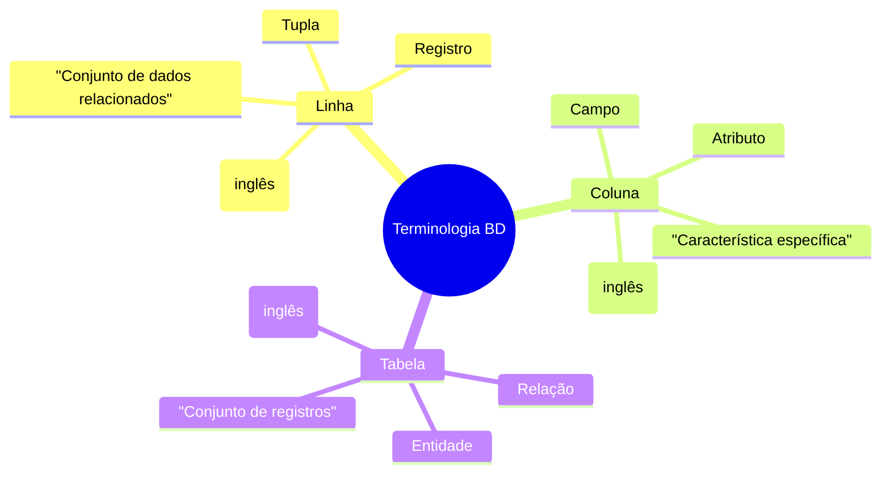
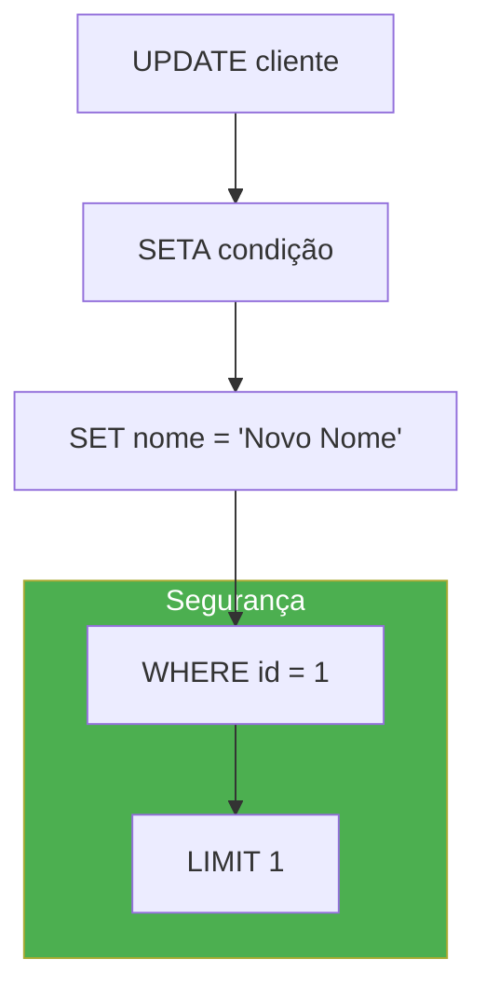

# 📚 Aula 7 - Atualização de Dados: Comando UPDATE

---

## 🎯 Objetivos da Aula

* Dominar a terminologia de bancos de dados: linhas, registros, tuplas
* Compreender a estrutura completa do comando UPDATE
* Aprender a usar a cláusula WHERE de forma segura e eficiente
* Implementar medidas de segurança para evitar alterações acidentais
* Praticar atualizações em múltiplas colunas simultaneamente
* Entender os riscos e aprender técnicas de prevenção de erros

---

## 📖 Terminologia e Estrutura de Dados

### Glossário de Termos Técnicos



### Comparação Visual da Estrutura

```sql
-- ESTRUTURA DE UMA TABELA 'cliente'
-- Colunas/Campos/Atributos ↓
CREATE TABLE cliente (
    id INT PRIMARY KEY,      -- ← Coluna 1
    nome VARCHAR(100),       -- ← Coluna 2  
    email VARCHAR(100),      -- ← Coluna 3
    data_cadastro DATE       -- ← Coluna 4
);

-- Linhas/Registros/Tuplas →
INSERT INTO cliente VALUES 
(1, 'João', 'joao@email.com', '2024-01-01'),    -- ← Linha 1
(2, 'Maria', 'maria@email.com', '2024-01-02'),  -- ← Linha 2
(3, 'Pedro', 'pedro@email.com', '2024-01-03');  -- ← Linha 3
```

### Comandos por Camada

| Camada | Comando | Foco | Exemplo |
|--------|---------|------|---------|
| **Estrutura (DDL)** | `ALTER TABLE` | Colunas | `ALTER TABLE ADD COLUMN` |
| **Conteúdo (DML)** | `UPDATE` | Linhas | `UPDATE SET ... WHERE` |
| **Conteúdo (DML)** | `INSERT` | Linhas | `INSERT INTO VALUES` |
| **Conteúdo (DML)** | `DELETE` | Linhas | `DELETE FROM WHERE` |

---

## 🔄 O Comando UPDATE: Anatomia Detalhada

### Estrutura Básica do UPDATE

```sql
UPDATE nome_tabela
SET coluna1 = novo_valor1,
    coluna2 = novo_valor2,
    ...
WHERE condicao;
```

### Componentes do UPDATE



### Exemplo Prático Passo a Passo

```sql
-- 1. Criar tabela de exemplo
CREATE TABLE IF NOT EXISTS funcionario (
    id INT PRIMARY KEY AUTO_INCREMENT,
    nome VARCHAR(100) NOT NULL,
    cargo VARCHAR(50),
    salario DECIMAL(10,2),
    departamento VARCHAR(50),
    data_admissao DATE,
    ativo BOOLEAN DEFAULT TRUE
);

-- 2. Inserir dados de teste
INSERT INTO funcionario (nome, cargo, salario, departamento, data_admissao) 
VALUES 
    ('João Silva', 'Analista', 3500.00, 'TI', '2023-01-15'),
    ('Maria Santos', 'Gerente', 5500.00, 'RH', '2022-03-10'),
    ('Pedro Oliveira', 'Desenvolvedor', 4200.00, 'TI', '2023-06-20'),
    ('Ana Costa', 'Analista', 3700.00, 'Financeiro', '2023-08-05');

-- 3. ATUALIZAÇÃO SIMPLES (um campo)
-- João foi promovido a Coordenador
UPDATE funcionario
SET cargo = 'Coordenador'
WHERE nome = 'João Silva';  -- Atualiza apenas João

-- 4. ATUALIZAÇÃO MÚLTIPLA (vários campos)
-- Maria mudou de departamento e teve aumento
UPDATE funcionario
SET departamento = 'Administrativo',
    salario = 6000.00,
    cargo = 'Gerente Sênior'
WHERE nome = 'Maria Santos';

-- 5. ATUALIZAÇÃO COM EXPRESSÕES
-- Aumento de 10% para todos do departamento TI
UPDATE funcionario
SET salario = salario * 1.10  -- Expressão matemática
WHERE departamento = 'TI';

-- 6. ATUALIZAÇÃO COM FUNÇÕES DO MySQL
-- Corrigir formato do nome (primeira letra maiúscula)
UPDATE funcionario
SET nome = CONCAT(
    UPPER(SUBSTRING(nome, 1, 1)),
    LOWER(SUBSTRING(nome, 2))
);

-- 7. ATUALIZAÇÃO CONDICIONAL COM CASE
-- Aumento diferenciado por cargo
UPDATE funcionario
SET salario = CASE
    WHEN cargo LIKE '%Gerente%' THEN salario * 1.15
    WHEN cargo LIKE '%Coordenador%' THEN salario * 1.12
    WHEN cargo LIKE '%Analista%' THEN salario * 1.10
    ELSE salario * 1.05
END
WHERE ativo = TRUE;

-- 8. VERIFICAR RESULTADOS
SELECT * FROM funcionario ORDER BY departamento, nome;
```

---

## 🔐 Segurança e o Uso da Chave Primária

### Por que a Chave Primária é Essencial?

```sql
-- ❌ CENÁRIO PERIGOSO: Atualizar sem chave primária
UPDATE funcionario
SET cargo = 'Estagiário'
WHERE nome = 'João Silva';

-- PROBLEMA: E se existir outro "João Silva"?
-- PROBLEMA: E se "João Silva" mudar o nome depois?

-- ✅ CENÁRIO SEGURO: Sempre usar chave primária
UPDATE funcionario
SET cargo = 'Coordenador'
WHERE id = 1;  -- ID é ÚNICO e IMUTÁVEL

-- ✅ BOA PRÁTICA: Selecionar antes de atualizar
-- Primeiro, veja o que vai atualizar
SELECT * FROM funcionario WHERE nome LIKE 'João%';

-- Depois, atualize usando o ID correto
UPDATE funcionario
SET cargo = 'Coordenador'
WHERE id = 1;

-- ✅ PRÁTICA AVANÇADA: Transação com SELECT + UPDATE
START TRANSACTION;

-- Primeiro selecione e confirme
SELECT id, nome, cargo 
FROM funcionario 
WHERE nome = 'João Silva'
FOR UPDATE;  -- Trava os registros para evitar concorrência

-- Depois atualize com segurança
UPDATE funcionario
SET cargo = 'Coordenador'
WHERE id = 1;

COMMIT;
```

### Técnicas para Encontrar a Chave Primária

```sql
-- 1. DESCOBRIR A ESTRUTURA DA TABELA
DESCRIBE funcionario;
-- Ou
SHOW COLUMNS FROM funcionario;

-- Resultado mostrará:
-- +-------+--------------+------+-----+---------+----------------+
-- | Field | Type         | Null | Key | Default | Extra          |
-- +-------+--------------+------+-----+---------+----------------+
-- | id    | int          | NO   | PRI | NULL    | auto_increment | ← PRIMARY KEY
-- | nome  | varchar(100) | NO   |     | NULL    |                |

-- 2. IDENTIFICAR TODAS AS CHAVES PRIMÁRIAS
SHOW KEYS FROM funcionario WHERE Key_name = 'PRIMARY';

-- 3. CONSULTA À INFORMATION_SCHEMA
SELECT 
    COLUMN_NAME,
    DATA_TYPE,
    COLUMN_KEY
FROM INFORMATION_SCHEMA.COLUMNS
WHERE TABLE_SCHEMA = DATABASE()
AND TABLE_NAME = 'funcionario'
AND COLUMN_KEY = 'PRI';
```

---

## ⚠️ Riscos e Medidas de Proteção CRÍTICAS

### O Pesadelo do UPDATE sem WHERE

```sql
-- 🚨 CENÁRIO CATASTRÓFICO (mais comum do que você imagina!)
UPDATE funcionario
SET cargo = 'Demitido';  -- ESQUECEU O WHERE!

-- RESULTADO: TODOS os funcionários agora têm cargo = 'Demitido'
-- Custo: Horas de restauração de backup, dados perdidos, dor de cabeça

-- 🚨 OUTRO CENÁRIO PERIGOSO: WHERE muito amplo
UPDATE funcionario
SET departamento = 'TI'
WHERE departamento = 'Tecnologia';  -- Mas não existe 'Tecnologia'!
-- Resultado: NENHUM registro atualizado (pelo menos não destrói dados)

UPDATE funcionario
SET salario = 1000.00
WHERE cargo LIKE '%Analista%';  -- MUITO AMPLO!
-- Resultado: Todos analistas, coordenadores analistas, etc = R$ 1000
```

### Medida 1: LIMIT - O Para-choques do UPDATE

```sql
-- ✅ LIMIT como trava de segurança
-- Mesmo se WHERE estiver errado, só afeta no máximo X registros

-- Atualizar cargo do João (com segurança extra)
UPDATE funcionario
SET cargo = 'Coordenador'
WHERE nome = 'João Silva'
LIMIT 1;  -- Máximo 1 registro, mesmo se houver múltiplos "João Silva"

-- Atualização em lote com controle
UPDATE funcionario
SET salario = salario * 1.05
WHERE departamento = 'TI'
LIMIT 10;  -- Só atualiza os 10 primeiros (teste antes de aplicar em todos)

-- ⚠️ CUIDADO: LIMIT com ORDER BY imprevisível
UPDATE funcionario
SET ativo = FALSE
WHERE salario > 5000
LIMIT 2;
-- Quais 2? Os primeiros que o MySQL encontrar (imprevisível!)

-- ✅ SOLUÇÃO: LIMIT com ORDER BY explícito
UPDATE funcionario
SET ativo = FALSE
WHERE salario > 5000
ORDER BY data_admissao ASC  -- Mais antigos primeiro
LIMIT 2;
```

### Medida 2: Safe Updates (Atualizações Seguras)

```sql
-- 🔧 HABILITAR SAFE UPDATES (MySQL Workbench faz por padrão)
SET SQL_SAFE_UPDATES = 1;  -- ON (recomendado para desenvolvimento)

-- Com Safe Updates ON, estes comandos FALHAM:
UPDATE funcionario SET cargo = 'Teste';  -- Falha: sem WHERE
UPDATE funcionario SET cargo = 'Teste' WHERE cargo = 'Analista';  -- Falha: WHERE não usa PK

-- Para desativar temporariamente (APENAS se necessário):
SET SQL_SAFE_UPDATES = 0;  -- OFF (cuidado!)

-- Fazer sua atualização...
UPDATE funcionario SET departamento = 'TI' WHERE cargo = 'Desenvolvedor';

-- Reativar imediatamente!
SET SQL_SAFE_UPDATES = 1;

-- ✅ MELHOR PRÁTICA: Usar em sessão específica
-- Inicie sua sessão assim:
SET SESSION SQL_SAFE_UPDATES = 1;
```

### Medida 3: Transações - O Ctrl+Z do Banco de Dados

```sql
-- ✅ USO DE TRANSAÇÕES PARA TESTE
START TRANSACTION;  -- Começa uma transação

-- Faça sua atualização "perigosa"
UPDATE funcionario
SET salario = salario * 1.10
WHERE departamento = 'TI';

-- Verifique o resultado
SELECT * FROM funcionario WHERE departamento = 'TI';

-- DECISÃO: Confirmar ou Desfazer?
-- Se estiver correto:
COMMIT;  -- Torna permanente

-- Se estiver errado:
ROLLBACK;  -- Desfaz tudo (Ctrl+Z)

-- ✅ PADRÃO OURO: Sempre teste em transação
START TRANSACTION;
UPDATE ... WHERE ...;
SELECT ...;  -- VERIFIQUE!
-- ROLLBACK; ou COMMIT;
```

### Medida 4: SELECT antes do UPDATE

```sql
-- ✅ SEMPRE FAÇA ISSO:
-- 1. Primeiro, SELECT para ver o que será afetado
SELECT id, nome, cargo, salario 
FROM funcionario 
WHERE departamento = 'TI'
AND salario < 4000;

-- 2. Conte quantos registros serão afetados
SELECT COUNT(*) as total_afetados
FROM funcionario 
WHERE departamento = 'TI'
AND salario < 4000;

-- 3. Execute o UPDATE com os mesmos critérios
UPDATE funcionario
SET salario = salario * 1.15
WHERE departamento = 'TI'
AND salario < 4000;

-- 4. Verifique o resultado
SELECT id, nome, cargo, salario 
FROM funcionario 
WHERE departamento = 'TI';
```

---

## 🛡️ Protocolo de Segurança para UPDATEs

### Checklist Antes de Qualquer UPDATE

```sql
/*
✅ CHECKLIST DE SEGURANÇA PARA UPDATE
=====================================
1. [ ] TENHO BACKUP RECENTE?
   - mysqldump -u root -p database > backup_$(date +%Y%m%d).sql

2. [ ] ESTOU EM AMBIENTE DE DESENVOLVIMENTO/TESTE?
   - NUNCA faça UPDATE perigoso direto em produção

3. [ ] USAREI UMA TRANSAÇÃO?
   - START TRANSACTION antes, COMMIT/ROLLBACK depois

4. [ ] JÁ FIZ UM SELECT COM OS MESMOS CRITÉRIOS?
   - SELECT * FROM tabela WHERE condição;

5. [ ] MEU WHERE USA CHAVE PRIMÁRIA?
   - WHERE id = X (não WHERE nome = 'João')

6. [ ] COLOQUEI LIMIT PARA ATUALIZAÇÕES EM MASSA?
   - UPDATE ... LIMIT 100 (teste com poucos primeiro)

7. [ ] SQL_SAFE_UPDATES ESTÁ ATIVADO?
   - SET SQL_SAFE_UPDATES = 1;

8. [ ] ESTOU USANDO HORÁRIO DE BAIXO TRÁFEGO?
   - Para tabelas grandes, evite horário comercial
*/
```

### Script de Segurança para UPDATEs Perigosos

```sql
-- SCRIPT DE ATUALIZAÇÃO SEGURA
DELIMITER //

CREATE PROCEDURE atualizacao_segura(
    IN p_id INT,
    IN p_novo_cargo VARCHAR(50)
)
BEGIN
    DECLARE EXIT HANDLER FOR SQLEXCEPTION
    BEGIN
        ROLLBACK;
        SELECT 'ERRO: Atualização falhou' AS resultado;
    END;
    
    START TRANSACTION;
    
    -- 1. Verificar se registro existe
    IF NOT EXISTS (SELECT 1 FROM funcionario WHERE id = p_id) THEN
        SELECT 'ERRO: ID não encontrado' AS resultado;
        ROLLBACK;
    ELSE
        -- 2. Log da alteração (opcional, mas recomendado)
        INSERT INTO log_alteracoes 
        (tabela, registro_id, acao, anterior, novo, usuario, data)
        SELECT 
            'funcionario',
            p_id,
            'UPDATE',
            cargo,
            p_novo_cargo,
            CURRENT_USER(),
            NOW()
        FROM funcionario 
        WHERE id = p_id;
        
        -- 3. Executar a atualização
        UPDATE funcionario
        SET cargo = p_novo_cargo
        WHERE id = p_id;
        
        -- 4. Confirmar
        COMMIT;
        SELECT 'SUCESSO: Atualização realizada' AS resultado;
    END IF;
END //

DELIMITER ;

-- Usando o procedimento seguro
CALL atualizacao_segura(1, 'Coordenador Sênior');
```

---

## 🏗️ Exemplo Prático Completo

### Sistema de Gestão de Funcionários - Cenário Real

```sql
-- 1. CRIAR ESTRUTURA COMPLETA
CREATE DATABASE IF NOT EXISTS gestao_funcionarios;
USE gestao_funcionarios;

CREATE TABLE funcionario (
    id INT PRIMARY KEY AUTO_INCREMENT,
    cpf VARCHAR(11) UNIQUE NOT NULL,
    nome VARCHAR(100) NOT NULL,
    email VARCHAR(100) UNIQUE,
    cargo VARCHAR(50) NOT NULL,
    salario DECIMAL(10,2) NOT NULL DEFAULT 0,
    departamento VARCHAR(50),
    data_admissao DATE NOT NULL,
    data_demissao DATE NULL,
    ativo BOOLEAN DEFAULT TRUE,
    data_criacao DATETIME DEFAULT CURRENT_TIMESTAMP,
    data_atualizacao DATETIME DEFAULT CURRENT_TIMESTAMP ON UPDATE CURRENT_TIMESTAMP,
    
    INDEX idx_departamento (departamento),
    INDEX idx_cargo (cargo),
    INDEX idx_ativo (ativo)
);

CREATE TABLE log_alteracoes (
    id INT PRIMARY KEY AUTO_INCREMENT,
    tabela VARCHAR(50),
    registro_id INT,
    acao VARCHAR(20),
    campo_alterado VARCHAR(50),
    valor_anterior TEXT,
    valor_novo TEXT,
    usuario VARCHAR(100),
    data_alteracao DATETIME DEFAULT CURRENT_TIMESTAMP
);

-- 2. INSERIR DADOS INICIAIS
INSERT INTO funcionario (cpf, nome, email, cargo, salario, departamento, data_admissao) 
VALUES 
    ('12345678901', 'João Silva', 'joao@empresa.com', 'Analista', 3500.00, 'TI', '2023-01-15'),
    ('98765432109', 'Maria Santos', 'maria@empresa.com', 'Gerente', 5500.00, 'RH', '2022-03-10'),
    ('45678912345', 'Pedro Oliveira', 'pedro@empresa.com', 'Desenvolvedor', 4200.00, 'TI', '2023-06-20'),
    ('78912345678', 'Ana Costa', 'ana@empresa.com', 'Analista', 3700.00, 'Financeiro', '2023-08-05'),
    ('32165498712', 'Carlos Souza', 'carlos@empresa.com', 'Desenvolvedor', 4100.00, 'TI', '2023-09-12');

-- 3. CENÁRIOS DE ATUALIZAÇÃO COM SEGURANÇA

-- CENÁRIO 1: PROMOÇÃO DE CARGO
START TRANSACTION;

SELECT 'ANTES:' as info, id, nome, cargo, salario 
FROM funcionario 
WHERE id = 1;

UPDATE funcionario
SET cargo = 'Coordenador',
    salario = 4500.00,
    data_atualizacao = NOW()
WHERE id = 1
LIMIT 1;

SELECT 'DEPOIS:' as info, id, nome, cargo, salario 
FROM funcionario 
WHERE id = 1;

COMMIT;

-- CENÁRIO 2: REAJUSTE SALARIAL POR DEPARTAMENTO
START TRANSACTION;

-- Primeiro, veja o impacto
SELECT 
    departamento,
    COUNT(*) as qtd_funcionarios,
    AVG(salario) as media_atual,
    AVG(salario * 1.10) as media_proposta
FROM funcionario 
WHERE ativo = TRUE
AND departamento = 'TI'
GROUP BY departamento;

-- Depois, execute com limite
UPDATE funcionario
SET salario = salario * 1.10,
    data_atualizacao = NOW()
WHERE departamento = 'TI'
AND ativo = TRUE
LIMIT 10;  -- Apenas 10 primeiros (para teste)

ROLLBACK;  -- Apenas teste, desfazer

-- CENÁRIO 3: CORREÇÃO DE DADOS EM MASSA (com segurança)
-- Problema: Emails com domínio errado
SELECT COUNT(*) as afetados
FROM funcionario 
WHERE email LIKE '%@empresa.com%';

START TRANSACTION;

UPDATE funcionario
SET email = REPLACE(email, '@empresa.com', '@companhia.com'),
    data_atualizacao = NOW()
WHERE email LIKE '%@empresa.com%'
LIMIT 100;  -- Por lote de 100

SELECT 'Atualizados:' as info, COUNT(*) 
FROM funcionario 
WHERE email LIKE '%@companhia.com%';

ROLLBACK;  -- Apenas demonstração

-- CENÁRIO 4: DEMISSÃO/INATIVAÇÃO
START TRANSACTION;

UPDATE funcionario
SET ativo = FALSE,
    data_demissao = CURDATE(),
    data_atualizacao = NOW()
WHERE id = 5
LIMIT 1;

-- Verificar
SELECT id, nome, ativo, data_demissao 
FROM funcionario 
WHERE id = 5;

COMMIT;

-- 4. CONSULTAS PARA VERIFICAÇÃO
-- Funcionários ativos por departamento
SELECT 
    departamento,
    COUNT(*) as total_ativos,
    AVG(salario) as salario_medio,
    MAX(salario) as salario_max,
    MIN(salario) as salario_min
FROM funcionario 
WHERE ativo = TRUE
GROUP BY departamento
ORDER BY departamento;

-- Histórico de alterações recentes
SELECT 
    nome,
    cargo,
    salario,
    data_atualizacao,
    TIMESTAMPDIFF(HOUR, data_criacao, data_atualizacao) as horas_since_criacao
FROM funcionario 
ORDER BY data_atualizacao DESC
LIMIT 5;
```

---

## 📋 Resumo Rápido

* **Terminologia**: Linha = Registro = Tupla; Coluna = Campo = Atributo
* **UPDATE estrutura**: `UPDATE tabela SET campo = valor WHERE condição`
* **WHERE é CRÍTICO**: Sem WHERE = atualiza TODOS os registros
* **Sempre use Chave Primária** no WHERE quando possível
* **LIMIT**: Trava de segurança para updates em massa
* **Safe Updates**: Proteção do MySQL Workbench (mantenha ativado)
* **Transações**: Use `START TRANSACTION` + `ROLLBACK/COMMIT` para testes
* **SELECT antes**: Sempre verifique o que será afetado primeiro
* **Backup**: Sempre tenha backup antes de updates perigosos

---

## 💡 Mantra do Administrador de Banco de Dados

"Um UPDATE sem WHERE é como saltar de paraquedas sem verificar se ele está aberto. Sempre teste primeiro, limite o escopo, e tenha um plano para desfazer."

> 🧠 **Exercício de Segurança**:
> 1. Crie tabela `produto`: id, nome, preco, estoque, ativo
> 2. Insira 10 produtos
> 3. PRATIQUE O PROTOCOLO:
     >    a) Faça SELECT para ver produtos com estoque < 5
     >    b) Inicie TRANSACTION
     >    c) UPDATE para aumentar preço em 15% onde estoque < 5 (com LIMIT 3)
     >    d) SELECT para verificar
     >    e) ROLLBACK (apenas prática)
     >    f) Agora faça COMMIT de verdade
> 4. Tente fazer UPDATE sem WHERE (com Safe Updates ON)

---
