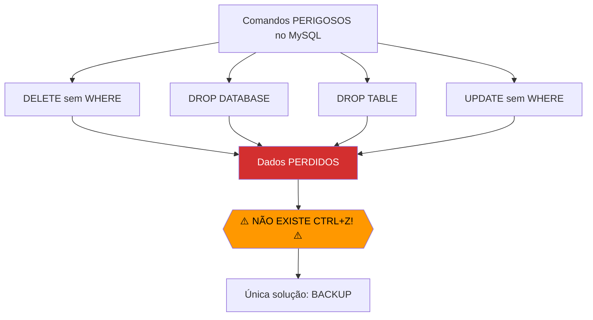
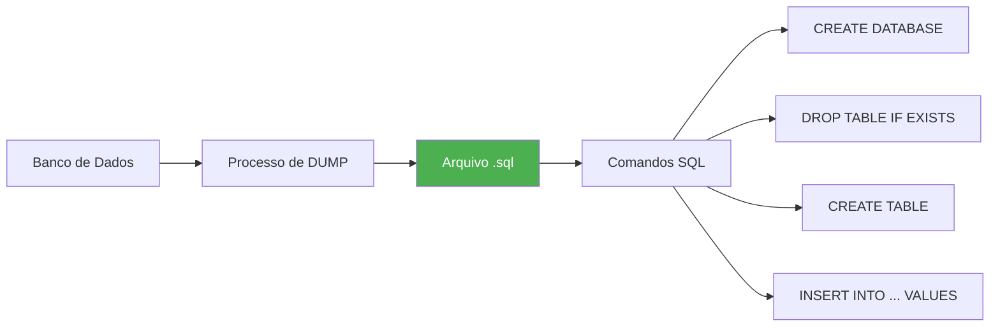
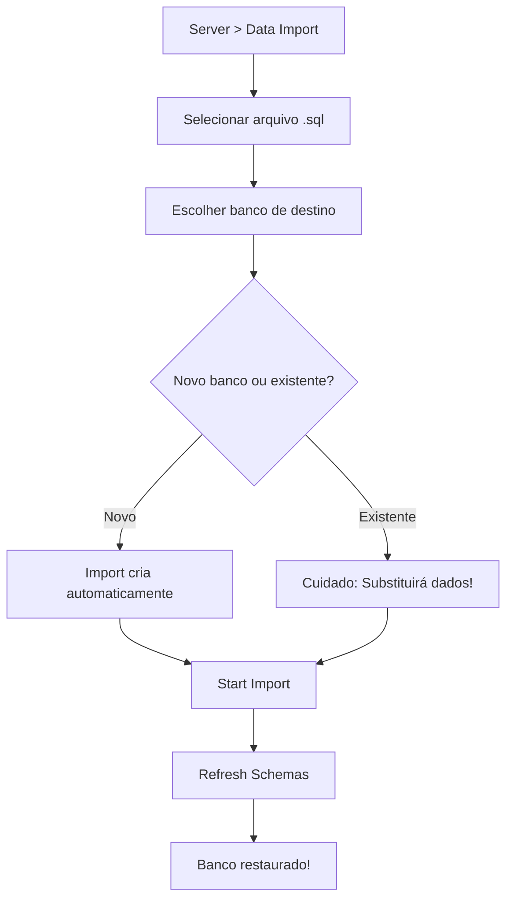
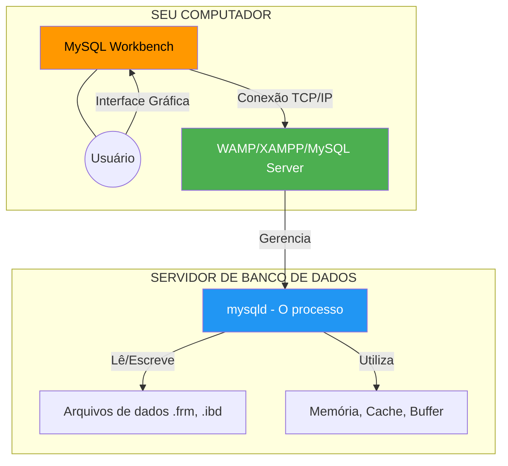
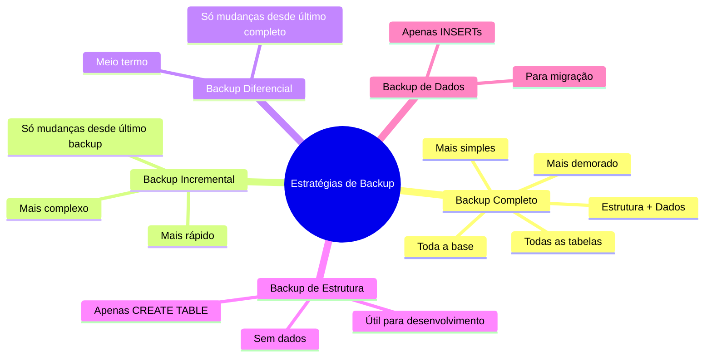

# 📚 Aula 8 - Backup e Restauração: Dump de Dados no MySQL

---

## 🎯 Objetivos da Aula

* Compreender a importância crítica de backups em bancos de dados
* Dominar o conceito de Dump como arquivo de comandos SQL
* Aprender a exportar bancos de dados usando MySQL Workbench
* Praticar a importação de backups para recuperação de dados
* Diferenciar tipos de dump: estrutura + dados vs. apenas estrutura
* Entender a relação entre ferramenta (Workbench) e servidor (WAMP/MySQL)

---

## 🚨 A Importância do Backup: Onde Está Seu Ctrl+Z?

### O Problema Fundamental dos Bancos de Dados



### Exemplos Reais de Desastres Evitáveis

```sql
-- CENÁRIO 1: DELETE sem WHERE (pesadelo de todo DBA)
DELETE FROM clientes;  
-- Resultado: TODOS os clientes sumiram!

-- CENÁRIO 2: DROP DATABASE acidental
DROP DATABASE empresa;
-- Resultado: A empresa inteira sumiu do servidor!

-- CENÁRIO 3: UPDATE com condição errada
UPDATE produtos SET preco = 0 WHERE categoria = 'eletronicos';
-- Resultado: Todos os produtos eletrônicos de graça!

-- CENÁRIO 4: Erro de ambiente
-- Tentou rodar script de produção no ambiente de desenvolvimento
-- Mas rodou no ambiente errado... e apagou dados reais!
```

### Por Que o MySQL Não Tem Ctrl+Z?

```text
📊 CARACTERÍSTICAS DO AMBIENTE DE BANCO DE DADOS:
- Múltiplos usuários simultâneos
- Transações de alta performance
- Milhões de registros
- Dados críticos de negócio

Se existisse um "desfazer" simples, ele teria que:
1. Manter histórico de todas as alterações
2. Travar o banco durante o rollback
3. Gerenciar conflitos entre usuários
4. Consumir espaço gigantesco em disco

➡️ Solução: Backup preventivo + Transações + Logs
```

---

## 📦 O Conceito de Dump

### O Que é um Dump?



### Anatomia de um Arquivo Dump

```sql
-- Exemplo real de como é um arquivo dump.sql
-- (Isso é TEXTO, não imagem binária!)

-- MariaDB dump 10.19  Distrib 10.4.28-MariaDB
-- Host: localhost    Database: escola
-- ------------------------------------------------------

-- Cria o banco se não existir
CREATE DATABASE IF NOT EXISTS `escola`;
USE `escola`;

-- Remove tabelas existentes para recriar limpas
DROP TABLE IF EXISTS `aluno`;

-- Recria a estrutura da tabela
CREATE TABLE `aluno` (
    `id` int(11) NOT NULL AUTO_INCREMENT,
    `nome` varchar(100) NOT NULL,
    `email` varchar(100) DEFAULT NULL,
    `data_nascimento` date DEFAULT NULL,
    PRIMARY KEY (`id`)
) ENGINE=InnoDB AUTO_INCREMENT=4 DEFAULT CHARSET=utf8mb4;

-- Insere os dados novamente
INSERT INTO `aluno` VALUES 
(1, 'João Silva', 'joao@email.com', '2005-03-15'),
(2, 'Maria Santos', 'maria@email.com', '2004-07-22'),
(3, 'Pedro Oliveira', 'pedro@email.com', '2006-01-30');

-- Dump completed on 2024-01-31 15:30:00
```

### Por Que Dump é um Arquivo de Texto?

```text
✅ VANTAGENS DO FORMATO TEXTO (.sql):
- Legível por humanos (pode abrir no bloco de notas!)
- Editável (corrigir dados antes de restaurar)
- Versionável (git diff mostra mudanças)
- Portável (funciona em qualquer MySQL/MariaDB)
- Comprimível (pode virar .zip, .gz)
- Pesquisável (grep para encontrar algo)

❌ DESVANTAGENS:
- Arquivo grande pode ser pesado
- Importação mais lenta que formato binário

✅ SOLUÇÃO PARA GRANDES VOLUMES:
- mysqldump com compressão
- Ou use backups físicos (arquivos binários)
```

---

## 📤 Processo de Exportação (Gerando Backup)

### Caminho no MySQL Workbench

```text
📌 MENU: Server → Data Export
```

### Interface Gráfica - Passo a Passo

```mermaid
flowchart TD
    A[Server > Data Export] --> B[Selecionar banco(s) a exportar]
    B --> C{Escolher tabelas}
    C -->|Exportar tudo| D[Selecionar todas]
    C -->|Exportar apenas algumas| E[Selecionar específicas]
    
    E --> F[Opções de exportação]
    F --> G{Dump Structure and Data}
    F --> H{Dump Structure Only}
    F --> I{Dump Data Only}
    
    G & H & I --> J[Self-Contained File]
    J --> K[Include Create Schema]
    K --> L[Start Export]
    L --> M[Arquivo .sql gerado!]
```

### Opções de Exportação Detalhadas

#### Opção 1: Dump Structure and Data (RECOMENDADO)
```sql
-- Exporta TUDO: estrutura + dados
-- Resultado: Banco completo, pronto para uso
CREATE TABLE aluno (...);  -- Estrutura
INSERT INTO aluno VALUES ...;  -- Dados
```

#### Opção 2: Dump Structure Only
```sql
-- Exporta APENAS a estrutura (tabelas vazias)
-- Útil para: distribuir modelo, teste, documentação
CREATE TABLE aluno (...);  -- Apenas estrutura
-- NÃO tem INSERTs
```

#### Opção 3: Dump Data Only
```sql
-- Exporta APENAS os dados (sem estrutura)
-- Útil para: migrar dados entre sistemas com mesma estrutura
-- NÃO tem CREATE TABLE
INSERT INTO aluno VALUES ...;  -- Apenas dados
```

### Opção Crucial: Include Create Schema

```sql
-- ❌ SEM Include Create Schema
-- Assume que o banco já existe
USE `escola`;
CREATE TABLE aluno (...);

-- ✅ COM Include Create Schema (MARCADO)
-- Cria o banco automaticamente se não existir
CREATE DATABASE IF NOT EXISTS `escola`;
USE `escola`;
DROP TABLE IF EXISTS `aluno`;
CREATE TABLE aluno (...);
```

### Self-Contained File vs. Exportar para Pastas Separadas

| Característica | Self-Contained File | Exportar para Pastas |
|----------------|---------------------|----------------------|
| **Formato** | Um único arquivo `.sql` | Múltiplos arquivos por tabela |
| **Portabilidade** | Alta (um arquivo só) | Baixa (muitos arquivos) |
| **Facilidade de uso** | Simples (só selecionar) | Complexo |
| **Recomendação** | ✅ **RECOMENDADO** | ❌ Evite para iniciantes |
| **Cenário ideal** | Backup completo | Desenvolvimento avançado |

### Exemplo Prático de Exportação

```sql
-- 1. CRIAR BANCO DE EXEMPLO PARA BACKUP
CREATE DATABASE backup_exemplo;
USE backup_exemplo;

CREATE TABLE cliente (
    id INT PRIMARY KEY AUTO_INCREMENT,
    nome VARCHAR(100) NOT NULL,
    email VARCHAR(100) UNIQUE,
    data_cadastro DATETIME DEFAULT CURRENT_TIMESTAMP
);

INSERT INTO cliente (nome, email) VALUES 
    ('João Silva', 'joao@email.com'),
    ('Maria Santos', 'maria@email.com'),
    ('Pedro Oliveira', 'pedro@email.com');

CREATE TABLE produto (
    id INT PRIMARY KEY AUTO_INCREMENT,
    nome VARCHAR(100) NOT NULL,
    preco DECIMAL(10,2),
    estoque INT DEFAULT 0
);

INSERT INTO produto (nome, preco, estoque) VALUES 
    ('Notebook', 2999.90, 10),
    ('Mouse', 49.90, 50),
    ('Teclado', 129.90, 30);

-- 2. AGORA VAMOS EXPORTAR (via Workbench)
-- Menu: Server > Data Export
-- Selecione 'backup_exemplo'
-- Marque: 'Dump Structure and Data'
-- Marque: 'Include Create Schema'
-- Escolha: 'Export to Self-Contained File'
-- Escolha local: C:\backups\backup_exemplo_20240131.sql
-- Clique: 'Start Export'
```

---

## 📥 Processo de Importação (Restaurando Backup)

### Caminho no MySQL Workbench

```text
📌 MENU: Server → Data Import
```

### Fluxo de Importação



### Passo a Passo da Importação

```sql
-- CENÁRIO: Desastre aconteceu!
-- Tabela cliente foi acidentalmente deletada
DROP TABLE cliente;

-- Verificando o desastre
SHOW TABLES;  -- Só produto existe

-- 1. Abrir MySQL Workbench
-- 2. Menu: Server > Data Import
-- 3. Selecionar: 'Import from Self-Contained File'
-- 4. Navegar até: C:\backups\backup_exemplo_20240131.sql
-- 5. Destination: backup_exemplo (banco existente)
-- 6. Opção: 'Dump Structure and Data' (já vem selecionado)
-- 7. Start Import

-- Após importação, verificar:
SELECT * FROM cliente;  -- Dados voltaram!
SHOW TABLES;  -- Tudo de volta!

-- SE NÃO APARECER: Clique em Refresh (ícone de atualizar)
```

### Cuidados na Importação

```sql
-- ⚠️ IMPORTANTE: O que acontece durante importação?

-- O dump executa estes comandos:
DROP TABLE IF EXISTS `cliente`;  -- Apaga tabela existente!
CREATE TABLE `cliente` (...);    -- Recria vazia
INSERT INTO `cliente` VALUES ...; -- Insere dados

-- ⚠️ ISSO SIGNIFICA: Dados existentes SÃO SUBSTITUÍDOS!
-- Não é um merge, é uma substituição completa.

-- ✅ SE QUISER APENAS ADICIONAR dados a uma tabela existente:
-- Use INSERT manual, não importação de dump completo
```

### Importação Seletiva (Tabelas Específicas)

```sql
-- No Workbench, você pode selecionar apenas algumas tabelas
-- 1. Server > Data Import
-- 2. Selecione o arquivo .sql
-- 3. Em 'Select Database Objects to Import'
-- 4. Desmarque tabelas que não quer importar
-- 5. Start Import

-- ⚠️ CUIDADO: As tabelas selecionadas serão SUBSTITUÍDAS
-- As não selecionadas permanecem intactas
```

---

## 🏢 Diferença: Ferramenta vs. Servidor

### Entendendo a Arquitetura



### Papéis na Arquitetura

| Componente | Função | Exemplo |
|------------|--------|---------|
| **MySQL Workbench** | Ferramenta de Interface | Cliente que envia comandos |
| **WAMP/XAMPP** | Pacote de Serviços | Fornece MySQL + Apache + PHP |
| **MySQL Server** | O Banco de Dados Real | mysqld.exe (processo) |
| **Arquivos de Dados** | Armazenamento Físico | Pasta `data/` no disco |

### Analogia para Entender

```text
🚗 CONCESSIONÁRIA DE CARROS:
- MySQL Workbench = O vendedor (interface)
- Volante, Painel = A interface gráfica
- WAMP = A concessionária (local onde está o carro)
- MySQL Server = O motor do carro (funcionamento real)
- Dados = O combustível e os passageiros
- Dump = O manual de instruções + lista de passageiros

📦 MUDANDO DE CARRO:
- Você quer levar TODOS os passageiros para outro carro
- Não pode levar o motor (MySQL Server) junto
- Mas pode levar o dump (manual + lista)
- No novo carro, segue o manual e recoloca os passageiros
```

---

## 🛡️ Estratégias de Backup Profissional

### Tipos de Backup



### Frequência de Backup por Cenário

```text
🏢 EMPRESA GRANDE (e-commerce, banco):
- Backup completo: Diário (madrugada)
- Backup incremental: A cada 1 hora
- Backup de logs: Contínuo

🏪 MÉDIA EMPRESA (loja, consultório):
- Backup completo: Diário (madrugada)
- Backup incremental: Diário (tarde)
- Backup manual antes de alterações grandes

👤 DESENVOLVEDOR/ESTUDANTE:
- Backup completo: Semanal
- Backup antes de cada ALTER TABLE importante
- Backup antes de DROP ou UPDATE sem WHERE
```

### Automatizando Backups (Linha de Comando)

```bash
# Backup via mysqldump (mais profissional que Workbench)

# Backup completo de um banco
mysqldump -u root -p escola > C:\backups\escola_$(date +%Y%m%d).sql

# Backup com compressão
mysqldump -u root -p escola | gzip > C:\backups\escola_$(date +%Y%m%d).sql.gz

# Backup apenas estrutura
mysqldump -u root -p --no-data escola > C:\backups\escola_estrutura.sql

# Backup apenas dados
mysqldump -u root -p --no-create-info escola > C:\backups\escola_dados.sql

# Backup de múltiplos bancos
mysqldump -u root -p --databases escola empresa loja > C:\backups\todos_bancos.sql

# Backup de todas as bases
mysqldump -u root -p --all-databases > C:\backups\backup_completo.sql

# Restaurar via linha de comando
mysql -u root -p escola < C:\backups\escola_20240131.sql
```

### Criando Script de Backup Automático (Windows)

```batch
@echo off
REM backup_automatico.bat
REM Configurações
set MYSQL_USER=root
set MYSQL_PASS=sua_senha
set BACKUP_DIR=C:\backups
set DATABASE=escola
set DATE=%date:~10,4%%date:~4,2%%date:~7,2%

REM Criar diretório se não existir
if not exist %BACKUP_DIR% mkdir %BACKUP_DIR%

REM Executar backup
echo Fazendo backup de %DATABASE% em %DATE%
mysqldump -u %MYSQL_USER% -p%MYSQL_PASS% %DATABASE% > %BACKUP_DIR%\%DATABASE%_%DATE%.sql

echo Backup concluído: %BACKUP_DIR%\%DATABASE%_%DATE%.sql

REM Manter apenas últimos 7 backups
forfiles /p %BACKUP_DIR% /m *.sql /d -7 /c "cmd /c del @file"
```

---

## 🏗️ Exemplo Prático Completo

### Ciclo Completo: Criação → Backup → Restauração

```sql
-- 1. CRIAR BANCO DE TESTE
CREATE DATABASE IF NOT EXISTS backup_pratica;
USE backup_pratica;

CREATE TABLE usuario (
    id INT PRIMARY KEY AUTO_INCREMENT,
    nome VARCHAR(100) NOT NULL,
    email VARCHAR(100) UNIQUE NOT NULL,
    data_cadastro DATETIME DEFAULT CURRENT_TIMESTAMP
);

CREATE TABLE post (
    id INT PRIMARY KEY AUTO_INCREMENT,
    usuario_id INT NOT NULL,
    titulo VARCHAR(200) NOT NULL,
    conteudo TEXT,
    data_publicacao DATETIME DEFAULT CURRENT_TIMESTAMP,
    FOREIGN KEY (usuario_id) REFERENCES usuario(id)
);

-- 2. POPULAR COM DADOS
INSERT INTO usuario (nome, email) VALUES 
    ('João Silva', 'joao@blog.com'),
    ('Maria Santos', 'maria@blog.com'),
    ('Pedro Oliveira', 'pedro@blog.com');

INSERT INTO post (usuario_id, titulo, conteudo) VALUES 
    (1, 'Introdução ao MySQL', 'Conteúdo sobre bancos de dados...'),
    (2, 'Dicas de Programação', 'Melhores práticas em Java...'),
    (1, 'Backup de Dados', 'Importância de fazer backup...'),
    (3, 'Banco de Dados', 'Modelagem relacional...');

-- 3. VERIFICAR DADOS
SELECT * FROM usuario;
SELECT * FROM post;

-- 4. EXPORTAR VIA WORKBENCH
-- Server > Data Export
-- Selecionar 'backup_pratica'
-- Opções: Dump Structure and Data + Include Create Schema
-- Salvar como: C:\backups\backup_pratica_20240131.sql

-- 5. SIMULAR DESASTRE
DROP DATABASE backup_pratica;  -- 😱 PÂNICO!

-- Verificar que sumiu
SHOW DATABASES;  -- backup_pratica não existe mais

-- 6. RESTAURAR VIA WORKBENCH
-- Server > Data Import
-- Selecionar arquivo: C:\backups\backup_pratica_20240131.sql
-- Importar

-- 7. VERIFICAR RECUPERAÇÃO
SHOW DATABASES;  -- backup_pratica voltou!
USE backup_pratica;
SELECT * FROM usuario;  -- Dados intactos
SELECT * FROM post;     -- Dados intactos

-- 8. COMPARAR COM BACKUP DE APENAS ESTRUTURA
-- Server > Data Export
-- Selecionar 'backup_pratica'
-- Opção: Dump Structure Only
-- Salvar como: C:\backups\backup_pratica_estrutura.sql

-- Este arquivo terá apenas CREATE TABLE, sem INSERTs
```

---

## 📋 Resumo Rápido

* **Backup é VITAL**: Não existe Ctrl+Z em banco de dados
* **Dump = arquivo .sql** com comandos para recriar o banco
* **Workbench > Data Export**: Caminho para exportar
* **Tipos de dump**: Structure+Data (completo), Structure Only (só estrutura), Data Only (só dados)
* **Include Create Schema**: Opção crítica para criar banco automaticamente
* **Self-Contained File**: Um único arquivo (recomendado)
* **Workbench é ferramenta**: O banco real está no servidor (WAMP/MySQL)
* **Importação substitui dados**: Não faz merge, substitui completamente
* **Automação**: Use mysqldump na linha de comando para backups programados
* **Prática**: Faça backup antes de qualquer operação perigosa

---

## 💡 O Mantra do DBA Profissional

"Existem dois tipos de administradores de banco de dados: os que já perderam dados e os que ainda vão perder. A diferença está em quem tem backup e quem não tem."

> 🧠 **Exercício Obrigatório**:
> 1. Crie um banco `meu_portfolio` com 3 tabelas relacionadas
> 2. Insira pelo menos 5 registros em cada tabela
> 3. Faça backup completo (Structure + Data) com Include Create Schema
> 4. Feche o Workbench e abra novamente
> 5. Delete o banco (simule o desastre)
> 6. Restaure a partir do backup
> 7. Verifique se todos os dados voltaram
> 8. **Bônus**: Crie um script .bat/.sh para backup automático

---
