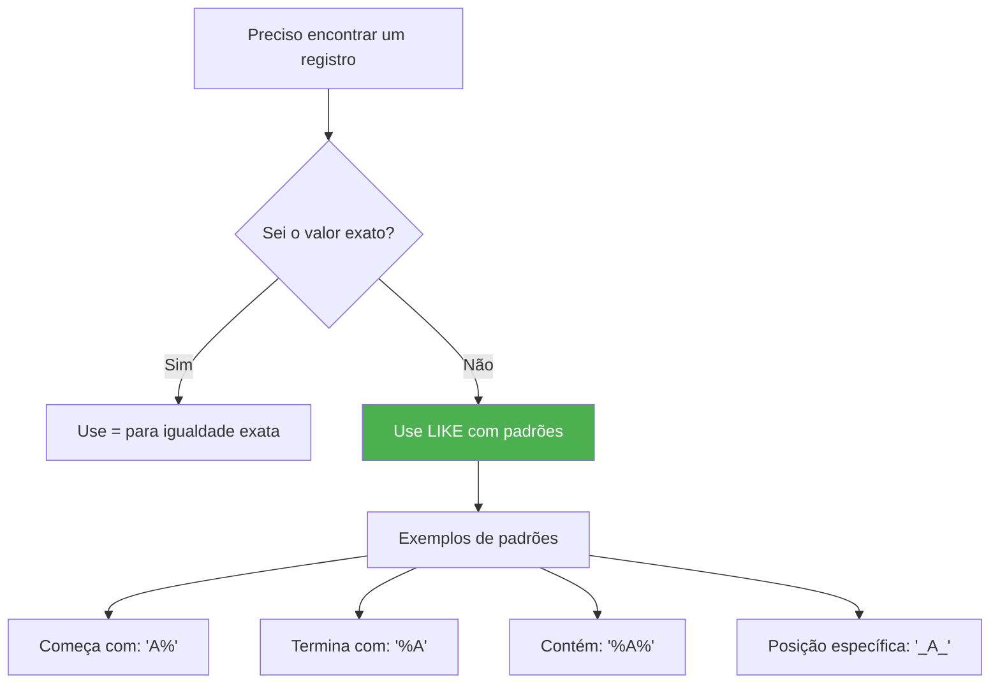
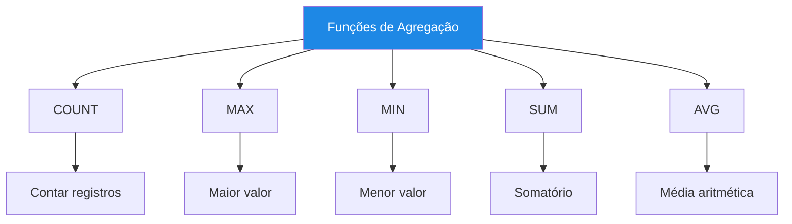

# 📚 Aula 10 - SELECT Avançado: Filtros de Texto, Distinção e Funções de Agregação

---

## 🎯 Objetivos da Aula

* Dominar o operador LIKE para buscas por padrões em textos
* Compreender o uso dos caracteres coringa % (porcentagem) e _ (sublinhado)
* Utilizar DISTINCT para eliminar duplicatas em consultas
* Aplicar funções de agregação para cálculos estatísticos
* Combinar diferentes técnicas para consultas sofisticadas
* Entender o comportamento do MySQL com acentos e maiúsculas/minúsculas

---

## 🔍 O Operador LIKE e Caracteres Coringa

### Por que usar LIKE?



### Criando Tabela de Exemplo

```sql
-- 1. Criar banco e tabela para prática
CREATE DATABASE IF NOT EXISTS select_avancado;
USE select_avancado;

CREATE TABLE aluno (
    id INT PRIMARY KEY AUTO_INCREMENT,
    nome VARCHAR(100) NOT NULL,
    email VARCHAR(100) UNIQUE,
    cidade VARCHAR(50),
    estado CHAR(2),
    data_nascimento DATE,
    nota_final DECIMAL(4,2)
);

-- 2. Inserir dados variados para praticar
INSERT INTO aluno (nome, email, cidade, estado, data_nascimento, nota_final) VALUES
    ('João Silva', 'joao.silva@email.com', 'São Paulo', 'SP', '2005-03-15', 8.5),
    ('Maria Santos', 'maria.santos@email.com', 'Rio de Janeiro', 'RJ', '2004-07-22', 9.0),
    ('Pedro Oliveira', 'pedro.oliveira@email.com', 'Belo Horizonte', 'MG', '2006-01-30', 7.5),
    ('Ana Souza', 'ana.souza@email.com', 'São Paulo', 'SP', '2005-11-08', 8.0),
    ('Carlos Lima', 'carlos.lima@email.com', 'Curitiba', 'PR', '2004-05-12', 6.5),
    ('Juliana Ferreira', 'juliana.ferreira@email.com', 'Porto Alegre', 'RS', '2005-09-25', 9.5),
    ('Roberto Almeida', 'roberto.almeida@email.com', 'Salvador', 'BA', '2004-12-03', 7.0),
    ('Fernanda Costa', 'fernanda.costa@email.com', 'Fortaleza', 'CE', '2006-02-18', 8.8),
    ('Lucas Martins', 'lucas.martins@email.com', 'Brasília', 'DF', '2005-06-30', 9.2),
    ('Beatriz Rocha', 'beatriz.rocha@email.com', 'Manaus', 'AM', '2004-08-14', 6.8);
```

---

## 📝 O Poder do LIKE com %

### 1. Porcentagem (%) - Qualquer Sequência de Caracteres

```sql
-- ✅ REGISTROS QUE COMEÇAM COM DETERMINADA LETRA
SELECT nome, email
FROM aluno
WHERE nome LIKE 'A%';

-- Resultado: Todos os nomes que começam com 'A'
-- +----------------+------------------------+
-- | nome           | email                  |
-- +----------------+------------------------+
-- | Ana Souza      | ana.souza@email.com    |
-- +----------------+------------------------+

-- ✅ REGISTROS QUE TERMINAM COM DETERMINADA LETRA
SELECT nome, email
FROM aluno
WHERE nome LIKE '%a';  -- Termina com 'a'

-- Resultado: Todos os nomes femininos (terminam com 'a')
-- +-------------------+---------------------------+
-- | nome              | email                     |
-- +-------------------+---------------------------+
-- | Maria Santos      | maria.santos@email.com    |
-- | Ana Souza         | ana.souza@email.com       |
-- | Juliana Ferreira  | juliana.ferreira@email.com|
-- | Fernanda Costa    | fernanda.costa@email.com  |
-- | Beatriz Rocha     | beatriz.rocha@email.com   |
-- +-------------------+---------------------------+

-- ✅ REGISTROS QUE CONTÊM DETERMINADA SEQUÊNCIA
SELECT nome, email
FROM aluno
WHERE nome LIKE '%Silva%';

-- Resultado: Nomes que têm 'Silva' em qualquer posição
-- +-------------+-------------------------+
-- | nome        | email                   |
-- +-------------+-------------------------+
-- | João Silva  | joao.silva@email.com    |
-- +-------------+-------------------------+

-- ✅ BUSCA POR DOMÍNIO DE EMAIL
SELECT nome, email
FROM aluno
WHERE email LIKE '%@email.com';

-- Resultado: Todos os emails que terminam com @email.com
-- (todos os nossos exemplos)

-- ✅ BUSCA POR PALAVRAS NO MEIO DO TEXTO
SELECT nome, cidade
FROM aluno
WHERE cidade LIKE '%São%';

-- Resultado: Cidades que contêm "São" no nome
-- +-------------+------------+
-- | nome        | cidade     |
-- +-------------+------------+
-- | João Silva  | São Paulo  |
-- | Ana Souza   | São Paulo  |
-- +-------------+------------+
```

### 2. Sublinhado (_) - Exatamente Um Caractere

```sql
-- ✅ NOMES COM EXATAMENTE 5 LETRAS
SELECT nome
FROM aluno
WHERE nome LIKE '_____';  -- 5 underscores

-- Resultado: Nenhum, pois todos têm mais letras
-- (demonstração: '_' exige exatamente 1 caractere)

-- ✅ NOMES QUE COMEÇAM COM 'J', DEPOIS QUALQUER CARACTERE, DEPOIS 'Ã', DEPOIS QUALQUER COISA
SELECT nome
FROM aluno
WHERE nome LIKE 'J_ão%';

-- Resultado: Nomes que começam com J + qualquer caractere + "ão"
-- +-------------+
-- | nome        |
-- +-------------+
-- | João Silva  |
-- +-------------+

-- ✅ BUSCAR POR PADRÃO DE EMAIL: 1ª LETRA DO NOME + SOBRENOME
SELECT nome, email
FROM aluno
WHERE email LIKE 'j%.%';  -- Começa com 'j', depois qualquer coisa, ponto, qualquer coisa

-- +----------------+--------------------------+
-- | nome           | email                    |
-- +----------------+--------------------------+
-- | João Silva     | joao.silva@email.com     |
-- | Juliana Ferreira| juliana.ferreira@email.com|
-- +----------------+--------------------------+

-- ✅ COMBINAÇÃO DE % E _
SELECT nome, data_nascimento
FROM aluno
WHERE data_nascimento LIKE '2005-__-__';

-- Resultado: Alunos nascidos em 2005 (qualquer mês e dia)
```

### 3. LIKE com Acentos e Case Sensitivity

```sql
-- ✅ O MySQL, por padrão, NÃO é case sensitive com UTF-8
-- Estas consultas retornam o MESMO resultado:

SELECT nome FROM aluno WHERE nome LIKE '%silva%';
SELECT nome FROM aluno WHERE nome LIKE '%SILVA%';
SELECT nome FROM aluno WHERE nome LIKE '%Silva%';

-- Todas encontram: João Silva

-- ✅ O MySQL reconhece acentos nas buscas
SELECT nome FROM aluno WHERE nome LIKE '%José%';  -- Não encontra
-- Mas se tivéssemos 'José', funcionaria normalmente

-- ⚠️ Se precisar de case sensitive, use COLLATE:
SELECT nome FROM aluno 
WHERE nome LIKE '%silva%' COLLATE utf8mb4_bin;
-- Agora só encontra se for exatamente 'silva' (minúsculo)
```

### 4. NOT LIKE - Excluindo Padrões

```sql
-- ✅ ALUNOS CUJOS NOMES NÃO TERMINAM COM 'A'
SELECT nome
FROM aluno
WHERE nome NOT LIKE '%a';

-- Resultado: Nomes masculinos (não terminam em 'a')
-- +------------------+
-- | nome             |
-- +------------------+
-- | João Silva       |
-- | Pedro Oliveira   |
-- | Carlos Lima      |
-- | Roberto Almeida  |
-- | Lucas Martins    |
-- +------------------+

-- ✅ ALUNOS QUE NÃO SÃO DE SÃO PAULO OU RIO
SELECT nome, cidade, estado
FROM aluno
WHERE cidade NOT LIKE '%São%' 
  AND cidade NOT LIKE '%Rio%'
ORDER BY estado;

-- ✅ EMAILS QUE NÃO SÃO DO DOMÍNIO PADRÃO
SELECT nome, email
FROM aluno
WHERE email NOT LIKE '%@email.com';
-- (se houvesse outros domínios)
```

---

## 🎯 DISTINCT - Eliminando Duplicatas

### O Problema da Repetição

```sql
-- ❌ SEM DISTINCT: Repetições aparecem
SELECT estado FROM aluno;

-- Resultado: Vários registros repetidos
-- +--------+
-- | estado |
-- +--------+
-- | SP     |
-- | RJ     |
-- | MG     |
-- | SP     |  ← Repetido
-- | PR     |
-- | RS     |
-- | BA     |
-- | CE     |
-- | DF     |
-- | AM     |
-- +--------+

-- ✅ COM DISTINCT: Apenas valores únicos
SELECT DISTINCT estado FROM aluno
ORDER BY estado;

-- Resultado: Cada estado aparece uma única vez
-- +--------+
-- | estado |
-- +--------+
-- | AM     |
-- | BA     |
-- | CE     |
-- | DF     |
-- | MG     |
-- | PR     |
-- | RJ     |
-- | RS     |
-- | SP     |
-- +--------+

-- ✅ DISTINCT EM MÚLTIPLAS COLUNAS
SELECT DISTINCT cidade, estado FROM aluno
ORDER BY estado, cidade;

-- Combinação única de cidade + estado
-- +-----------------+--------+
-- | cidade          | estado |
-- +-----------------+--------+
-- | Manaus          | AM     |
-- | Salvador        | BA     |
-- | Fortaleza       | CE     |
-- | Brasília        | DF     |
-- | Belo Horizonte  | MG     |
-- | Curitiba        | PR     |
-- | Rio de Janeiro  | RJ     |
-- | Porto Alegre    | RS     |
-- | São Paulo       | SP     |  (aparece uma vez, não duas!)
-- +-----------------+--------+
```

### Aplicações Práticas do DISTINCT

```sql
-- 1. QUAIS SÃO OS ESTADOS ONDE TEMOS ALUNOS?
SELECT DISTINCT estado FROM aluno
ORDER BY estado;

-- 2. QUAIS SÃO AS DIFERENTES CIDADES?
SELECT DISTINCT cidade FROM aluno
ORDER BY cidade;

-- 3. QUAIS SÃO AS COMBINAÇÕES DE CIDADE+ESTADO?
SELECT DISTINCT 
    CONCAT(cidade, ' - ', estado) AS localizacao
FROM aluno
ORDER BY localizacao;

-- 4. CONTAR QUANTOS ESTADOS DIFERENTES (com COUNT)
SELECT COUNT(DISTINCT estado) AS total_estados
FROM aluno;

-- Resultado: 9 estados diferentes

-- 5. DISTINCT COM CONDIÇÕES
SELECT DISTINCT estado
FROM aluno
WHERE nota_final >= 8.0
ORDER BY estado;
-- Estados dos alunos com nota >= 8.0
```

---

## 📊 Funções de Agregação

### Visão Geral das Funções



### 1. COUNT - Contar Registros

```sql
-- ✅ CONTAR TODOS OS ALUNOS
SELECT COUNT(*) AS total_alunos
FROM aluno;

-- Resultado:
-- +--------------+
-- | total_alunos |
-- +--------------+
-- |           10 |
-- +--------------+

-- ✅ CONTAR ALUNOS COM CONDIÇÃO
SELECT COUNT(*) AS alunos_aprovados
FROM aluno
WHERE nota_final >= 7.0;

-- Resultado: 8 aprovados (nota >= 7.0)

-- ✅ CONTAR VALORES NÃO NULOS (COUNT com coluna específica)
SELECT COUNT(email) AS emails_cadastrados
FROM aluno;
-- Mesmo que COUNT(*), pois email é NOT NULL

-- ✅ CONTAR VALORES DISTINTOS
SELECT COUNT(DISTINCT estado) AS estados_atendidos
FROM aluno;

-- Resultado: 9 estados
```

### 2. MAX e MIN - Maior e Menor Valor

```sql
-- ✅ MAIOR NOTA
SELECT MAX(nota_final) AS maior_nota
FROM aluno;

-- Resultado:
-- +------------+
-- | maior_nota |
-- +------------+
-- |        9.5 |
-- +------------+

-- ✅ MENOR NOTA
SELECT MIN(nota_final) AS menor_nota
FROM aluno;

-- Resultado:
-- +------------+
-- | menor_nota |
-- +------------+
-- |        6.5 |
-- +------------+

-- ✅ MAIOR E MENOR COM CONTEXTO (subconsulta - prévia da próxima aula)
SELECT nome, nota_final
FROM aluno
WHERE nota_final = (SELECT MAX(nota_final) FROM aluno);

-- Resultado:
-- +-----------------+------------+
-- | nome            | nota_final |
-- +-----------------+------------+
-- | Juliana Ferreira |        9.5 |
-- +-----------------+------------+

-- ✅ DATA DE NASCIMENTO MAIS ANTIGA E MAIS RECENTE
SELECT 
    MIN(data_nascimento) AS mais_velho,
    MAX(data_nascimento) AS mais_novo
FROM aluno;

-- Resultado:
-- +-------------+------------+
-- | mais_velho  | mais_novo  |
-- +-------------+------------+
-- | 2004-05-12  | 2006-02-18 |
-- +-------------+------------+
```

### 3. SUM - Somatório

```sql
-- ✅ SOMATÓRIO DE NOTAS (pouco útil individualmente)
SELECT SUM(nota_final) AS soma_notas
FROM aluno;

-- Resultado:
-- +------------+
-- | soma_notas |
-- +------------+
-- |       81.8 |
-- +------------+

-- ✅ SOMA COM CONDIÇÃO
SELECT SUM(nota_final) AS soma_notas_aprovados
FROM aluno
WHERE nota_final >= 7.0;

-- Resultado: 68.5 (soma das notas dos aprovados)

-- ✅ USO PRÁTICO: Total de alunos aprovados vs reprovados
SELECT 
    SUM(CASE WHEN nota_final >= 7.0 THEN 1 ELSE 0 END) AS aprovados,
    SUM(CASE WHEN nota_final < 7.0 THEN 1 ELSE 0 END) AS reprovados
FROM aluno;

-- Resultado:
-- +-----------+-----------+
-- | aprovados | reprovados |
-- +-----------+-----------+
-- |         8 |         2 |
-- +-----------+-----------+
```

### 4. AVG - Média Aritmética

```sql
-- ✅ MÉDIA GERAL DA TURMA
SELECT AVG(nota_final) AS media_geral
FROM aluno;

-- Resultado:
-- +-------------+
-- | media_geral |
-- +-------------+
-- |    8.180000 |
-- +-------------+

-- ✅ MÉDIA COM FORMATAÇÃO
SELECT 
    ROUND(AVG(nota_final), 2) AS media_geral
FROM aluno;

-- Resultado:
-- +-------------+
-- | media_geral |
-- +-------------+
-- |        8.18 |
-- +-------------+

-- ✅ MÉDIA DOS APROVADOS
SELECT 
    ROUND(AVG(nota_final), 2) AS media_aprovados
FROM aluno
WHERE nota_final >= 7.0;

-- Resultado: 8.56

-- ✅ MÉDIA POR ESTADO (com GROUP BY - próxima aula)
SELECT 
    estado,
    ROUND(AVG(nota_final), 2) AS media_estado,
    COUNT(*) AS alunos
FROM aluno
GROUP BY estado
ORDER BY media_estado DESC;
```

---

## 🏗️ Combinando Tudo em Consultas Poderosas

### Exemplos Integrados

```sql
-- 1. ANÁLISE COMPLETA DA TURMA
SELECT 
    COUNT(*) AS total_alunos,
    ROUND(AVG(nota_final), 2) AS media_geral,
    MAX(nota_final) AS maior_nota,
    MIN(nota_final) AS menor_nota,
    SUM(CASE WHEN nota_final >= 7.0 THEN 1 ELSE 0 END) AS aprovados,
    SUM(CASE WHEN nota_final < 7.0 THEN 1 ELSE 0 END) AS reprovados,
    ROUND(SUM(CASE WHEN nota_final >= 7.0 THEN 1 ELSE 0 END) / COUNT(*) * 100, 1) AS taxa_aprovacao
FROM aluno;

-- Resultado:
-- +--------------+-------------+------------+------------+-----------+-----------+----------------+
-- | total_alunos | media_geral | maior_nota | menor_nota | aprovados | reprovados | taxa_aprovacao |
-- +--------------+-------------+------------+------------+-----------+-----------+----------------+
-- |           10 |        8.18 |        9.5 |        6.5 |         8 |         2 |           80.0 |
-- +--------------+-------------+------------+------------+-----------+-----------+----------------+

-- 2. BUSCAR ALUNOS DESTAQUE (acima da média)
SELECT nome, nota_final
FROM aluno
WHERE nota_final > (SELECT AVG(nota_final) FROM aluno)
ORDER BY nota_final DESC;

-- Resultado:
-- +-----------------+------------+
-- | nome            | nota_final |
-- +-----------------+------------+
-- | Juliana Ferreira |        9.5 |
-- | Lucas Martins    |        9.2 |
-- | Maria Santos     |        9.0 |
-- | Fernanda Costa   |        8.8 |
-- | João Silva       |        8.5 |
-- +-----------------+------------+

-- 3. ALUNOS COM NOMES QUE COMEÇAM COM 'J' - ESTATÍSTICAS
SELECT 
    COUNT(*) AS total_com_j,
    ROUND(AVG(nota_final), 2) AS media_com_j
FROM aluno
WHERE nome LIKE 'J%';

-- Resultado:
-- +-------------+-------------+
-- | total_com_j | media_com_j |
-- +-------------+-------------+
-- |           2 |        9.00 |
-- +-------------+-------------+

-- 4. DISTRIBUIÇÃO POR FAIXA DE NOTA
SELECT 
    CASE 
        WHEN nota_final >= 9.0 THEN 'Excelente (9-10)'
        WHEN nota_final >= 8.0 THEN 'Bom (8-9)'
        WHEN nota_final >= 7.0 THEN 'Regular (7-8)'
        ELSE 'Precisa Melhorar (<7)'
    END AS faixa,
    COUNT(*) AS quantidade,
    ROUND(AVG(nota_final), 2) AS media_faixa
FROM aluno
GROUP BY faixa
ORDER BY faixa;
```

---

## 📋 Resumo Rápido

* **LIKE**: Busca por padrões em textos (não igualdade exata)
* **`%`** (porcentagem): Substitui zero ou mais caracteres
* **`_`** (sublinhado): Substitui exatamente um caractere
* **NOT LIKE**: Exclui padrões específicos
* **DISTINCT**: Elimina valores duplicados no resultado
* **COUNT**: Conta registros
* **MAX**: Encontra o maior valor
* **MIN**: Encontra o menor valor
* **SUM**: Soma valores numéricos
* **AVG**: Calcula média aritmética
* **Case insensitive**: MySQL não diferencia maiúsculas/minúsculas por padrão
* **Acentos**: São reconhecidos normalmente com UTF-8

---

## 💡 Sabedoria do SQL

"LIKE é como um detetive que procura pistas - você não precisa saber o nome exato, apenas um padrão. DISTINCT é o organizador que remove bagunça. As funções de agregação são os matemáticos que transformam dados brutos em informação valiosa."

> 🧠 **Exercício Desafio**:
> 1. Adicione mais 10 alunos à tabela (com nomes variados)
> 2. Encontre alunos cujos nomes tenham exatamente 5 letras
> 3. Liste todos os emails que NÃO são do domínio padrão (se houver)
> 4. Mostre quantos estados diferentes temos alunos
> 5. Calcule a média de notas por estado
> 6. Encontre a maior nota entre alunos com nomes que começam com vogal
> 7. **Bônus**: Crie uma consulta que mostre quantos alunos têm nota acima da média geral

---
