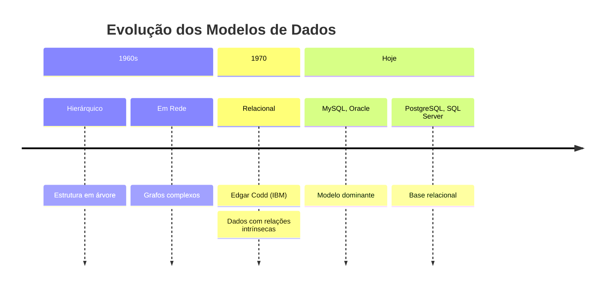
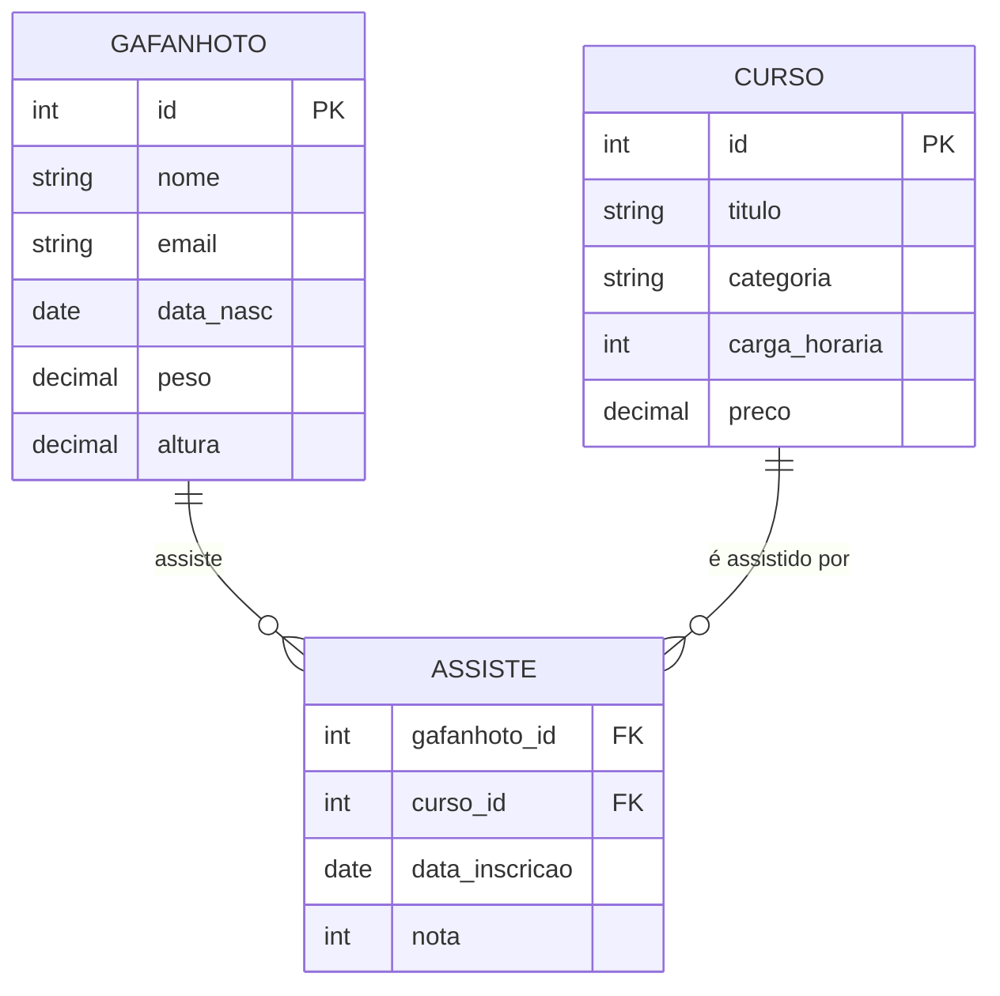
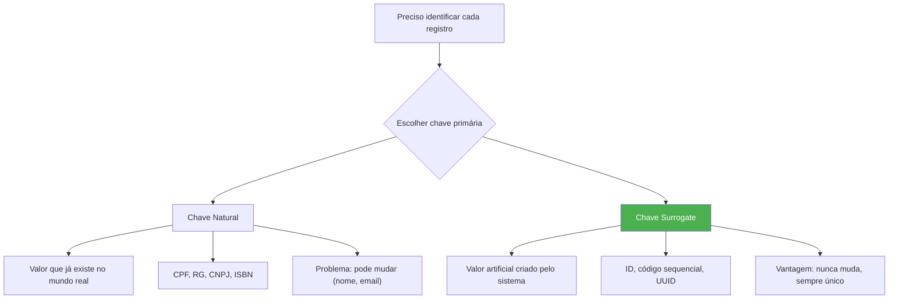
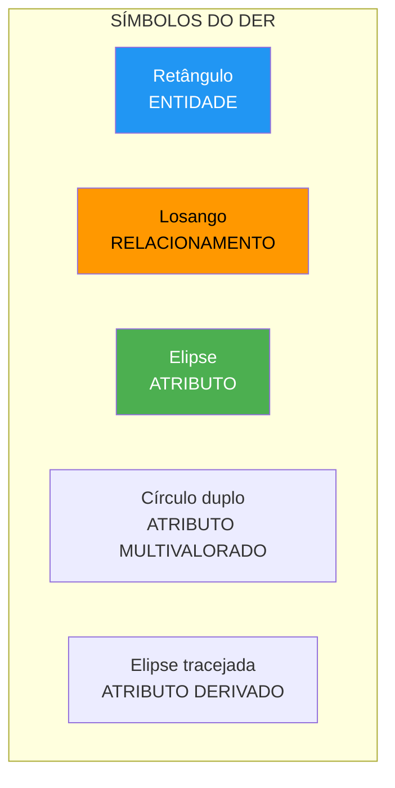
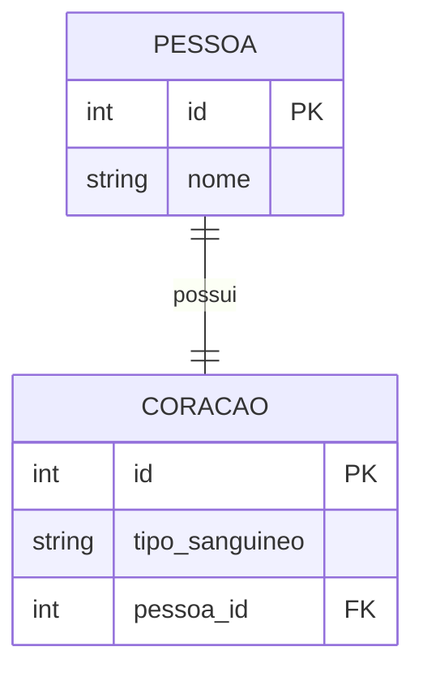
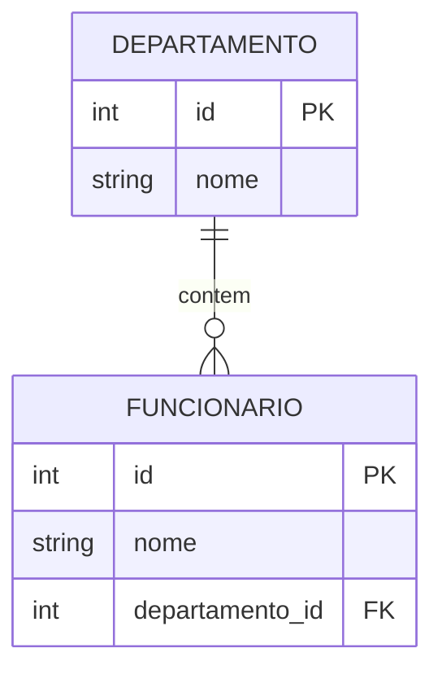
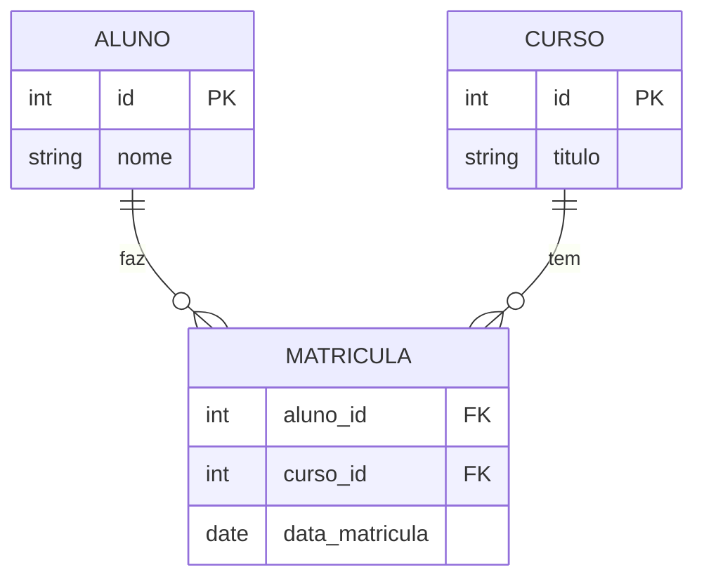
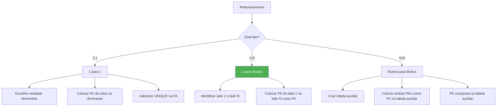

# 📚 Aula 12 - Modelo Relacional: Entidades, Relacionamentos e Chaves

---

## 🎯 Objetivos da Aula

* Compreender o modelo relacional proposto por Edgar Codd
* Dominar os conceitos de Entidade e Atributo
* Entender a importância da Chave Primária (PK)
* Aprender a construir Diagramas Entidade-Relacionamento (DER)
* Diferenciar os tipos de cardinalidade (1:1, 1:N, N:N)
* Implementar Chaves Estrangeiras (FK) para criar relacionamentos
* Aplicar regras práticas de implementação de chaves

---

## 📐 O Modelo Relacional: Fundamentos

### A Revolução de Edgar Codd (IBM - Década de 70)



### O Problema que o Modelo Relacional Resolveu

```text
❌ ANTES (Hierárquico/Em Rede):
- Dados armazenados de forma isolada
- Relações difíceis de estabelecer
- Consultas complexas e lentas
- Muita redundância de informação

✅ DEPOIS (Relacional):
- Dados conectados por relações lógicas
- Integridade referencial automática
- Consultas flexíveis e poderosas
- Eliminação de redundância (normalização)
```

---

## 🏗️ Componentes Básicos: Entidades e Atributos

### Analogia Visual do Modelo Relacional



### Entidade: O "Container" de Dados

```sql
-- ENTIDADE: É a representação de um objeto do mundo real
-- Exemplo: Uma tabela "cliente" é a entidade Cliente

CREATE TABLE cliente (
    id INT PRIMARY KEY,      -- Atributo identificador
    nome VARCHAR(100),       -- Atributo descritivo
    email VARCHAR(100)       -- Atributo descritivo
);

-- Cada linha é uma "ocorrência" da entidade Cliente
INSERT INTO cliente VALUES (1, 'João Silva', 'joao@email.com');
-- ☝️ Esta é UMA ocorrência da entidade Cliente
```

### Atributo: As Características da Entidade

```text
📊 CLASSIFICAÇÃO DOS ATRIBUTOS:

┌─────────────────────────────────────────────────────────┐
│ ATRIBUTO SIMPLES: Não pode ser dividido                │
│ Ex: idade, peso, altura, nome                          │
├─────────────────────────────────────────────────────────┤
│ ATRIBUTO COMPOSTO: Pode ser dividido em partes menores │
│ Ex: endereço (rua, número, bairro, cidade)             │
│     nome_completo (primeiro_nome, sobrenome)           │
├─────────────────────────────────────────────────────────┤
│ ATRIBUTO MULTIVALORADO: Pode ter múltiplos valores     │
│ Ex: telefones (residencial, comercial, celular)        │
│     habilidades (Java, Python, SQL)                    │
├─────────────────────────────────────────────────────────┤
│ ATRIBUTO DERIVADO: Calculado a partir de outros        │
│ Ex: idade (calculada a partir de data_nascimento)      │
│     IMC (calculado a partir de peso e altura)          │
└─────────────────────────────────────────────────────────┘
```

### Exemplo Prático de Atributos

```sql
CREATE TABLE pessoa (
    -- ATRIBUTO SIMPLES
    id INT PRIMARY KEY,
    nome VARCHAR(100),           -- Simples
    
    -- ATRIBUTO COMPOSTO (na prática, quebramos em colunas)
    endereco_rua VARCHAR(100),   -- Parte do composto
    endereco_numero VARCHAR(10), -- Parte do composto
    endereco_bairro VARCHAR(50), -- Parte do composto
    endereco_cidade VARCHAR(50), -- Parte do composto
    
    -- ATRIBUTO MULTIVALORADO (criamos tabela separada)
    -- telefones: tabela telefone_pessoa
    
    -- ATRIBUTO DERIVADO (não armazenamos, calculamos)
    -- idade: TIMESTAMPDIFF(YEAR, data_nascimento, CURDATE())
    data_nascimento DATE
);
```

---

## 🔑 Identificadores: Chave Primária (PK)

### O que é uma Chave Primária?



### Implementando Chave Primária

```sql
-- ✅ CHAVE NATURAL (quando existe identificador único real)
CREATE TABLE pais (
    codigo CHAR(2) PRIMARY KEY,    -- 'BR', 'US', 'PT'
    nome VARCHAR(50) NOT NULL
);

CREATE TABLE produto_natural (
    codigo_barras VARCHAR(13) PRIMARY KEY,  -- ISBN, EAN
    nome VARCHAR(100),
    preco DECIMAL(10,2)
);

-- ✅ CHAVE SURROGATE (RECOMENDADO para a maioria)
CREATE TABLE cliente_surrogate (
    id INT PRIMARY KEY AUTO_INCREMENT,  -- Artificial
    cpf VARCHAR(11) UNIQUE NOT NULL,    -- Natural (mantém)
    nome VARCHAR(100) NOT NULL,
    email VARCHAR(100)
);

-- ✅ CHAVE COMPOSTA (múltiplas colunas)
CREATE TABLE matricula (
    aluno_id INT,
    curso_id INT,
    data_matricula DATE,
    nota DECIMAL(4,2),
    PRIMARY KEY (aluno_id, curso_id)  -- Duas colunas juntas formam a PK
);
```

### Por que a Chave Primária é Essencial?

```sql
-- ❌ SEM CHAVE PRIMÁRIA (problemas garantidos)
CREATE TABLE aluno_sem_pk (
    nome VARCHAR(100),
    cpf VARCHAR(11)
);

-- Problema 1: Duplicação permitida
INSERT INTO aluno_sem_pk VALUES ('João', '12345678901');
INSERT INTO aluno_sem_pk VALUES ('João', '12345678901');  -- Aceita!

-- Problema 2: Não consigo identificar um registro específico
UPDATE aluno_sem_pk SET nome = 'João Silva' WHERE cpf = '12345678901';
-- Atualiza TODOS os Joões com esse CPF!

-- ✅ COM CHAVE PRIMÁRIA
CREATE TABLE aluno_com_pk (
    id INT PRIMARY KEY AUTO_INCREMENT,
    nome VARCHAR(100),
    cpf VARCHAR(11) UNIQUE
);

-- Cada registro é ÚNICO e IDENTIFICÁVEL
INSERT INTO aluno_com_pk (nome, cpf) VALUES ('João', '12345678901');  -- id = 1
INSERT INTO aluno_com_pk (nome, cpf) VALUES ('João', '12345678901');  -- ERRO! UNIQUE violada
```

---

## 📊 O Diagrama Entidade-Relacionamento (DER)

### Elementos Gráficos do DER



### Exemplo de DER Completo

```text
┌─────────────────────────────────────────────────────────────────┐
│                    DIAGRAMA ENTIDADE-RELACIONAMENTO             │
│                                                                 │
│    ┌──────────┐          ┌──────────┐          ┌──────────┐   │
│    │ GAFANHOTO│          │  ASSISTE │          │   CURSO  │   │
│    ├──────────┤    N     ├──────────┤    N     ├──────────┤   │
│    │ id (PK)  │◄─────────│gafanhoto│─────────►│ id (PK)  │   │
│    │ nome     │          │   (FK)  │          │ titulo   │   │
│    │ email    │          │ curso   │          │ carga    │   │
│    │ data_nasc│          │   (FK)  │          │ preco    │   │
│    │ peso     │          │ data    │          └──────────┘   │
│    │ altura   │          │ nota    │                          │
│    └──────────┘          └──────────┘                          │
│         │                      │                               │
│         │ (1,N)                 │                               │
│         ▼                      ▼                               │
│    ┌──────────┐          ┌──────────┐                         │
│    │ TELEFONE │          │  MODULO  │                         │
│    ├──────────┤          ├──────────┤                         │
│    │ id (PK)  │          │ id (PK)  │                         │
│    │ numero   │          │ nome     │                         │
│    │ tipo     │          │ ordem    │                         │
│    │gafanhoto │          │curso(FK) │                         │
│    │   (FK)   │          └──────────┘                         │
│    └──────────┘                                               │
└─────────────────────────────────────────────────────────────────┘
```

### Construindo um DER na Prática

```sql
-- Vamos criar um sistema de biblioteca baseado em DER

-- ENTIDADE 1: LIVRO
CREATE TABLE livro (
    id INT PRIMARY KEY AUTO_INCREMENT,
    titulo VARCHAR(200) NOT NULL,
    isbn VARCHAR(13) UNIQUE,
    ano_publicacao YEAR,
    preco DECIMAL(10,2)
);

-- ENTIDADE 2: AUTOR
CREATE TABLE autor (
    id INT PRIMARY KEY AUTO_INCREMENT,
    nome VARCHAR(100) NOT NULL,
    nacionalidade VARCHAR(50)
);

-- RELACIONAMENTO N:N entre LIVRO e AUTOR
-- (Um livro pode ter vários autores, um autor pode escrever vários livros)
CREATE TABLE livro_autor (
    livro_id INT,
    autor_id INT,
    PRIMARY KEY (livro_id, autor_id),
    FOREIGN KEY (livro_id) REFERENCES livro(id),
    FOREIGN KEY (autor_id) REFERENCES autor(id)
);
```

---

## 🔗 Tipos de Cardinalidade

### 1. Relacionamento Um para Um (1:1)



**Exemplo Prático 1:1**

```sql
-- Um cliente pode ter UMA assinatura
-- Uma assinatura pertence a UM cliente

CREATE TABLE cliente (
    id INT PRIMARY KEY AUTO_INCREMENT,
    nome VARCHAR(100),
    email VARCHAR(100)
);

CREATE TABLE assinatura (
    id INT PRIMARY KEY AUTO_INCREMENT,
    plano VARCHAR(50),
    data_inicio DATE,
    data_fim DATE,
    cliente_id INT UNIQUE,  -- UNIQUE garante 1:1
    FOREIGN KEY (cliente_id) REFERENCES cliente(id)
);

-- Como implementar 1:1?
-- Escolha uma entidade "dominante" e coloque a FK nela
-- Neste caso: cliente é dominante, assinatura tem a FK
```

### 2. Relacionamento Um para Muitos (1:N)



**Exemplo Prático 1:N**

```sql
-- Um departamento tem MUITOS funcionários
-- Um funcionário pertence a UM departamento

CREATE TABLE departamento (
    id INT PRIMARY KEY AUTO_INCREMENT,
    nome VARCHAR(50) NOT NULL,
    orcamento DECIMAL(12,2)
);

CREATE TABLE funcionario (
    id INT PRIMARY KEY AUTO_INCREMENT,
    nome VARCHAR(100) NOT NULL,
    salario DECIMAL(10,2),
    departamento_id INT,
    FOREIGN KEY (departamento_id) REFERENCES departamento(id)
);

-- Regra de Ouro do 1:N:
-- A chave primária do lado "1" (departamento.id)
-- vai para o lado "N" (funcionario.departamento_id) como chave estrangeira
```

### 3. Relacionamento Muitos para Muitos (N:N)



**Exemplo Prático N:N**

```sql
-- Um aluno faz MUITOS cursos
-- Um curso tem MUITOS alunos
-- RELACIONAMENTO N:N exige uma TABELA AUXILIAR

CREATE TABLE aluno (
    id INT PRIMARY KEY AUTO_INCREMENT,
    nome VARCHAR(100),
    matricula VARCHAR(20) UNIQUE
);

CREATE TABLE curso (
    id INT PRIMARY KEY AUTO_INCREMENT,
    titulo VARCHAR(100),
    carga_horaria INT
);

-- TABELA DE RELACIONAMENTO (também chamada de "tabela de ligação")
CREATE TABLE matricula (
    aluno_id INT,
    curso_id INT,
    data_matricula DATE DEFAULT CURRENT_DATE,
    nota_final DECIMAL(4,2),
    
    PRIMARY KEY (aluno_id, curso_id),  -- Chave composta
    FOREIGN KEY (aluno_id) REFERENCES aluno(id),
    FOREIGN KEY (curso_id) REFERENCES curso(id)
);

-- A tabela de relacionamento pode ter seus próprios atributos
-- (data_matricula, nota_final são atributos do relacionamento)
```

---

## 🔗 Conexão Prática: Chave Estrangeira (FK)

### O que é uma Chave Estrangeira?

```text
CHAVE ESTRANGEIRA (FOREIGN KEY - FK):
┌─────────────────────────────────────────────────────────────────┐
│ É a chave primária de uma tabela que foi "copiada" para outra  │
│ tabela para estabelecer um relacionamento.                     │
│                                                                 │
│ "Estrangeira" porque pertence originalmente a outra entidade.  │
└─────────────────────────────────────────────────────────────────┘

EXEMPLO:
┌─────────────┐         ┌─────────────┐
│ DEPARTAMENTO│         │ FUNCIONARIO │
├─────────────┤         ├─────────────┤
│ id (PK) 1───┼────────►│ id (PK)     │
│ nome        │         │ nome        │
└─────────────┘         │ dep_id (FK)─┼───► Aponta para id do departamento
                        └─────────────┘

A coluna funcionario.dep_id é uma CHAVE ESTRANGEIRA
porque ela se refere (aponta) para departamento.id
```

### Sintaxe da Chave Estrangeira

```sql
-- Opção 1: Na criação da tabela (inline)
CREATE TABLE pedido (
    id INT PRIMARY KEY,
    cliente_id INT REFERENCES cliente(id),  -- MySQL ignora assim
    data_pedido DATE
);

-- Opção 2: Na criação da tabela (separado - RECOMENDADO)
CREATE TABLE pedido (
    id INT PRIMARY KEY,
    cliente_id INT,
    data_pedido DATE,
    FOREIGN KEY (cliente_id) REFERENCES cliente(id)
);

-- Opção 3: Adicionar depois (ALTER TABLE)
CREATE TABLE pedido (
    id INT PRIMARY KEY,
    cliente_id INT,
    data_pedido DATE
);

ALTER TABLE pedido 
ADD CONSTRAINT fk_pedido_cliente 
FOREIGN KEY (cliente_id) REFERENCES cliente(id);

-- Opção 4: Chave estrangeira composta
CREATE TABLE item_pedido (
    pedido_id INT,
    produto_id INT,
    quantidade INT,
    preco_unitario DECIMAL(10,2),
    PRIMARY KEY (pedido_id, produto_id),
    FOREIGN KEY (pedido_id) REFERENCES pedido(id),
    FOREIGN KEY (produto_id) REFERENCES produto(id)
);
```

### Comportamento da Chave Estrangeira

```sql
-- Criando tabelas com regras de integridade
CREATE TABLE departamento (
    id INT PRIMARY KEY,
    nome VARCHAR(50)
);

CREATE TABLE funcionario (
    id INT PRIMARY KEY,
    nome VARCHAR(100),
    depto_id INT,
    FOREIGN KEY (depto_id) REFERENCES departamento(id)
);

-- INSERÇÃO: A FK deve existir na tabela referenciada
INSERT INTO funcionario VALUES (1, 'João', 1);
-- ERRO: Não existe departamento com id = 1 ainda!

-- CORRETO: Primeiro insere o departamento
INSERT INTO departamento VALUES (1, 'TI');
INSERT INTO funcionario VALUES (1, 'João', 1);  -- OK agora

-- UPDATE: Não pode mudar a FK para um valor inexistente
UPDATE funcionario SET depto_id = 99 WHERE id = 1;
-- ERRO: Não existe departamento 99

-- DELETE: Não pode deletar um departamento que tem funcionários
DELETE FROM departamento WHERE id = 1;
-- ERRO: Existem funcionários referenciando este departamento
```

---

## 📋 Regras de Implementação de Chaves

### Resumo das Regras por Tipo de Relacionamento



### Tabela Resumo

| Relacionamento | Como Implementar | Exemplo |
|----------------|------------------|---------|
| **1:1** | FK + UNIQUE | `pessoa_id INT UNIQUE REFERENCES pessoa(id)` |
| **1:N** | FK no lado N | `departamento_id INT REFERENCES departamento(id)` |
| **N:N** | Tabela auxiliar | `aluno_curso (aluno_id, curso_id)` |

---

## 🏗️ Exemplo Prático Completo

### Sistema de Escola com Relacionamentos

```sql
-- 1. CRIAR BANCO
CREATE DATABASE escola_relacional;
USE escola_relacional;

-- 2. ENTIDADE: ALUNO (independente)
CREATE TABLE aluno (
    id INT PRIMARY KEY AUTO_INCREMENT,
    nome VARCHAR(100) NOT NULL,
    cpf VARCHAR(11) UNIQUE NOT NULL,
    data_nascimento DATE,
    email VARCHAR(100)
);

-- 3. ENTIDADE: CURSO (independente)
CREATE TABLE curso (
    id INT PRIMARY KEY AUTO_INCREMENT,
    titulo VARCHAR(100) NOT NULL,
    carga_horaria INT,
    preco DECIMAL(10,2)
);

-- 4. ENTIDADE: PROFESSOR (independente)
CREATE TABLE professor (
    id INT PRIMARY KEY AUTO_INCREMENT,
    nome VARCHAR(100) NOT NULL,
    especialidade VARCHAR(50),
    salario DECIMAL(10,2)
);

-- 5. RELACIONAMENTO 1:N: Professor ministra Curso
-- (Um professor pode ministrar vários cursos, cada curso tem um professor)
ALTER TABLE curso 
ADD COLUMN professor_id INT,
ADD CONSTRAINT fk_curso_professor 
FOREIGN KEY (professor_id) REFERENCES professor(id);

-- 6. RELACIONAMENTO N:N: Aluno se matricula em Curso
CREATE TABLE matricula (
    aluno_id INT,
    curso_id INT,
    data_matricula DATE DEFAULT CURRENT_DATE,
    nota_final DECIMAL(4,2),
    PRIMARY KEY (aluno_id, curso_id),
    FOREIGN KEY (aluno_id) REFERENCES aluno(id),
    FOREIGN KEY (curso_id) REFERENCES curso(id)
);

-- 7. RELACIONAMENTO 1:N: Curso tem Módulos (exemplo de 1:N adicional)
CREATE TABLE modulo (
    id INT PRIMARY KEY AUTO_INCREMENT,
    nome VARCHAR(100) NOT NULL,
    ordem INT,
    curso_id INT NOT NULL,
    FOREIGN KEY (curso_id) REFERENCES curso(id)
);

-- 8. INSERIR DADOS DE TESTE
INSERT INTO professor (nome, especialidade, salario) VALUES
    ('Dr. João Silva', 'Banco de Dados', 8500.00),
    ('Profa. Maria Santos', 'Programação', 9200.00),
    ('Prof. Carlos Lima', 'Redes', 7800.00);

INSERT INTO curso (titulo, carga_horaria, preco, professor_id) VALUES
    ('MySQL Completo', 50, 520.00, 1),
    ('Java Fundamentos', 60, 580.00, 2),
    ('Python para Dados', 70, 890.00, 2),
    ('Redes TCP/IP', 45, 450.00, 3);

INSERT INTO aluno (nome, cpf, data_nascimento, email) VALUES
    ('João Silva', '12345678901', '1995-03-15', 'joao@email.com'),
    ('Maria Santos', '98765432109', '1998-07-22', 'maria@email.com'),
    ('Pedro Oliveira', '45678912345', '1992-01-30', 'pedro@email.com'),
    ('Ana Costa', '78912345678', '1996-11-08', 'ana@email.com');

INSERT INTO modulo (nome, ordem, curso_id) VALUES
    ('Introdução ao MySQL', 1, 1),
    ('Consultas Básicas', 2, 1),
    ('JOINs e Subconsultas', 3, 1),
    ('Introdução ao Java', 1, 2),
    ('Orientação a Objetos', 2, 2);

INSERT INTO matricula (aluno_id, curso_id, nota_final) VALUES
    (1, 1, 8.5),
    (1, 2, 9.0),
    (2, 1, 7.5),
    (2, 3, 8.8),
    (3, 2, 9.5),
    (3, 4, 7.0),
    (4, 1, 9.2),
    (4, 3, 8.0);

-- 9. CONSULTAS DEMONSTRANDO OS RELACIONAMENTOS

-- Listar cursos com seus professores (1:N)
SELECT 
    c.titulo AS curso,
    p.nome AS professor,
    c.carga_horaria,
    c.preco
FROM curso c
JOIN professor p ON c.professor_id = p.id
ORDER BY c.titulo;

-- Listar alunos matriculados em cada curso (N:N)
SELECT 
    c.titulo AS curso,
    a.nome AS aluno,
    m.nota_final,
    m.data_matricula
FROM matricula m
JOIN curso c ON m.curso_id = c.id
JOIN aluno a ON m.aluno_id = a.id
ORDER BY c.titulo, m.nota_final DESC;

-- Listar módulos de cada curso (1:N adicional)
SELECT 
    c.titulo AS curso,
    m.nome AS modulo,
    m.ordem
FROM modulo m
JOIN curso c ON m.curso_id = c.id
ORDER BY c.titulo, m.ordem;

-- Estatísticas por professor
SELECT 
    p.nome AS professor,
    COUNT(c.id) AS cursos_ministrados,
    AVG(c.preco) AS preco_medio_cursos,
    SUM(c.carga_horaria) AS horas_totais
FROM professor p
LEFT JOIN curso c ON p.id = c.professor_id
GROUP BY p.id
ORDER BY cursos_ministrados DESC;
```

---

## 📋 Resumo Rápido

| Conceito | Definição | Representação |
|----------|-----------|---------------|
| **Entidade** | Objeto do mundo real | Retângulo |
| **Atributo** | Característica da entidade | Elipse |
| **Relacionamento** | Ligação entre entidades | Losango |
| **Chave Primária (PK)** | Identificador único | Sublinhado |
| **Chave Estrangeira (FK)** | Referência a outra tabela | FK na coluna |
| **Cardinalidade 1:1** | Um para um | UNIQUE + FK |
| **Cardinalidade 1:N** | Um para muitos | FK no lado N |
| **Cardinalidade N:N** | Muitos para muitos | Tabela auxiliar |

### Regras de Ouro

```text
🗝️ CHAVE PRIMÁRIA:
- Toda tabela deve ter uma PK
- PK nunca pode ser NULL
- PK nunca pode se repetir

🗝️ CHAVE ESTRANGEIRA:
- FK pode ser NULL (relacionamento opcional)
- FK deve existir na tabela referenciada
- FK pode se repetir

📐 RELACIONAMENTOS:
- 1:1 → FK + UNIQUE
- 1:N → FK no lado N
- N:N → Tabela auxiliar
```

---

## 💡 A Sabedoria do Modelo Relacional

"O modelo relacional não é apenas sobre armazenar dados. É sobre armazenar CONEXÕES. A chave estrangeira é o que transforma um monte de tabelas isoladas em um SISTEMA de informação integrado."

> 🧠 **Exercícios de Fixação**:
> 1. Crie um DER para um sistema de e-commerce (Produto, Cliente, Pedido, ItemPedido)
> 2. Implemente as tabelas com todas as chaves primárias e estrangeiras
> 3. Identifique os tipos de cardinalidade em cada relacionamento
> 4. **Bônus**: Adicione atributos específicos às tabelas de relacionamento N:N

---

### 🎯 Preparação para Próxima Aula
Na **Aula 13** vamos:
1. Dominar **INNER JOIN, LEFT JOIN, RIGHT JOIN**
2. Aprender a **combinar múltiplas tabelas** em uma consulta
3. Trabalhar com **self-join** (tabela que se relaciona com ela mesma)
4. Praticar **junções complexas** com mais de 3 tabelas
5. Otimizar **consultas com JOIN** usando índices

**Trazer**: Um diagrama DER do seu projeto para praticarmos consultas com JOIN! 🔗 