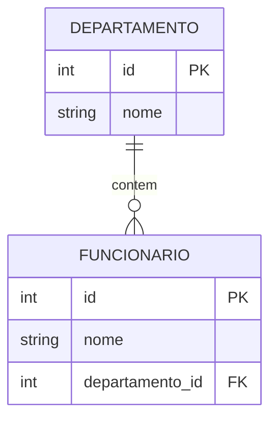
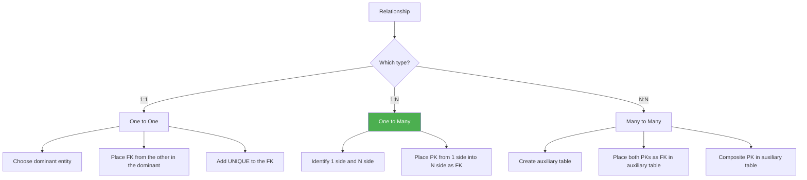

# 📚 Lesson 12 — Relational Model (Fundamentals)

---

* Understand what the **Relational Model** is
* Identify **Entities** and **Attributes**
* Understand the importance of the Primary Key (PK)
* Understand the **Entity-Relationship Diagram (ERD)**
* Learn the types of **cardinality**
* Understand the use of the **Foreign Key (FK)**
* Apply relationship rules between tables

---

# 🧠 What is the Relational Model?

The **Relational Model** was created by **Edgar Codd** in the 1970s.

It introduced a revolutionary idea:

```text
Data does not exist in isolation — it has RELATIONSHIPS with other data
```

---

💡 Simple example:

```text
A student → is enrolled in a course  
A course → has multiple students  
```

👉 This is a **relationship**

---

# 🧱 Entities and Attributes

## 📦 Entity

An entity is like a:

```text
"container of information"
```

Examples:

```text
- Student  
- Course  
- Product  
```

In a database, this becomes a **table**.

---

## 🏷️ Attributes

They are the **characteristics of an entity**.

Example:

```text
Student:
- name  
- age  
- height  
```

In the database, these become **columns**.

---

## 📌 Record (Tuple)

Each row in a table represents a:

```text
Record (or Tuple)
```

Example:

```text
João | 21 | 1.80
```

---

# 🔑 Primary Key (PK)

The **PK** is the unique identifier of each record.

```text
Cannot be duplicated  
Cannot be null  
```

---

## Example

```sql id="v2k8sj"
CREATE TABLE alunos (
    id INT PRIMARY KEY AUTO_INCREMENT,
    nome VARCHAR(100)
);
```

---

💡 Analogy:

```text
CPF → identifies a person  
ID → identifies a record  
```

---

# 🔗 Relationships

A relationship is the **connection between entities**.

Example:

```text
Student → attends → Course
```

---

# 📊 ERD (Entity-Relationship Diagram)

It is the **visual** way to represent the database.

Elements:

```text
Rectangle → Entity  
Diamond   → Relationship  
Oval      → Attribute (conceptual)  
```

---

### 💡 Visual representation:


---

## 🔗 Cardinality (Types of Relationship)

Defines **how many records relate to others**.

## 1️⃣ One to One (1:1)

```text
One entity relates to only one of the other
```

Example:


---

## 2️⃣ One to Many (1:N)

```text
One side → multiple records  
Other side → only one  
```

Example:


---

## 3️⃣ Many to Many (N:N)

```text
Both sides have multiple relationships
```

Example:


---

## 🔑 Foreign Key (FK)

```text
It is the primary key of one table that was "copied" into another table  
to establish a relationship.                     
```

* "Foreign" because it originally belongs to another entity

Example:



> The column funcionario.dep_id is a FOREIGN KEY
> because it refers (points) to departamento.id

---

### Foreign Key Syntax

Table cursos:

```sql id="s9d2kf"
CREATE TABLE cursos (
    id INT PRIMARY KEY,
    nome VARCHAR(100)
);
```

Table alunos:

```sql id="m3l7xp"
CREATE TABLE alunos (
    id INT PRIMARY KEY,
    nome VARCHAR(100),
    curso_id INT,
    FOREIGN KEY (curso_id) REFERENCES cursos(id)
);
```

---

💡 Here:

```text
curso_id → FK  
cursos.id → original PK  
```

---

# ⚙️ Implementation Rules

Now comes the most important part in practice 👇

---

## 🔹 1:1 (One to One)

Choose one side to receive the FK.

```text
Table A ← receives FK from Table B
```

---

## 🔹 1:N (One to Many)

Fixed rule:

```text
The key from the 1 side goes to the N side
```

Example:

```text
Course (1) → Student (N)

FK goes in: Student
```

---

## 🔹 N:N (Many to Many)

Here everything changes:

👉 We create an **intermediate table**

---

### Example

```text
Student ↔ Course
```

Intermediate table:

```sql id="k8p4rt"
CREATE TABLE aluno_curso (
    aluno_id INT,
    curso_id INT,
    FOREIGN KEY (aluno_id) REFERENCES alunos(id),
    FOREIGN KEY (curso_id) REFERENCES cursos(id)
);
```

---

💡 This table represents the **relationship**

---

# 🧠 Visual Summary



---

## 📋 Quick Summary

| Concept              | Definition                   | Representation   |
| -------------------- | ---------------------------- | ---------------- |
| **Entity**           | Real-world object            | Rectangle        |
| **Attribute**        | Characteristic of the entity | Ellipse          |
| **Relationship**     | Connection between entities  | Diamond          |
| **Primary Key (PK)** | Unique identifier            | Underlined       |
| **Foreign Key (FK)** | Reference to another table   | FK in column     |
| **Cardinality 1:1**  | One to one                   | UNIQUE + FK      |
| **Cardinality 1:N**  | One to many                  | FK on the N side |
| **Cardinality N:N**  | Many to many                 | Auxiliary table  |

---

> 💡**Tip**: "The relational model is not just about storing data. It is about storing CONNECTIONS. The foreign key is what transforms a set of isolated tables into an integrated information SYSTEM."
