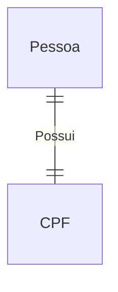
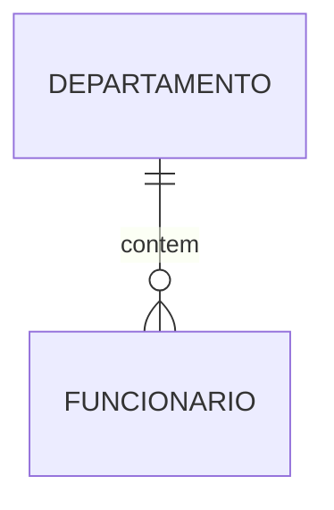
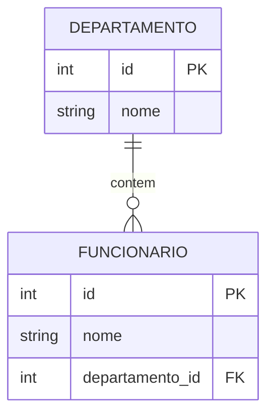
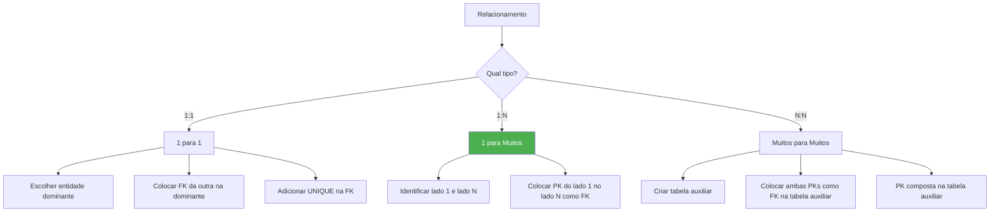

# 📚 Aula 12 — Modelo Relacional (Fundamentos)

---

* Compreender o que é o **Modelo Relacional**
* Identificar **Entidades** e **Atributos**
* Entender a importância da Chave Primária (PK)
* Compreender o **Diagrama Entidade-Relacionamento (DER)**
* Aprender os tipos de **cardinalidade**
* Entender o uso da **Chave Estrangeira (FK)**
* Aplicar as regras de relacionamento entre tabelas

---

# 🧠 O que é o Modelo Relacional?

O **Modelo Relacional** foi criado por **Edgar Codd** na década de 1970.

Ele trouxe uma ideia revolucionária:

```text
Os dados não existem isolados — eles possuem RELAÇÕES entre si
```

---

💡 Exemplo simples:

```text
Um aluno → está matriculado em um curso
Um curso → possui vários alunos
```

👉 Isso é uma **relação**

---

# 🧱 Entidades e Atributos

## 📦 Entidade

Uma entidade é como um:

```text
"container de informações"
```

Exemplos:

```text
- Aluno
- Curso
- Produto
```

No banco de dados, isso vira uma **tabela**.

---

## 🏷️ Atributos

São as **características da entidade**.

Exemplo:

```text
Aluno:
- nome
- idade
- altura
```

No banco, isso vira **colunas**.

---

## 📌 Registro (Tupla)

Cada linha da tabela representa um:

```text
Registro (ou Tupla)
```

Exemplo:

```text
João | 21 | 1.80
```

---

# 🔑 Chave Primária (Primary Key — PK)

A **PK** é o identificador único de cada registro.

```text
Não pode repetir
Não pode ser nula
```

---

## Exemplo

```sql
CREATE TABLE alunos (
    id INT PRIMARY KEY AUTO_INCREMENT,
    nome VARCHAR(100)
);
```

---

💡 Analogia:

```text
CPF → identifica uma pessoa
ID → identifica um registro
```

---

# 🔗 Relacionamentos

Relacionamento é a **ligação entre entidades**.

Exemplo:

```text
Aluno → assiste → Curso
```

---

# 📊 DER (Diagrama Entidade-Relacionamento)

É a forma **visual** de representar o banco.

Elementos:

```text
Retângulo → Entidade
Losango   → Relacionamento
Oval      → Atributo (conceitual)
```

---

### 💡 Representação visual:


---

## 🔗 Cardinalidade (Tipos de Relação)

Define **quantos registros se relacionam com outros**.

## 1️⃣ Um para Um (1:1)
```text
Uma entidade se relaciona com apenas uma da outra
```

Exemplo:



---

## 2️⃣ Um para Muitos (1:N)

```text
Um lado → vários registros
Outro lado → apenas um
```

Exemplo:



---

## 3️⃣ Muitos para Muitos (N:N)

```text
Ambos os lados possuem múltiplos relacionamentos
```

Exemplo:


---

## 🔑 Chave Estrangeira (Foreign Key — FK)

```text
É a chave primária de uma tabela que foi "copiada" para outra tabela 
para estabelecer um relacionamento.                     
```

- "Estrangeira" porque pertence originalmente a outra entidade


Exemplo:



> A coluna funcionario.dep_id é uma CHAVE ESTRANGEIRA
porque ela se refere (aponta) para departamento.id

---

### Sintaxe da Chave Estrangeira

Tabela cursos:

```sql
CREATE TABLE cursos (
    id INT PRIMARY KEY,
    nome VARCHAR(100)
);
```

Tabela alunos:

```sql
CREATE TABLE alunos (
    id INT PRIMARY KEY,
    nome VARCHAR(100),
    curso_id INT,
    FOREIGN KEY (curso_id) REFERENCES cursos(id)
);
```

---

💡 Aqui:

```text
curso_id → FK
cursos.id → PK original
```

---

# ⚙️ Regras de Implementação

Agora vem o mais importante na prática 👇

---

## 🔹 1:1 (Um para Um)

Escolhe-se um lado para receber a FK.

```text
Tabela A ← recebe FK da Tabela B
```

---

## 🔹 1:N (Um para Muitos)

Regra fixa:

```text
A chave do lado 1 vai para o lado N
```

Exemplo:

```text
Curso (1) → Aluno (N)

FK fica em: Aluno
```

---

## 🔹 N:N (Muitos para Muitos)

Aqui muda tudo:

👉 Criamos uma **tabela intermediária**

---

### Exemplo


Tabela intermediária:

```sql
CREATE TABLE aluno_curso (
    aluno_id INT,
    curso_id INT,
    FOREIGN KEY (aluno_id) REFERENCES alunos(id),
    FOREIGN KEY (curso_id) REFERENCES cursos(id)
);
```

---

💡 Essa tabela representa o **relacionamento**

---

# 🧠 Resumo Visual



---

## 📋 Resumo Rápido

| Conceito | Definição | Representação |
|----------|-----------|---------------|
| **Entidade** | Objeto do mundo real | Retângulo |
| **Atributo** | Característica da entidade | Elipse |
| **Relacionamento** | Ligação entre entidades | Losango |
| **Chave Primária (PK)** | Identificador único | Sublinhado |
| **Chave Estrangeira (FK)** | Referência a outra tabela | FK na coluna |
| **Cardinalidade 1:1** | Um para um | UNIQUE + FK |
| **Cardinalidade 1:N** | Um para muitos | FK no lado N |
| **Cardinalidade N:N** | Muitos para muitos | Tabela auxiliar |

---

> 💡**Dica**: "O modelo relacional não é apenas sobre armazenar dados. É sobre armazenar CONEXÕES. A chave estrangeira é o que transforma um monte de tabelas isoladas em um SISTEMA de informação integrado."
