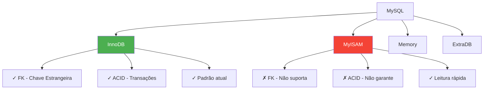
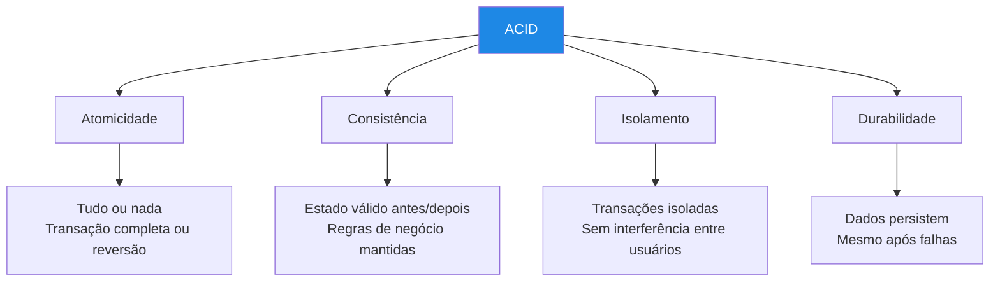
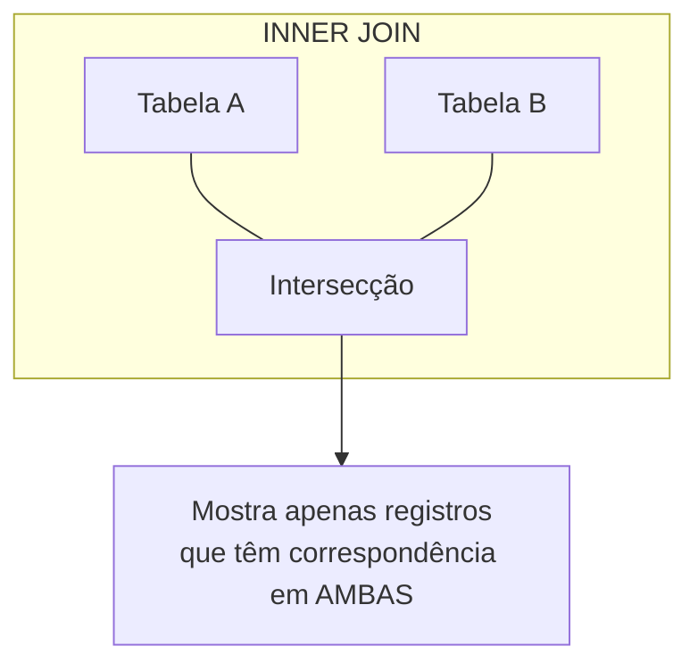
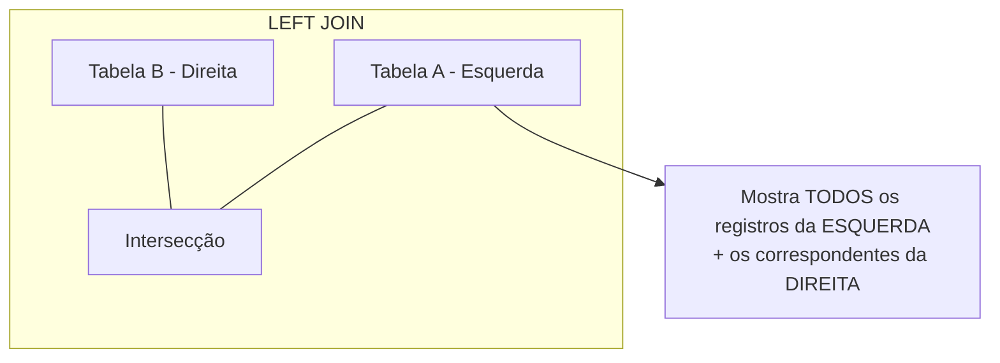
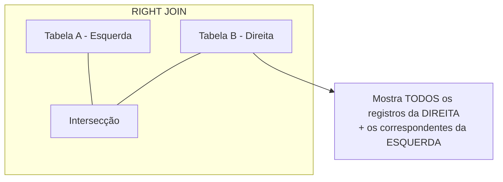

# 📚 Aula 13 - Implementando Relacionamentos: JOINs, FK e Integridade Referencial

---

## 🎯 Objetivos da Aula

* Compreender os motores de armazenamento do MySQL (InnoDB vs MyISAM)
* Entender o conceito ACID e sua importância para transações
* Implementar Chaves Estrangeiras (FK) na prática
* Garantir a Integridade Referencial entre tabelas
* Dominar as junções (JOINs) para consultar múltiplas tabelas
* Utilizar aliases (AS) para otimizar comandos SQL

---

## ⚙️ Motores de Armazenamento (Engines)

### O que são Engines?



### Comparação entre Engines

| Característica | InnoDB | MyISAM | Memory |
|----------------|--------|--------|--------|
| **Chave Estrangeira (FK)** | ✅ Sim | ❌ Não | ❌ Não |
| **Transações ACID** | ✅ Sim | ❌ Não | ❌ Não |
| **Lock de linha** | ✅ Sim | ❌ Não (tabela) | ❌ Não (tabela) |
| **Full-text search** | ✅ Sim (5.6+) | ✅ Sim | ❌ Não |
| **Cache de dados** | ✅ Buffer pool | ✅ Cache de índice | ✅ Dados em RAM |
| **Uso recomendado** | Sistemas transacionais | Consultas leitura | Tabelas temporárias |

### Como definir a Engine

```sql
-- ✅ EXPLÍCITO (RECOMENDADO) - Define a engine na criação
CREATE TABLE cliente (
    id INT PRIMARY KEY AUTO_INCREMENT,
    nome VARCHAR(100) NOT NULL
) ENGINE = InnoDB;

-- ✅ VERIFICAR a engine de uma tabela
SELECT ENGINE 
FROM information_schema.TABLES 
WHERE TABLE_NAME = 'cliente';

-- ✅ ALTERAR a engine depois de criada
ALTER TABLE cliente ENGINE = InnoDB;

-- ✅ VER todas as engines disponíveis
SHOW ENGINES;
```

---

## 🔒 O Conceito ACID

### O que é ACID?



### Exemplo Prático do ACID

```sql
-- Cenário: Transferência bancária
-- Conta A: R$ 1000,00
-- Conta B: R$ 500,00
-- Transferência: R$ 200,00 de A para B

START TRANSACTION;

-- 1. Atomicidade: Ambas operações são uma unidade
UPDATE conta SET saldo = saldo - 200 WHERE id = 1;  -- Conta A
UPDATE conta SET saldo = saldo + 200 WHERE id = 2;  -- Conta B

-- 2. Consistência: Saldo nunca pode ser negativo (CHECK constraint)
-- Se saldo de A fosse 150, a transação falharia

-- 3. Isolamento: Outras transações veem o estado antes ou depois
-- Não veem o "meio do caminho"

-- 4. Durabilidade: Após COMMIT, dados são permanentes
COMMIT;

-- Se algo falhar antes do COMMIT:
ROLLBACK;  -- Tudo volta ao estado anterior
```

---

## 🔗 Implementação de Chaves Estrangeiras (FK)

### Regra de Ouro: 1:N

```text
┌─────────────────────────────────────────────────────────────────┐
│                                                                 │
│   REGRA DE OURO DO RELACIONAMENTO 1:N                           │
│                                                                 │
│   A CHAVE PRIMÁRIA (PK) do lado "1"                             │
│                ↓                                                │
│   VAI para o lado "N" (muitos) como CHAVE ESTRANGEIRA (FK)      │
│                                                                 │
│                                                                 │
│   Exemplo:                                                      │
│                                                                 │
│   ┌─────────────┐              ┌─────────────┐                 │
│   │   CURSO     │   1         N│   ALUNO     │                 │
│   │  (lado 1)   │ ──────────►  │  (lado N)   │                 │
│   ├─────────────┤              ├─────────────┤                 │
│   │ id (PK)─────┼──────────────│ curso_id(FK)│                 │
│   │ nome        │              │ nome        │                 │
│   └─────────────┘              └─────────────┘                 │
│                                                                 │
└─────────────────────────────────────────────────────────────────┘
```

### Requisitos Técnicos da FK

```text
✅ A FK NÃO precisa ter o mesmo nome da PK original
✅ Porém, DEVE ter o MESMO TIPO e TAMANHO
✅ A FK pode ser NULL (relacionamento opcional)
✅ A FK pode se repetir (vários registros apontam para o mesmo)
```

### Criando Chave Estrangeira Passo a Passo

```sql
-- 1. CRIAR TABELA PRINCIPAL (lado 1)
CREATE TABLE curso (
    id INT PRIMARY KEY AUTO_INCREMENT,
    nome VARCHAR(100) NOT NULL,
    carga_horaria INT
) ENGINE = InnoDB;

-- 2. CRIAR TABELA DEPENDENTE (lado N)
CREATE TABLE aluno (
    id INT PRIMARY KEY AUTO_INCREMENT,
    nome VARCHAR(100) NOT NULL,
    email VARCHAR(100)
) ENGINE = InnoDB;

-- 3. ADICIONAR A COLUNA QUE SERÁ FK
ALTER TABLE aluno ADD COLUMN curso_id INT;

-- 4. CRIAR A RESTRIÇÃO DE CHAVE ESTRANGEIRA
ALTER TABLE aluno 
ADD CONSTRAINT fk_aluno_curso 
FOREIGN KEY (curso_id) REFERENCES curso(id);

-- VERIFICAR a FK criada
DESCRIBE aluno;
-- O campo curso_id mostrará "MUL" em "Key" (Multiple/foreign key)
```

### Sintaxe Alternativa (na criação da tabela)

```sql
-- Já criando a tabela com a FK
CREATE TABLE aluno (
    id INT PRIMARY KEY AUTO_INCREMENT,
    nome VARCHAR(100) NOT NULL,
    email VARCHAR(100),
    curso_id INT,
    FOREIGN KEY (curso_id) REFERENCES curso(id)
) ENGINE = InnoDB;
```

### Exemplo Completo com Dados

```sql
-- Criar estrutura
CREATE DATABASE escola_relacional;
USE escola_relacional;

-- Tabela cursos (lado 1)
CREATE TABLE curso (
    id INT PRIMARY KEY AUTO_INCREMENT,
    nome VARCHAR(100) NOT NULL,
    carga_horaria INT
) ENGINE = InnoDB;

-- Tabela alunos (lado N)
CREATE TABLE aluno (
    id INT PRIMARY KEY AUTO_INCREMENT,
    nome VARCHAR(100) NOT NULL,
    email VARCHAR(100),
    curso_id INT,
    FOREIGN KEY (curso_id) REFERENCES curso(id)
) ENGINE = InnoDB;

-- Inserir cursos
INSERT INTO curso (nome, carga_horaria) VALUES
    ('MySQL Completo', 50),
    ('Java Fundamentos', 60),
    ('Python para Dados', 70);

-- Inserir alunos (com curso_id válido)
INSERT INTO aluno (nome, email, curso_id) VALUES
    ('João Silva', 'joao@email.com', 1),
    ('Maria Santos', 'maria@email.com', 1),
    ('Pedro Oliveira', 'pedro@email.com', 2),
    ('Ana Costa', 'ana@email.com', 3);

-- ❓ O que acontece se tentarmos?
INSERT INTO aluno (nome, email, curso_id) VALUES
    ('Invalido', 'invalido@email.com', 99);
-- ERRO: Cannot add or update a child row (FK violada)
```

---

## 🛡️ Integridade Referencial

### O que é Integridade Referencial?

```text
┌─────────────────────────────────────────────────────────────────┐
│                                                                 │
│   INTEGRIDADE REFERENCIAL                                       │
│                                                                 │
│   Garante que os relacionamentos entre tabelas sejam            │
│   sempre consistentes e válidos.                                │
│                                                                 │
│   ⚠️ Impede exclusão de registros "pai" que possuem             │
│      registros "filho" dependentes.                            │
│                                                                 │
└─────────────────────────────────────────────────────────────────┘
```

### Exemplo de Proteção

```sql
-- Tentar excluir um curso que tem alunos matriculados
DELETE FROM curso WHERE id = 1;
-- ERRO: Cannot delete or update a parent row
-- Motivo: Existem alunos referenciando este curso!

-- Para excluir, primeiro precisamos:
-- Opção 1: Excluir os alunos primeiro
DELETE FROM aluno WHERE curso_id = 1;
DELETE FROM curso WHERE id = 1;

-- Opção 2: Atualizar os alunos para outro curso
UPDATE aluno SET curso_id = 2 WHERE curso_id = 1;
DELETE FROM curso WHERE id = 1;
```

### Comportamentos ON DELETE

```sql
-- Podemos definir o comportamento quando o "pai" é excluído
CREATE TABLE aluno (
    id INT PRIMARY KEY AUTO_INCREMENT,
    nome VARCHAR(100),
    curso_id INT,
    FOREIGN KEY (curso_id) REFERENCES curso(id)
        ON DELETE CASCADE  -- Exclui os alunos também
        -- ON DELETE SET NULL  -- Seta curso_id = NULL
        -- ON DELETE RESTRICT  -- Impede exclusão (padrão)
        -- ON DELETE NO ACTION  -- Mesmo que RESTRICT
) ENGINE = InnoDB;
```

---

## 🔗 Junções de Tabelas (JOINs)

### O Problema: Dados em Múltiplas Tabelas

```sql
-- Dados separados em duas tabelas
SELECT * FROM aluno;
-- +----+--------------+-------------------+----------+
-- | id | nome         | email             | curso_id |
-- +----+--------------+-------------------+----------+
-- | 1  | João Silva   | joao@email.com    | 1        |
-- | 2  | Maria Santos | maria@email.com   | 1        |
-- | 3  | Pedro        | pedro@email.com   | 2        |
-- +----+--------------+-------------------+----------+

SELECT * FROM curso;
-- +----+----------------+---------------+
-- | id | nome           | carga_horaria |
-- +----+----------------+---------------+
-- | 1  | MySQL Completo | 50            |
-- | 2  | Java Fundamentos| 60           |
-- +----+----------------+---------------+

-- ❌ Precisamos ver o NOME do curso junto com o aluno!
```

### A Cláusula ON - Essencial para JOIN

```sql
-- ❌ SEM ON (Produto Cartesiano - PERIGO!)
SELECT * FROM aluno, curso;
-- Resultado: 3 alunos × 2 cursos = 6 linhas (combinações erradas!)
-- +----+---------+----------+----+------------------+
-- | id | nome    | curso_id | id | nome             |
-- +----+---------+----------+----+------------------+
-- | 1  | João    | 1        | 1  | MySQL Completo   | ← Correto
-- | 1  | João    | 1        | 2  | Java Fundamentos | ← Errado!
-- | 2  | Maria   | 1        | 1  | MySQL Completo   | ← Correto
-- | 2  | Maria   | 1        | 2  | Java Fundamentos | ← Errado!
-- ...

-- ✅ COM ON (Junção correta)
SELECT * 
FROM aluno 
JOIN curso ON aluno.curso_id = curso.id;
-- Apenas as combinações que realmente existem!
```

### 1. INNER JOIN (Junção Interna)



```sql
-- INNER JOIN: Mostra apenas alunos com curso válido
SELECT 
    aluno.nome AS aluno_nome,
    curso.nome AS curso_nome,
    curso.carga_horaria
FROM aluno
INNER JOIN curso ON aluno.curso_id = curso.id
ORDER BY curso.nome, aluno.nome;

-- Resultado:
-- +--------------+------------------+---------------+
-- | aluno_nome   | curso_nome       | carga_horaria |
-- +--------------+------------------+---------------+
-- | João Silva   | MySQL Completo   | 50            |
-- | Maria Santos | MySQL Completo   | 50            |
-- | Pedro        | Java Fundamentos | 60            |
-- +--------------+------------------+---------------+
-- (Alunos sem curso NÃO aparecem)
```

### 2. LEFT JOIN (Junção à Esquerda)



```sql
-- LEFT JOIN: Prioriza a tabela da ESQUERDA (aluno)
SELECT 
    aluno.nome AS aluno_nome,
    curso.nome AS curso_nome
FROM aluno
LEFT JOIN curso ON aluno.curso_id = curso.id;

-- Resultado (inclui alunos sem curso):
-- +--------------+------------------+
-- | aluno_nome   | curso_nome       |
-- +--------------+------------------+
-- | João Silva   | MySQL Completo   |
-- | Maria Santos | MySQL Completo   |
-- | Pedro        | Java Fundamentos |
-- | Ana Costa    | NULL             |  ← Aluno sem curso!
-- +--------------+------------------+
```

### 3. RIGHT JOIN (Junção à Direita)



```sql
-- RIGHT JOIN: Prioriza a tabela da DIREITA (curso)
SELECT 
    aluno.nome AS aluno_nome,
    curso.nome AS curso_nome
FROM aluno
RIGHT JOIN curso ON aluno.curso_id = curso.id;

-- Resultado (inclui cursos sem alunos):
-- +--------------+------------------+
-- | aluno_nome   | curso_nome       |
-- +--------------+------------------+
-- | João Silva   | MySQL Completo   |
-- | Maria Santos | MySQL Completo   |
-- | Pedro        | Java Fundamentos |
-- | NULL         | Python para Dados| ← Curso sem alunos!
-- +--------------+------------------+
```

### Visualização dos JOINs

```text
┌─────────────────────────────────────────────────────────────────────┐
│                                                                     │
│   INNER JOIN:                       LEFT JOIN:                      │
│   ┌─────────┐                       ┌─────────┐                     │
│   │   A ∩ B │                       │    A    │                     │
│   └─────────┘                       └────┬────┘                     │
│                                          │                          │
│                                          ▼                          │
│                                    ┌─────────┐                      │
│                                    │   A ∩ B │                      │
│                                    └─────────┘                      │
│                                                                     │
│   RIGHT JOIN:                       FULL JOIN (MySQL não tem)      │
│   ┌─────────┐                       ┌─────────┐                     │
│   │    B    │                       │ A ∪ B   │                     │
│   └────┬────┘                       └─────────┘                     │
│        │                                                           │
│        ▼                                                           │
│   ┌─────────┐                                                      │
│   │   A ∩ B │                                                      │
│   └─────────┘                                                      │
│                                                                     │
└─────────────────────────────────────────────────────────────────────┘
```

---

## 📝 Aliases (Apelidos) com AS

### Por que usar Aliases?

```sql
-- ❌ SEM ALIAS (código longo e repetitivo)
SELECT 
    aluno.nome, 
    curso.nome, 
    curso.carga_horaria,
    aluno.email
FROM aluno
INNER JOIN curso ON aluno.curso_id = curso.id
ORDER BY curso.nome, aluno.nome;

-- ✅ COM ALIAS (mais limpo e profissional)
SELECT 
    a.nome AS aluno_nome,
    c.nome AS curso_nome,
    c.carga_horaria,
    a.email
FROM aluno AS a
INNER JOIN curso AS c ON a.curso_id = c.id
ORDER BY c.nome, a.nome;
```

### Sintaxe do AS

```sql
-- AS é opcional (espaço também funciona)
SELECT a.nome aluno_nome, c.nome curso_nome
FROM aluno a
INNER JOIN curso c ON a.curso_id = c.id;

-- Para colunas com espaço, use aspas
SELECT a.nome AS "Nome do Aluno"
FROM aluno a;
```

---

## 🏗️ Exemplo Prático Completo

### Sistema de Biblioteca com JOINs

```sql
-- 1. CRIAR ESTRUTURA
CREATE DATABASE biblioteca_joins;
USE biblioteca_joins;

-- Tabela autores (lado 1)
CREATE TABLE autor (
    id INT PRIMARY KEY AUTO_INCREMENT,
    nome VARCHAR(100) NOT NULL,
    nacionalidade VARCHAR(50)
) ENGINE = InnoDB;

-- Tabela livros (lado N)
CREATE TABLE livro (
    id INT PRIMARY KEY AUTO_INCREMENT,
    titulo VARCHAR(200) NOT NULL,
    ano YEAR,
    preco DECIMAL(10,2),
    autor_id INT,
    FOREIGN KEY (autor_id) REFERENCES autor(id)
) ENGINE = InnoDB;

-- Tabela clientes
CREATE TABLE cliente (
    id INT PRIMARY KEY AUTO_INCREMENT,
    nome VARCHAR(100) NOT NULL,
    cidade VARCHAR(50)
) ENGINE = InnoDB;

-- Tabela empréstimos (relacionamento N:N)
CREATE TABLE emprestimo (
    id INT PRIMARY KEY AUTO_INCREMENT,
    livro_id INT,
    cliente_id INT,
    data_emprestimo DATE,
    data_devolucao DATE,
    FOREIGN KEY (livro_id) REFERENCES livro(id),
    FOREIGN KEY (cliente_id) REFERENCES cliente(id)
) ENGINE = InnoDB;

-- 2. INSERIR DADOS
INSERT INTO autor (nome, nacionalidade) VALUES
    ('Machado de Assis', 'Brasileira'),
    ('George Orwell', 'Britânica'),
    ('J.K. Rowling', 'Britânica');

INSERT INTO livro (titulo, ano, preco, autor_id) VALUES
    ('Dom Casmurro', 1899, 29.90, 1),
    ('1984', 1949, 39.90, 2),
    ('Harry Potter', 1997, 49.90, 3),
    ('Memórias Póstumas', 1881, 34.90, 1);

INSERT INTO cliente (nome, cidade) VALUES
    ('João Silva', 'São Paulo'),
    ('Maria Santos', 'Rio de Janeiro'),
    ('Pedro Costa', 'São Paulo');

INSERT INTO emprestimo (livro_id, cliente_id, data_emprestimo) VALUES
    (1, 1, '2024-04-01'),
    (2, 1, '2024-04-02'),
    (3, 2, '2024-04-03');

-- 3. CONSULTAS COM JOIN

-- Livros e seus autores (INNER JOIN)
SELECT 
    l.titulo AS livro,
    a.nome AS autor,
    l.ano,
    l.preco
FROM livro l
INNER JOIN autor a ON l.autor_id = a.id
ORDER BY a.nome, l.ano;

-- Todos os autores e seus livros (LEFT JOIN - autores sem livro também)
SELECT 
    a.nome AS autor,
    l.titulo AS livro,
    l.ano
FROM autor a
LEFT JOIN livro l ON a.id = l.autor_id
ORDER BY a.nome;

-- Empréstimos com dados completos (múltiplos JOINs)
SELECT 
    c.nome AS cliente,
    l.titulo AS livro,
    a.nome AS autor,
    e.data_emprestimo
FROM emprestimo e
INNER JOIN cliente c ON e.cliente_id = c.id
INNER JOIN livro l ON e.livro_id = l.id
INNER JOIN autor a ON l.autor_id = a.id
ORDER BY e.data_emprestimo DESC;
```

---

## 📋 Resumo Rápido

| Conceito | Descrição |
|----------|-----------|
| **InnoDB** | Engine padrão que suporta FK e ACID |
| **MyISAM** | Engine antiga, NÃO suporta FK |
| **ACID** | Atomicidade, Consistência, Isolamento, Durabilidade |
| **FK (Chave Estrangeira)** | Liga tabelas, aponta para PK de outra tabela |
| **Integridade Referencial** | Impede exclusão de registros com dependentes |
| **INNER JOIN** | Mostra apenas registros com correspondência |
| **LEFT JOIN** | Mostra TODOS da esquerda + correspondentes |
| **RIGHT JOIN** | Mostra TODOS da direita + correspondentes |
| **Alias (AS)** | Apelidos para tabelas/colunas |

---

## 💡 Dica do Especialista

"Sempre use ENGINE = InnoDB. Sem ela, suas chaves estrangeiras são apenas 'enfeites' - o banco não vai proteger sua integridade referencial. E lembre: ON no JOIN não é opcional - sem ele, você terá um produto cartesiano catastrófico!"

> 🧠 **Exercícios de Fixação**:
> 1. Crie um banco `empresa` com tabelas `departamento` (id, nome) e `funcionario` (id, nome, salario, depto_id)
> 2. Adicione a FK em `funcionario` apontando para `departamento`
> 3. Insira 3 departamentos e 5 funcionários
> 4. Faça um INNER JOIN para mostrar funcionários com seus departamentos
> 5. Faça um LEFT JOIN para mostrar todos os departamentos, mesmo sem funcionários
> 6. **Bônus**: Tente excluir um departamento que tem funcionários e veja o erro

---
