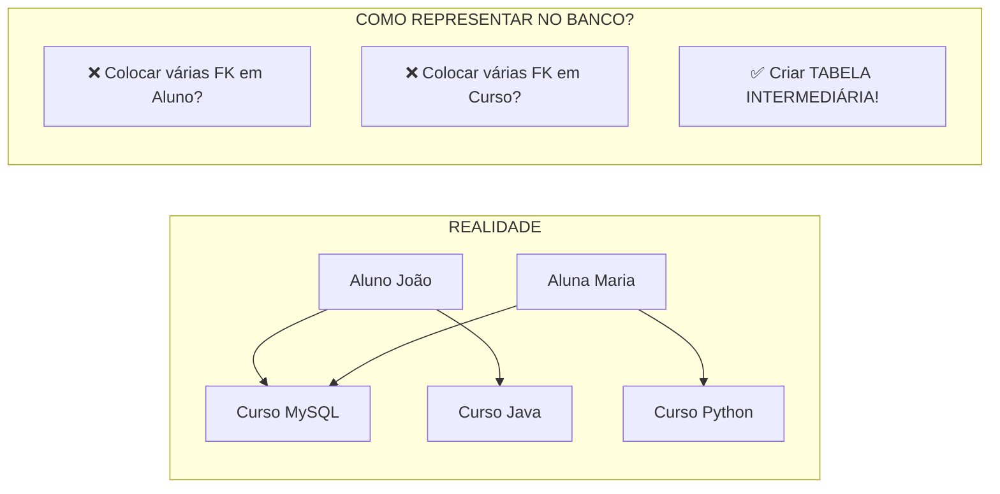
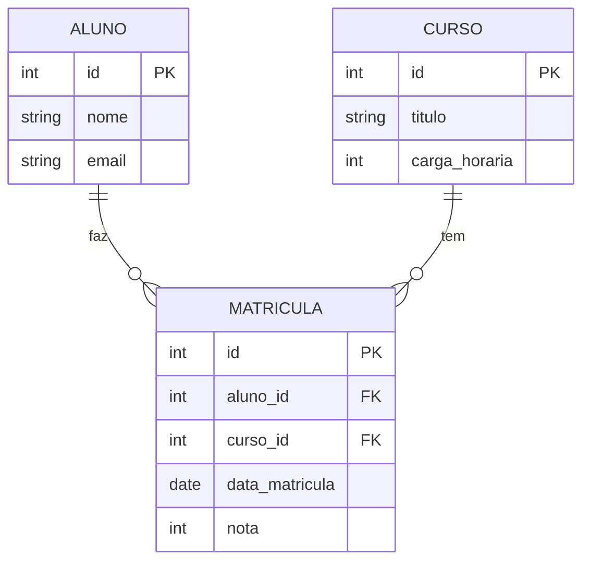
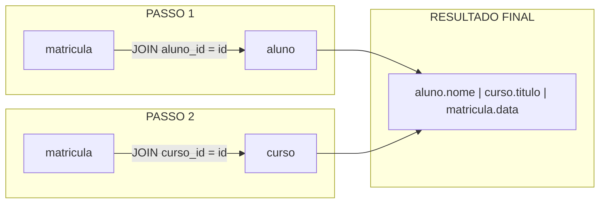

# 📚 Aula 14 - Relacionamentos N:N e JOINs Múltiplos (Final)

---

## 🎯 Objetivos da Aula

* Compreender o relacionamento Muitos para Muitos (N:N)
* Aprender a técnica da Entidade Associativa (tabela intermediária)
* Implementar na prática relacionamentos N:N com chaves estrangeiras
* Dominar junções com múltiplas tabelas (Multiple JOINs)
* Utilizar apelidos (aliases) para evitar ambiguidade
* Consolidar todos os conceitos do curso através de exercícios práticos

---

## 🔗 Relacionamento Muitos para Muitos (N:N)

### O Problema do N:N



### Exemplo Clássico: Alunos e Cursos

```text
┌─────────────────────────────────────────────────────────────────────┐
│                                                                     │
│   ALUNO                    CURSO                                   │
│   ┌──────────────┐         ┌──────────────┐                        │
│   │ João (id=1)  │         │ MySQL (id=1) │                        │
│   │ Maria (id=2) │         │ Java (id=2)  │                        │
│   │ Pedro (id=3) │         │ Python (id=3)│                        │
│   └──────────────┘         └──────────────┘                        │
│                                                                     │
│   RELACIONAMENTO N:N:                                              │
│   • João faz MySQL e Java                                          │
│   • Maria faz MySQL e Python                                       │
│   • Pedro faz Java                                                 │
│   • MySQL tem João e Maria                                         │
│   • Java tem João e Pedro                                          │
│   • Python tem Maria                                               │
│                                                                     │
└─────────────────────────────────────────────────────────────────────┘
```

### A Solução: Entidade Associativa (Tabela Intermediária)



### Transformando N:N em dois 1:N

```text
ANTES:                    DEPOIS:
┌─────┐    N:N    ┌─────┐    ┌─────┐    1:N    ┌───────────┐    1:N    ┌─────┐
│ALUNO│◄────────►│CURSO│    │ALUNO│──────────►│ MATRICULA │◄──────────│CURSO│
└─────┘           └─────┘    └─────┘           └───────────┘           └─────┘

O relacionamento N:N foi "quebrado" em dois relacionamentos 1:N
com uma tabela no meio (entidade associativa)
```

---

## 🏗️ Implementando um Relacionamento N:N

### Passo 1: Criar as Tabelas Originais

```sql
-- Criar banco de dados
CREATE DATABASE IF NOT EXISTS curso_nn;
USE curso_nn;

-- Tabela ALUNO (entidade 1)
CREATE TABLE aluno (
    id INT PRIMARY KEY AUTO_INCREMENT,
    nome VARCHAR(100) NOT NULL,
    email VARCHAR(100) UNIQUE,
    data_nascimento DATE
) ENGINE = InnoDB;

-- Tabela CURSO (entidade 2)
CREATE TABLE curso (
    id INT PRIMARY KEY AUTO_INCREMENT,
    titulo VARCHAR(100) NOT NULL,
    carga_horaria INT,
    preco DECIMAL(10,2)
) ENGINE = InnoDB;
```

### Passo 2: Criar a Tabela Intermediária (Entidade Associativa)

```sql
-- TABELA INTERMEDIÁRIA (resolve o N:N)
CREATE TABLE matricula (
    id INT PRIMARY KEY AUTO_INCREMENT,
    
    -- Chaves estrangeiras (devem ter o MESMO TIPO das PKs originais)
    aluno_id INT NOT NULL,
    curso_id INT NOT NULL,
    
    -- Atributos próprios do relacionamento
    data_matricula DATE DEFAULT CURRENT_DATE,
    nota_final DECIMAL(4,2),
    situacao ENUM('cursando', 'aprovado', 'reprovado') DEFAULT 'cursando',
    
    -- Constraints de chave estrangeira
    FOREIGN KEY (aluno_id) REFERENCES aluno(id),
    FOREIGN KEY (curso_id) REFERENCES curso(id),
    
    -- Garantir que o mesmo aluno não se matricule duas vezes no mesmo curso
    UNIQUE KEY (aluno_id, curso_id)
) ENGINE = InnoDB;
```

### Passo 3: Popular as Tabelas

```sql
-- Inserir alunos
INSERT INTO aluno (nome, email, data_nascimento) VALUES
    ('João Silva', 'joao@email.com', '1995-03-15'),
    ('Maria Santos', 'maria@email.com', '1998-07-22'),
    ('Pedro Oliveira', 'pedro@email.com', '1992-01-30'),
    ('Ana Costa', 'ana@email.com', '1996-11-08');

-- Inserir cursos
INSERT INTO curso (titulo, carga_horaria, preco) VALUES
    ('MySQL Completo', 50, 520.00),
    ('Java Fundamentos', 60, 580.00),
    ('Python para Dados', 70, 890.00),
    ('JavaScript Avançado', 45, 490.00);

-- Inserir matrículas (relacionamentos)
INSERT INTO matricula (aluno_id, curso_id, data_matricula, nota_final, situacao) VALUES
    -- João faz MySQL e Java
    (1, 1, '2024-01-15', 8.5, 'aprovado'),
    (1, 2, '2024-01-15', 9.0, 'aprovado'),
    -- Maria faz MySQL e Python
    (2, 1, '2024-02-01', 7.5, 'aprovado'),
    (2, 3, '2024-02-01', 8.8, 'cursando'),
    -- Pedro faz Java e JavaScript
    (3, 2, '2024-03-10', 9.5, 'aprovado'),
    (3, 4, '2024-03-10', 8.0, 'cursando'),
    -- Ana faz Python
    (4, 3, '2024-01-20', 9.2, 'aprovado');
```

### Passo 4: Verificar a Integridade Referencial

```sql
-- ❌ Tenta inserir matrícula com aluno inexistente
INSERT INTO matricula (aluno_id, curso_id) VALUES (99, 1);
-- ERRO: Cannot add or update a child row (FK violada)

-- ❌ Tenta inserir matrícula com curso inexistente
INSERT INTO matricula (aluno_id, curso_id) VALUES (1, 99);
-- ERRO: Cannot add or update a child row (FK violada)

-- ❌ Tenta matricular o mesmo aluno duas vezes no mesmo curso
INSERT INTO matricula (aluno_id, curso_id) VALUES (1, 1);
-- ERRO: Duplicate entry (UNIQUE constraint)

-- ❌ Tenta excluir aluno que tem matrículas
DELETE FROM aluno WHERE id = 1;
-- ERRO: Cannot delete or update a parent row (integridade referencial)
```

---

## 🔗 Junções com Múltiplas Tabelas (Multiple JOINs)

### O Problema: Dados Espalhados

```sql
-- ❌ SELECT simples mostra apenas IDs (não os nomes reais)
SELECT * FROM matricula;
-- +----+----------+----------+-----------------+------------+-----------+
-- | id | aluno_id | curso_id | data_matricula  | nota_final | situacao  |
-- +----+----------+----------+-----------------+------------+-----------+
-- | 1  | 1        | 1        | 2024-01-15      | 8.5        | aprovado  |
-- | 2  | 1        | 2        | 2024-01-15      | 9.0        | aprovado  |
-- ...

-- Queremos ver: NOME do aluno + TÍTULO do curso + dados da matrícula
```

### Solução: Encadeamento de JOINs

```sql
-- ✅ JOIN com 3 tabelas
SELECT 
    a.nome AS aluno,
    c.titulo AS curso,
    m.data_matricula,
    m.nota_final,
    m.situacao
FROM matricula m
INNER JOIN aluno a ON m.aluno_id = a.id
INNER JOIN curso c ON m.curso_id = c.id
ORDER BY a.nome, m.data_matricula;
```

### Entendendo o Fluxo do JOIN Múltiplo



### Exemplo Detalhado do JOIN Múltiplo

```sql
-- Versão completa com todos os campos
SELECT 
    -- Dados do aluno (vem da tabela aluno)
    a.id AS aluno_id,
    a.nome AS aluno_nome,
    a.email AS aluno_email,
    
    -- Dados do curso (vem da tabela curso)
    c.id AS curso_id,
    c.titulo AS curso_titulo,
    c.carga_horaria,
    c.preco,
    
    -- Dados da matrícula (vem da tabela matricula)
    m.data_matricula,
    m.nota_final,
    m.situacao
    
FROM matricula m
INNER JOIN aluno a ON m.aluno_id = a.id
INNER JOIN curso c ON m.curso_id = c.id
ORDER BY a.nome, m.data_matricula DESC;

-- Resultado:
-- +----------+--------------+-----------------+----------+------------------+---------------+---------------+-----------------+------------+-----------+
-- | aluno_id | aluno_nome   | aluno_email     | curso_id | curso_titulo     | carga_horaria | preco         | data_matricula  | nota_final | situacao  |
-- +----------+--------------+-----------------+----------+------------------+---------------+---------------+-----------------+------------+-----------+
-- | 4        | Ana Costa    | ana@email.com   | 3        | Python para Dados| 70            | 890.00        | 2024-01-20      | 9.2        | aprovado  |
-- | 1        | João Silva   | joao@email.com  | 1        | MySQL Completo   | 50            | 520.00        | 2024-01-15      | 8.5        | aprovado  |
-- | 1        | João Silva   | joao@email.com  | 2        | Java Fundamentos | 60            | 580.00        | 2024-01-15      | 9.0        | aprovado  |
-- | 2        | Maria Santos | maria@email.com | 1        | MySQL Completo   | 50            | 520.00        | 2024-02-01      | 7.5        | aprovado  |
-- | 2        | Maria Santos | maria@email.com | 3        | Python para Dados| 70            | 890.00        | 2024-02-01      | 8.8        | cursando  |
-- | 3        | Pedro Oliveira|pedro@email.com | 2        | Java Fundamentos | 60            | 580.00        | 2024-03-10      | 9.5        | aprovado  |
-- | 3        | Pedro Oliveira|pedro@email.com | 4        | JavaScript Avançado|45           | 490.00        | 2024-03-10      | 8.0        | cursando  |
-- +----------+--------------+-----------------+----------+------------------+---------------+---------------+-----------------+------------+-----------+
```

### Usando Aliases para Evitar Ambiguidade

```sql
-- ❌ PROBLEMA: Coluna ambígua (id existe em 3 tabelas)
SELECT id, nome, titulo FROM matricula 
JOIN aluno ON aluno_id = id 
JOIN curso ON curso_id = id;
-- ERRO: Column 'id' in field list is ambiguous

-- ✅ SOLUÇÃO: Usar aliases para especificar a origem
SELECT 
    a.id AS aluno_id,
    a.nome AS aluno_nome,
    c.id AS curso_id,
    c.titulo AS curso_titulo,
    m.data_matricula,
    m.nota_final
FROM matricula m
JOIN aluno a ON m.aluno_id = a.id
JOIN curso c ON m.curso_id = c.id;
```

### JOIN com Filtros e Agregação

```sql
-- 1. Alunos aprovados em cada curso
SELECT 
    a.nome AS aluno,
    c.titulo AS curso,
    m.nota_final,
    m.situacao
FROM matricula m
JOIN aluno a ON m.aluno_id = a.id
JOIN curso c ON m.curso_id = c.id
WHERE m.situacao = 'aprovado'
ORDER BY m.nota_final DESC;

-- 2. Quantos alunos por curso
SELECT 
    c.titulo AS curso,
    COUNT(*) AS total_alunos,
    ROUND(AVG(m.nota_final), 2) AS media_notas,
    SUM(CASE WHEN m.situacao = 'aprovado' THEN 1 ELSE 0 END) AS aprovados
FROM matricula m
JOIN curso c ON m.curso_id = c.id
GROUP BY c.id
ORDER BY total_alunos DESC;

-- 3. Cursos que cada aluno faz (LEFT JOIN para mostrar alunos sem matrícula)
SELECT 
    a.nome AS aluno,
    GROUP_CONCAT(c.titulo ORDER BY c.titulo SEPARATOR ', ') AS cursos
FROM aluno a
LEFT JOIN matricula m ON a.id = m.aluno_id
LEFT JOIN curso c ON m.curso_id = c.id
GROUP BY a.id
ORDER BY a.nome;
```

---

## 📊 Relacionamentos Ternários (Conceito Avançado)

```text
┌─────────────────────────────────────────────────────────────────────┐
│                                                                     │
│   RELACIONAMENTO TERNÁRIO                                          │
│                                                                     │
│   Envolve TRÊS entidades em um único relacionamento                │
│                                                                     │
│   Exemplo:                                                         │
│   Um FUNCIONÁRIO vende um PRODUTO para um CLIENTE                  │
│                                                                     │
│   ┌────────────┐                                                   │
│   │ FUNCIONARIO│                                                   │
│   └─────┬──────┘                                                   │
│         │                                                          │
│         ▼                                                          │
│   ┌────────────┐         ┌────────────┐                           │
│   │   VENDA    │─────────│  CLIENTE   │                           │
│   └─────┬──────┘         └────────────┘                           │
│         │                                                          │
│         ▼                                                          │
│   ┌────────────┐                                                   │
│   │  PRODUTO   │                                                   │
│   └────────────┘                                                   │
│                                                                     │
│   A tabela VENDA teria 3 chaves estrangeiras:                      │
│   - funcionario_id                                                 │
│   - cliente_id                                                     │
│   - produto_id                                                     │
│                                                                     │
└─────────────────────────────────────────────────────────────────────┘
```

---

## 🏗️ Exemplo Final: Sistema de Biblioteca Completo

```sql
-- ============================================
-- SISTEMA DE BIBLIOTECA COM RELACIONAMENTOS
-- ============================================

-- 1. CRIAR BANCO
CREATE DATABASE biblioteca_final;
USE biblioteca_final;

-- 2. ENTIDADES PRINCIPAIS
CREATE TABLE autor (
    id INT PRIMARY KEY AUTO_INCREMENT,
    nome VARCHAR(100) NOT NULL,
    nacionalidade VARCHAR(50),
    data_nascimento DATE
) ENGINE = InnoDB;

CREATE TABLE livro (
    id INT PRIMARY KEY AUTO_INCREMENT,
    titulo VARCHAR(200) NOT NULL,
    isbn VARCHAR(13) UNIQUE,
    ano_publicacao YEAR,
    preco DECIMAL(10,2),
    estoque INT DEFAULT 0
) ENGINE = InnoDB;

CREATE TABLE cliente (
    id INT PRIMARY KEY AUTO_INCREMENT,
    nome VARCHAR(100) NOT NULL,
    cpf VARCHAR(11) UNIQUE,
    email VARCHAR(100),
    telefone VARCHAR(15)
) ENGINE = InnoDB;

-- 3. RELACIONAMENTO N:N: LIVRO ↔ AUTOR
CREATE TABLE livro_autor (
    livro_id INT,
    autor_id INT,
    PRIMARY KEY (livro_id, autor_id),
    FOREIGN KEY (livro_id) REFERENCES livro(id),
    FOREIGN KEY (autor_id) REFERENCES autor(id)
) ENGINE = InnoDB;

-- 4. RELACIONAMENTO N:N: CLIENTE ↔ LIVRO (EMPRÉSTIMO)
CREATE TABLE emprestimo (
    id INT PRIMARY KEY AUTO_INCREMENT,
    cliente_id INT NOT NULL,
    livro_id INT NOT NULL,
    data_emprestimo DATE DEFAULT CURRENT_DATE,
    data_devolucao_prevista DATE,
    data_devolucao_real DATE,
    status ENUM('ativo', 'atrasado', 'devolvido') DEFAULT 'ativo',
    
    FOREIGN KEY (cliente_id) REFERENCES cliente(id),
    FOREIGN KEY (livro_id) REFERENCES livro(id),
    
    -- Garantir que o mesmo livro não seja emprestado duas vezes enquanto ativo
    -- (Implementado na aplicação ou com trigger)
    INDEX idx_cliente (cliente_id),
    INDEX idx_livro (livro_id),
    INDEX idx_status (status)
) ENGINE = InnoDB;

-- 5. INSERIR DADOS
INSERT INTO autor (nome, nacionalidade) VALUES
    ('Machado de Assis', 'Brasileira'),
    ('George Orwell', 'Britânica'),
    ('J.K. Rowling', 'Britânica'),
    ('Stephen King', 'Americana');

INSERT INTO livro (titulo, isbn, ano_publicacao, preco, estoque) VALUES
    ('Dom Casmurro', '9788535902775', 1899, 29.90, 5),
    ('1984', '9788535914846', 1949, 39.90, 3),
    ('Harry Potter e a Pedra Filosofal', '9788532511010', 1997, 49.90, 7),
    ('It: A Coisa', '9788532526281', 1986, 79.90, 2);

INSERT INTO livro_autor (livro_id, autor_id) VALUES
    (1, 1),  -- Dom Casmurro - Machado
    (2, 2),  -- 1984 - Orwell
    (3, 3),  -- Harry Potter - Rowling
    (4, 4);  -- It - King

INSERT INTO cliente (nome, cpf, email, telefone) VALUES
    ('João Silva', '12345678901', 'joao@email.com', '11999999999'),
    ('Maria Santos', '98765432109', 'maria@email.com', '11988888888');

INSERT INTO emprestimo (cliente_id, livro_id, data_emprestimo, data_devolucao_prevista, status) VALUES
    (1, 1, '2024-04-01', '2024-04-15', 'ativo'),
    (1, 2, '2024-04-01', '2024-04-15', 'ativo'),
    (2, 3, '2024-04-02', '2024-04-16', 'ativo');

-- 6. CONSULTA COMPLETA COM MÚLTIPLOS JOINs
SELECT 
    c.nome AS cliente,
    l.titulo AS livro,
    GROUP_CONCAT(DISTINCT a.nome ORDER BY a.nome SEPARATOR ', ') AS autores,
    e.data_emprestimo,
    e.data_devolucao_prevista,
    DATEDIFF(CURDATE(), e.data_devolucao_prevista) AS dias_atraso,
    e.status
FROM emprestimo e
JOIN cliente c ON e.cliente_id = c.id
JOIN livro l ON e.livro_id = l.id
JOIN livro_autor la ON l.id = la.livro_id
JOIN autor a ON la.autor_id = a.id
WHERE e.status IN ('ativo', 'atrasado')
GROUP BY e.id
ORDER BY e.data_emprestimo;

-- 7. RELATÓRIO DE LIVROS MAIS EMPRESTADOS
SELECT 
    l.titulo AS livro,
    COUNT(e.id) AS total_emprestimos,
    l.estoque,
    GROUP_CONCAT(DISTINCT a.nome SEPARATOR ', ') AS autores
FROM livro l
LEFT JOIN emprestimo e ON l.id = e.livro_id AND e.status != 'devolvido'
LEFT JOIN livro_autor la ON l.id = la.livro_id
LEFT JOIN autor a ON la.autor_id = a.id
GROUP BY l.id
ORDER BY total_emprestimos DESC;
```

---

## 📋 Resumo Final do Curso

### Tabela de Comandos Essenciais

| Comando | Categoria | Uso |
|---------|-----------|-----|
| `CREATE DATABASE` | DDL | Criar banco de dados |
| `CREATE TABLE` | DDL | Criar tabelas |
| `ALTER TABLE` | DDL | Modificar estrutura |
| `DROP TABLE` | DDL | Remover tabelas |
| `INSERT INTO` | DML | Inserir dados |
| `UPDATE` | DML | Atualizar dados |
| `DELETE` | DML | Remover dados |
| `SELECT` | DQL | Consultar dados |
| `INNER JOIN` | DQL | Juntar tabelas (interseção) |
| `LEFT JOIN` | DQL | Juntar (prioriza esquerda) |
| `RIGHT JOIN` | DQL | Juntar (prioriza direita) |
| `GROUP BY` | DQL | Agrupar resultados |
| `HAVING` | DQL | Filtrar grupos |
| `ORDER BY` | DQL | Ordenar resultados |

### Checklist de Boas Práticas

```text
✅ SEMPRE use ENGINE = InnoDB para FK e ACID
✅ SEMPRE defina uma PRIMARY KEY em cada tabela
✅ SEMPRE use FOREIGN KEY para integridade referencial
✅ SEMPRE use aliases (AS) em JOINs com múltiplas tabelas
✅ SEMPRE faça SELECT antes de DELETE/UPDATE perigoso
✅ SEMPRE use transações (START TRANSACTION/COMMIT/ROLLBACK)
✅ SEMPRE faça backup (mysqldump) antes de operações críticas
✅ SEMPRE use tipos de dados adequados (economize bytes!)
```

---

## 💡 Palavras Finais do Curso

```text
┌─────────────────────────────────────────────────────────────────────┐
│                                                                     │
│   🎓 PARABÉNS! Você concluiu o curso de MySQL!                      │
│                                                                     │
│   Lembre-se:                                                        │
│                                                                     │
│   "A teoria explica o que fazer, mas só a prática ensina            │
│    como fazer direito. Não pare por aqui!"                          │
│                                                                     │
│   Para evoluir:                                                     │
│   • Pratique com projetos reais                                     │
│   • Estude modelagem de dados (DER avançado)                        │
│   • Aprenda stored procedures e triggers                            │
│   • Explore índices e otimização de consultas                       │
│   • Estude backup e recuperação de desastres                        │
│   • Conheça NoSQL para cenários específicos                         │
│                                                                     │
└─────────────────────────────────────────────────────────────────────┘
```

---

## 🧠 Exercício Final do Curso

```sql
-- DESAFIO: Crie um sistema de pedidos completo
-- 
-- Requisitos:
-- 1. Tabela CLIENTE (id, nome, email, telefone)
-- 2. Tabela PRODUTO (id, nome, preco, estoque)
-- 3. Tabela PEDIDO (id, cliente_id, data_pedido, status)
-- 4. Tabela ITEM_PEDIDO (pedido_id, produto_id, quantidade, preco_unitario)
-- 
-- 5. Relacionamentos:
--    - Cliente 1:N Pedido
--    - Pedido N:N Produto (via Item_Pedido)
-- 
-- 6. Inserir dados de exemplo
-- 7. Criar consultas:
--    a) Listar todos os pedidos com nome do cliente e total do pedido
--    b) Listar produtos mais vendidos
--    c) Listar clientes que nunca compraram
--    d) Valor total vendido por mês
--
-- BÔNUS: Adicione gatilhos (triggers) para atualizar estoque automaticamente
```

---

### 🎯 Próximos Passos

```text
Com o conhecimento deste curso, você está pronto para:

1. 📦 Criar bancos de dados para aplicações reais
2. 🔗 Modelar relacionamentos complexos
3. 📊 Gerar relatórios com consultas avançadas
4. 🚀 Integrar MySQL com Java, Python, PHP, etc.
5. 🛡️ Garantir integridade e segurança dos dados

Continue praticando e bons estudos! 🎉
```