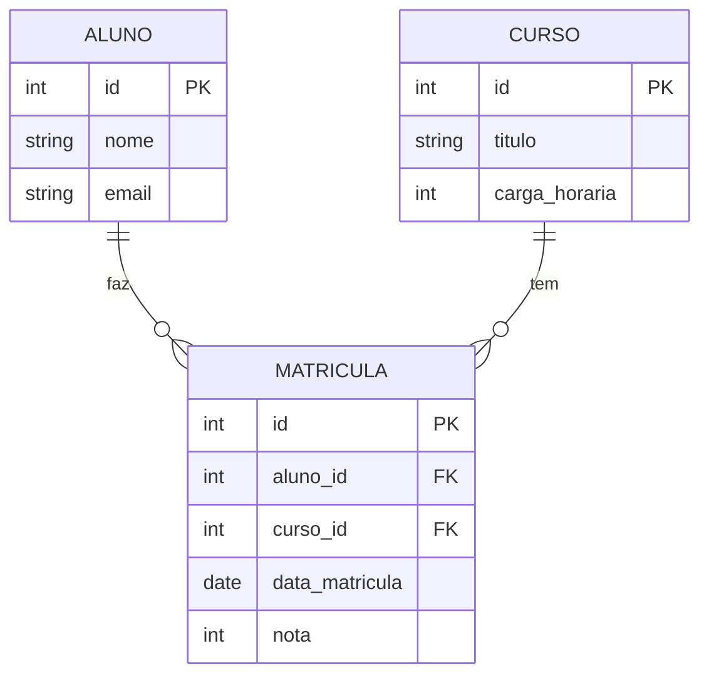

# 📚 Lesson 14 — Many-to-Many Relationships and Multiple JOINs (Conclusion)

---

## 🎯 Lesson Objectives

* Understand Many-to-Many relationships (N:N)
* Learn the Associative Entity technique (intermediate table)
* Ensure **referential integrity** in complex relationships
* Insert data into relational tables
* Perform **JOINs across multiple tables**
* Use **aliases** for complex queries

---

## 🔗 Many-to-Many Relationship (N:N)

This is the most common type of relationship in real systems.

---

## 🧠 Concept

```text id="9u3x4p"
Multiple records on one side → relate to multiple records on the other
```

## 💡 Classic Example

```text id="6zlpow"
Student ↔ Course
```

* 👉 A student can take multiple courses
* 👉 A course can have multiple students

---

# 🧩 Intermediate Table

We cannot link them directly.

👉 We need to create a **new table**

---

## 📦 Associative Entity

This table represents the relationship.

```text id="t3n5xo"
Student ← attends → Course
```

---

## 💡 Visual example:

### Example


---

## 🏗️ Table Structure

```sql id="b6l9e8"
CREATE TABLE assiste (
    id INT PRIMARY KEY AUTO_INCREMENT,
    data_inicio DATE,
    
    gafanhoto_id INT,
    curso_id INT,
    
    FOREIGN KEY (gafanhoto_id) REFERENCES gafanhotos(id),
    FOREIGN KEY (curso_id) REFERENCES cursos(id)
);
```

---

## 📌 What this table contains:

```text id="2w8k9q"
✔ Its own PK (id)  
✔ FK to gafanhotos  
✔ FK to cursos  
✔ Its own attributes (e.g., date)  
```

---

💡 Now we have:



The N:N relationship was "broken" into two 1:N relationships
with a table in the middle (associative entity)

---

## 🔒 Referential Integrity

FKs ensure:

```text id="y5z1xk"
- No invalid relationships exist  
- No orphan data exists  
```

---

## ❌ Invalid Example

```sql id="p9j3ta"
INSERT INTO assiste (gafanhoto_id, curso_id)
VALUES (999, 1);
```

👉 If gafanhoto 999 does not exist:

```text id="c8r6kq"
ERROR ❌
```

---

## ➕ Inserting Data

Now creating real relationships:

```sql id="v0m4zy"
INSERT INTO assiste (gafanhoto_id, curso_id, data_inicio)
VALUES (1, 2, '2024-01-10');
```

---

💡 Translation:

```text id="q2f8wd"
Student 1 is attending Course 2
```

---

## 🔄 Real Problem

If we run:

```sql id="k3e7xt"
SELECT * FROM assiste;
```

Result:

```text id="d6y2ps"
1 | 2024-01-10 | 1 | 2
```

👉 Only IDs 😐

---

## 🔗 Solution: Multiple Table JOINs

We need to retrieve the real data.

---

## 🧠 Strategy

1. Join **gafanhotos + assiste**
2. Join **assiste + cursos**

---

## ✅ Complete Query

```sql id="n7q5ra"
SELECT 
    g.nome AS aluno,
    c.nome AS curso,
    a.data_inicio
FROM gafanhotos g
INNER JOIN assiste a
    ON g.id = a.gafanhoto_id
INNER JOIN cursos c
    ON a.curso_id = c.id;
```

---

## 📊 Result

```text id="z4k1pb"
João  | MySQL   | 2024-01-10
Maria | Java    | 2024-02-05
Pedro | Python  | 2024-03-01
```

---

## 🏷️ Using Aliases

Essential for large queries.

```sql id="u9r2mx"
g → gafanhotos  
a → assiste  
c → cursos
```

---

## ⚠️ Ambiguous Column

Without alias:

```sql id="b8v1he"
SELECT nome FROM gafanhotos, cursos;
```

👉 ERROR ❌ (two tables have "nome")

---

### ✔ Correct

```sql id="s4y7dl"
SELECT g.nome, c.nome
FROM gafanhotos g
JOIN cursos c;
```

---

## 🔁 JOIN Order

```text id="e3k9hn"
Main table → JOIN → JOIN → JOIN...
```

Each JOIN needs:

```sql id="j5x2tw"
ON tabela1.campo = tabela2.campo
```

---

## 📈 Improving the Query

```sql id="a1z6uc"
SELECT 
    g.nome AS aluno,
    c.nome AS curso,
    a.data_inicio
FROM gafanhotos g
INNER JOIN assiste a ON g.id = a.gafanhoto_id
INNER JOIN cursos c ON a.curso_id = c.id
ORDER BY g.nome;
```

---

## 🧠 Flow Overview

```text id="p6m4vr"
Gafanhotos → Assiste → Cursos
```

👉 You navigate between tables using JOIN

---

## 📊 Quick Summary

* **N:N** requires an intermediate table
* The table has **two FKs**
* It can have **its own attributes**
* FKs ensure **referential integrity**
* **Multiple JOINs** connect everything
* **Aliases** are essential
* Without JOIN → only IDs
* With JOIN → real data

---

## 📋 Final Summary: Essential Commands Table

| Command           | Category | Usage                      |
| ----------------- | -------- | -------------------------- |
| `CREATE DATABASE` | DDL      | Create database            |
| `CREATE TABLE`    | DDL      | Create tables              |
| `ALTER TABLE`     | DDL      | Modify structure           |
| `DROP TABLE`      | DDL      | Remove tables              |
| `INSERT INTO`     | DML      | Insert data                |
| `UPDATE`          | DML      | Update data                |
| `DELETE`          | DML      | Remove data                |
| `SELECT`          | DQL      | Query data                 |
| `INNER JOIN`      | DQL      | Join tables (intersection) |
| `LEFT JOIN`       | DQL      | Join (prioritizes left)    |
| `RIGHT JOIN`      | DQL      | Join (prioritizes right)   |
| `GROUP BY`        | DQL      | Group results              |
| `HAVING`          | DQL      | Filter groups              |
| `ORDER BY`        | DQL      | Sort results               |

---

Welcome to the level where you truly **understand databases** 🚀

> 💡**Final tip**: You don’t learn databases just by watching or reading.
> You learn by PRACTICING
