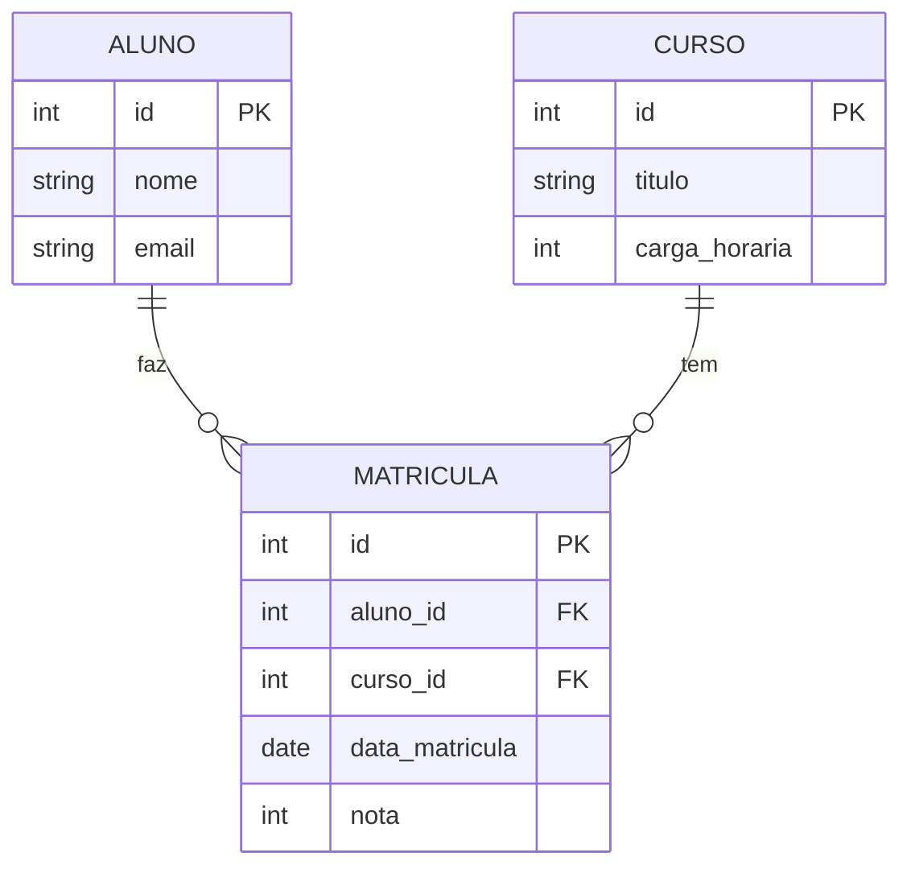

# 📚 Aula 14 — Relacionamento N:N e JOINs Múltiplos (Encerramento)

---

## 🎯 Objetivos da Aula

* Compreender o relacionamento Muitos para Muitos (N:N)
* Aprender a técnica da Entidade Associativa (tabela intermediária)
* Garantir **integridade referencial** em relações complexas
* Inserir dados em tabelas relacionais
* Realizar **JOINs entre múltiplas tabelas**
* Utilizar **aliases** para consultas complexas

---

## 🔗 Relacionamento Muitos para Muitos (N:N)

Esse é o tipo de relacionamento mais comum em sistemas reais.

---

## 🧠 Conceito

```text
Vários registros de um lado → se relacionam com vários do outro
```

## 💡 Exemplo clássico

```text
Gafanhoto (Aluno) ↔ Curso
```

- 👉 Um aluno pode fazer vários cursos
- 👉 Um curso pode ter vários alunos

# 🧩 Tabela Intermediária

Não dá pra ligar direto.

👉 Precisamos criar uma **nova tabela**

---

## 📦 Entidade Associativa

Essa tabela representa o relacionamento.

```text
Gafanhoto ← Assiste → Curso
```

---

## 💡 Exemplo visual:

### Exemplo


---

## 🏗️ Estrutura da Tabela

```sql
CREATE TABLE assiste (
    id INT PRIMARY KEY AUTO_INCREMENT,
    data_inicio DATE,
    
    gafanhoto_id INT,
    curso_id INT,
    
    FOREIGN KEY (gafanhoto_id) REFERENCES gafanhotos(id),
    FOREIGN KEY (curso_id) REFERENCES cursos(id)
);
```

---

## 📌 O que essa tabela possui:

```text
✔ PK própria (id)
✔ FK para gafanhotos
✔ FK para cursos
✔ Atributos próprios (ex: data)
```

---

💡 Agora temos:



O relacionamento N:N foi "quebrado" em dois relacionamentos 1:N
com uma tabela no meio (entidade associativa)

---

## 🔒 Integridade Referencial

As FKs garantem:

```text
- Não existe relacionamento inválido
- Não existem dados órfãos
```

---

## ❌ Exemplo inválido

```sql
INSERT INTO assiste (gafanhoto_id, curso_id)
VALUES (999, 1);
```

👉 Se o gafanhoto 999 não existir:

```text
ERRO ❌
```

---

## ➕ Inserindo Dados

Agora sim, criando relações reais:

```sql
INSERT INTO assiste (gafanhoto_id, curso_id, data_inicio)
VALUES (1, 2, '2024-01-10');
```

---

💡 Tradução:

```text
Gafanhoto 1 está assistindo o Curso 2
```

---

## 🔄 Problema Real

Se fizermos:

```sql
SELECT * FROM assiste;
```

Resultado:

```text
1 | 2024-01-10 | 1 | 2
```

👉 Só IDs 😐

---

## 🔗 Solução: Junções com Múltiplas Tabelas (Multiple JOINs)

Precisamos buscar os dados reais.

---


## 🧠 Estratégia

1. Junta **gafanhotos + assiste**
2. Junta **assiste + cursos**

---

## ✅ Query Completa

```sql
SELECT 
    g.nome AS aluno,
    c.nome AS curso,
    a.data_inicio
FROM gafanhotos g
INNER JOIN assiste a
    ON g.id = a.gafanhoto_id
INNER JOIN cursos c
    ON a.curso_id = c.id;
```

---

## 📊 Resultado

```text
João  | MySQL   | 2024-01-10
Maria | Java    | 2024-02-05
Pedro | Python  | 2024-03-01
```

---

## 🏷️ Uso de Aliases

Essencial para queries grandes.

```sql
g → gafanhotos  
a → assiste  
c → cursos
```

---

## ⚠️ Coluna Ambígua

Sem alias:

```sql
SELECT nome FROM gafanhotos, cursos;
```

👉 ERRO ❌ (duas tabelas têm "nome")

---

### ✔ Correto

```sql
SELECT g.nome, c.nome
FROM gafanhotos g
JOIN cursos c;
```

---

## 🔁 Ordem dos JOINs

```text
Tabela principal → JOIN → JOIN → JOIN...
```

Cada JOIN precisa de:

```sql
ON tabela1.campo = tabela2.campo
```

---

## 📈 Melhorando a Query

```sql
SELECT 
    g.nome AS aluno,
    c.nome AS curso,
    a.data_inicio
FROM gafanhotos g
INNER JOIN assiste a ON g.id = a.gafanhoto_id
INNER JOIN cursos c ON a.curso_id = c.id
ORDER BY g.nome;
```

---

## 🧠 Visão Geral do Fluxo

```text
Gafanhotos → Assiste → Cursos
```

👉 Você navega entre tabelas via JOIN

---

## 📊 Resumo Rápido

* **N:N** precisa de tabela intermediária
* A tabela possui **duas FKs**
* Pode ter **atributos próprios**
* FKs garantem **integridade referencial**
* **JOINs múltiplos** conectam tudo
* **Aliases** são essenciais
* Sem JOIN → só IDs
* Com JOIN → dados reais


---
## 📋 Resumo Final: Tabela de Comandos Essenciais

| Comando | Categoria | Uso |
|---------|-----------|-----|
| `CREATE DATABASE` | DDL | Criar banco de dados |
| `CREATE TABLE` | DDL | Criar tabelas |
| `ALTER TABLE` | DDL | Modificar estrutura |
| `DROP TABLE` | DDL | Remover tabelas |
| `INSERT INTO` | DML | Inserir dados |
| `UPDATE` | DML | Atualizar dados |
| `DELETE` | DML | Remover dados |
| `SELECT` | DQL | Consultar dados |
| `INNER JOIN` | DQL | Juntar tabelas (interseção) |
| `LEFT JOIN` | DQL | Juntar (prioriza esquerda) |
| `RIGHT JOIN` | DQL | Juntar (prioriza direita) |
| `GROUP BY` | DQL | Agrupar resultados |
| `HAVING` | DQL | Filtrar grupos |
| `ORDER BY` | DQL | Ordenar resultados |

---

E bem-vindo ao nível onde você realmente **entende banco de dados** 🚀

>💡**Dica final:** Banco de dados NÃO se aprende só assistindo ou lendo.
> Se aprende PRATICANDO

